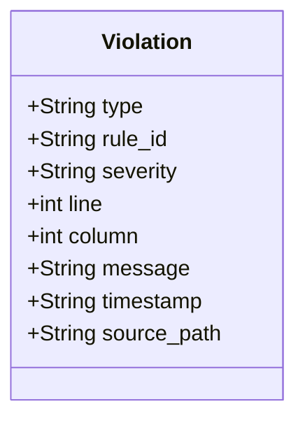

# 违规进 trail 设计

本设计定义 sih-doclint 违规输出进 trail 的机制。承接 PRO-004 第三层判定器段「违规进 trail」与旧仓 T6D 报告的 Violation schema。本设计解决已存在工程断点：sih-doclint 当前只输出 exit code 0 与非 0，违规具体内容丢失，治理动作无机械留痕。本设计不展开 trail 文件格式，由 DEC-004 书简组件承载；本设计只定义 sih-doclint 与 trail 之间的契约。

## 概览 {#overview}

- 当前断点承接 PRO-08 应而不藏，sih-doclint 输出只有 exit code 无结构化违规::[当前断点](#current-gap)
- 三条候选方案：wrap script 解析、改工具源码加 --emit-json、采纳 T6D 双二进制架构::[候选方案](#candidates)
- 推荐改工具源码加 --emit-json 选项，不破 v0 单 crate 形态::[推荐方案](#recommended)
- T6D 报告已定义 Violation schema，本设计沿用并补 trail 字段::[契约定义](#contract)
- trail 写入承接 DEC-004 书简组件，本设计不展开::[trail 集成](#trail-integration)
- 认识论立场 design-corollary，参数留空由真数据填入::[认识论立场](#epistemic-stance)

## 当前断点 {#current-gap}

sih-doclint 当前实现承接旧仓设计：CLI 入口接收路径参数，编排 markdownlint 子进程调用，行级扫描文档，五类规则模块串行调用，违规聚合后输出终端文本。退出码 0 = 全部通过，非 0 = 至少一条违规。

断点：退出码只承载二元判定，违规具体内容如规则 ID、违规位置、违规严重度、违规消息均只在终端文本输出，未结构化进入治理留痕系统。

承接 PRO-08 应而不藏：留痕是应鉴循环的构成性条件。违规不进 trail 则应鉴循环在 lint 这一环断裂，鉴层无法机械审计治理动作是否经过格式校验。承接工程基线第四条可验证性约束：所有写入操作须满足操作来源可追溯、操作结果可机械校验、操作历史不可篡改。当前实现未满足第三条。

PRO-004 L82 显式声明此断点为已存在工程断点。T6D 报告 L177 定义 Violation 结构含 type / request_id / rule_id / severity / line / column / message 字段，本设计沿用并补 trail 字段。

## 候选方案 {#candidates}

候选方案一 wrap script 解析
: 待审议
: 写 shell 或 Python wrap script，调用 sih-doclint 抓终端输出，正则解析违规行，转结构化 JSON 写 trail。拒绝理由：终端输出格式不稳定，正则解析脆弱；终端输出含 ANSI 颜色码需剥离；wrap script 自身需维护；正则解析对 LLM 不友好，参见工程记忆 YAML 缩进案例。

候选方案二 改工具源码加 --emit-json 选项
: 待审议
: 改 sih-doclint CLI 入口加 --emit-json 选项，输出结构化 NDJSON 到 stdout，终端文本到 stderr，exit code 不变。拒绝理由：需改 Rust 源码；扩展点限于 CLI 入口与 report.rs，不破 v0 单 crate 形态；T6D 报告说 v0 阶段不拆 workspace，未说 v0 阶段不改源码。

候选方案三 采纳 T6D 双二进制架构
: 待审议
: 按 T6D 报告方案二实现核心加插件双二进制，NDJSON over stdin/stdout IPC。拒绝理由：T6D 报告 L577 自述 v0 阶段不采纳，等第 6 条规则出现后；当前规则数 5 未到阈值；T6D 报告 L319 建议 v0 保持单 crate，仅在第 6 条规则或外部协作者出现后触发 workspace 拆分；本方案违反 T6D 自述结论。

## 推荐方案 {#recommended}

推荐候选方案二即改工具源码加 --emit-json 选项。

决策依据三条。第一条 T6D 报告 v0 阶段约束。T6D 报告 L577 显式声明 v0 阶段不拆 workspace，本方案不破 workspace 形态，符合 v0 约束。第二条 Violation schema 已就绪。T6D 报告 L177 已定义 Violation 消息结构，本方案沿用并补 trail 字段，schema 不需重新设计。第三条 不引入新组件。候选方案一引入 wrap script 是新组件，候选方案三引入插件二进制是新组件；本方案扩展点在现有工具 CLI 入口与 report.rs，不引入新组件，承接工程基线第一条与第五条。

实施边界。本方案实施分两步。第一步改 sih-doclint main.rs 加 --emit-json 选项，输出 NDJSON 到 stdout，终端文本到 stderr，exit code 不变。第二步写 trail 写入脚本，接收 --emit-json 输出，结构化后经 DEC-004 书简组件写 trail。本设计只定义第一步契约与第二步接口预留。第一步实施在 v1 路线图决策后由 DEC 承载，第二步实施在 DEC-004 书简组件定锚后由 SPEC 承载。

## 契约定义 {#contract}

CLI 选项。--emit-json 接受两个值：default 等于仅终端文本与现状一致，ndjson 等于 NDJSON 流输出到 stdout 终端文本到 stderr。

响应 schema。沿用 T6D 报告 L177 Violation 结构，补 `timestamp` 与 `source_path` 字段。每条违规消息结构如下:

退出码。0 等于无违规，1 等于至少一条违规，2 等于工具内部错误含 CLI 解析失败或配置文件错误，124 等于超时被强杀。

错误处理。JSON 序列化失败不阻断，stderr 输出错误消息，exit code 2。CLI 解析失败不输出 NDJSON，仅 stderr 错误消息 + exit code 2。

不变量。每条 NDJSON 行必须是合法 JSON，不依赖跨行解析。type 字段必填，缺 type 视为协议违规。

## trail 集成 {#trail-integration}

trail 写入承接 DEC-004 书简组件。本设计不定义 trail 文件格式、不定义书简组件接口、不定义 trail 写入工具。本设计只定义 sih-doclint 与 trail 写入层之间的契约。

契约为：sih-doclint 输出 NDJSON 行流到 stdout，trail 写入层逐行读 NDJSON 解析，结构化后调用书简组件的写 trail 接口。trail 写入层是独立工具，不在本设计实现范围。

未来 trail 写入层可选方案：shell + jq + book-001 CLI、Python 包装、Go 包装、Rust 小二进制。选型不归本设计承载，归书简组件 spec 决策。

## 作用域 {#scope}

本设计作用域。改 sih-doclint main.rs 加 CLI 选项，改 src/report.rs 加 NDJSON 序列化函数。本设计不破 src/document.rs、不破 src/rules/、不破 src/markdownlint.rs。

本设计不覆盖。trail 写入层实现，书简组件接口，trail 文件格式，跨工具 IPC，插件架构。承接 T6D 报告 v0 阶段约束。

## 关联 {#relation}

- 上游：PRO-004 参验语义层设计方向
- 上游：旧仓 T6D 报告 REPORT-T6D-PLAN-B-CORE-PLUGIN-DUAL-BINARY.md
- 上游：PRO-08 应而不藏
- 上游：工程基线第一条与第四条
- 平行：DEC-004 书简组件
- 平行：T6D 报告方案二，本设计不采纳 v0 阶段
- 下游：书简组件 spec，trail 写入层 spec

## 认识论立场 {#epistemic-stance}

本设计为 design-corollary，工程实现路径的方案设计，不修改哲学命题。

可证伪条件一：若 --emit-json 输出 NDJSON 在真文档批量扫描中实测序列化开销超过扫描本身 5 倍，本方案的性能假设失效。

可证伪条件二：若终端文本与 NDJSON 双输出导致 stdout/stderr 分离在 shell 管道中误捕获，本方案的 CLI 契约失效。

可证伪条件三：若 trail 写入层消费 NDJSON 时发现 Violation schema 字段不足，本设计需补字段并升 v2。

## 自检 {#self-check}

### 形式合规自检 {#formal-self-check}

- 一级标题无锚点，仅一个，满足
- 二级及以上标题均带锚点，满足
- 首个二级标题命名为概览，满足
- 无破折号、无装饰符号、无 Unicode Emoji，满足
- 全角括号仅用于引用论证而非常规补充，满足

### 内容自检 {#content-self-check}

- 当前断点承接 PRO-004 与 PRO-08 与工程基线，未自创断言
- 三个候选方案各含拒绝理由，拒绝理由是事实陈述
- 推荐方案决策依据三条均含数据引用 T6D L577、T6D L177、工程基线
- 契约定义含 CLI 选项、响应 schema、退出码、错误处理、不变量
- trail 集成显式声明不展开书简组件接口
- 作用域显式声明本设计不覆盖哪些范围
- 认识论立场 design-corollary 与可证伪条件三条

### 自反性结论 {#reflexive-conclusion}

本设计经过自我审视，未发现违反 DES-001 格式规范的形态。本设计不破 v0 单 crate 形态，承接 T6D 报告自述结论。本设计是 P0 独立动作，不依赖其他组件，先于语义层完整设计落地。
