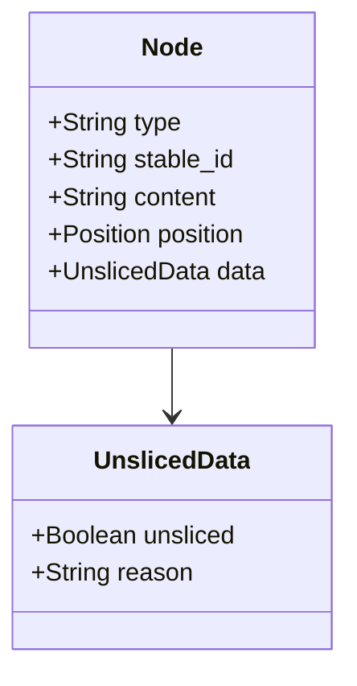

# 参验语义层完整设计

## 概览 {#overview}

本设计承接 PRO-004 参验语义层设计方向,做完整设计展开。原 DES-007 编号被工程基座设计占用,本设计用 DES-009 编号承接。本设计吃 PRO-004 P1 全部 4 项细化要求,展开为可工程化的完整设计。承接 T6-PARADIGMS.md 集群范式与 DES-005 v2 偏离率度量。承接 OQ-12 信息洪流内建防护,本设计分阶段承接,PRO-004 已登记方向,DES-009 展开完整设计,SPEC-001 承载接口契约,Rust 工具链实现待 v1 路线图决策后启动。

- 参验语义层吃 PRO-004 五层骨架全部展开::[五层骨架](#architecture)
- 路径二三细分二 a 文本质量二 b 语义结构二 c 偏离率度量::[路径二细分](#path-two)
- 偏离率度量承接 DES-005 v2 双指标::[偏离率](#divergence)
- 规则可证伪性元约束吃 PRO-004 P3.1 退化机制::[规则可证伪](#rule-falsifiability)
- 混合结构前提承接 PRO-004 设计前提::[混合结构](#mixed-structure)
- P1 全部 4 项展开含波动系数与自由文本容器与 Rust 接口与 P3.1 定位::[P1 展开](#p1-detail)
- 哲学检索五条加 convergence P3.1 原文定位::[哲学检索](#philosophy-search)
- 认识论立场 design-corollary 含可证伪条件::[认识论立场](#epistemic-stance)

## 核心问题 {#core-problem}

参验当前只有格式层校验,工具即 sih-doclint,查字符集与结构。语义层是真空区。真空区含四类问题:候选方案拒绝理由是否搪塞、哲学检索引用是否真实、范畴排除是否显式、命题承接是否成立。这四类问题当前只能靠人类审阅,违反工程基线第二条信息洪流与第三条人类只看异常信号。

承接 PRO-004 L18 显式声明此真空区。承接工程基线第五 LLM 是材料生成器不是度量权威,vacuum 的填法必须确定性程序承载,LLM 辅助。

本设计的展开方式。从 PRO-004 方向性登记,展开五层骨架,每层含业界对应、工具承载、契约定义、输入输出,达到可工程化水平。承接 T6-PARADIGMS.md 集群范式的 5 段任务包结构,本设计各层描述对齐任务包模板二的五段。

## 五层骨架 {#architecture}

### 第一层 分词 {#layer-tokenization}

把治理文档从纯文本切分为语义单元。每个单元带类型标记与 stable id。承接 ai-ex/T6-PARADIGMS.md 集群范式,语义单元由确定性程序切分,LLM 不参与切分。

stable id 派生规则。文件路径加节点类型加节点序号加内容 hash 派生,碰撞由内容 hash 兜底。stable id 变更进 trail,承接「决策等于治理对象」经验。

工具栈选型。Rust 栈 pulldown-cmark 加 comrak,不引入 Node 工具链。理由见 sih-engine/sih/state/calibration/markdown-tokenization-toolchain-survey.md。tree-sitter-markdown 不选,因 ikatyang 版自述不追求正确性主目标是语法高亮。

业界对应。IETF xml2rfc 的 XML 元素标签、法律 NLP 的语义元数据提取。GDPR 合规检查论文原文 semantic metadata is a prerequisite。

输入。治理文档 .md 路径列表。输出。语义单元树 JSON,含 stable id、type、content、position 四字段。

### 第二层 语义树 {#layer-semantic-tree}

把语义单元组织成树结构,表达单元间的包含与顺序关系。候选方案节点下挂拒绝理由子节点,哲学检索节点下挂命题编号子节点。

工具承载。pulldown-cmark 与 comrak 的 AST 树,经 Rust serde Serialize 输出为 JSON。承接工程基线第一确定性程序承载,语义树不依赖 LLM 生成。

业界对应。tree-sitter 的具体语法树、remark 的 mdast、IETF 的 XML DOM 树。

输入。第一层输出的语义单元树。输出。带父节点引用的语义树,含 containment 与 order 关系。

### 第三层 判定器 {#layer-judge}

在语义单元树上跑静态语义分析,查跨节点语义约束。这是路径一确定性规则校验的语义层扩展。

判定范围。节点存在性即候选方案节点必须存在。必填性即候选方案必须含拒绝理由子节点且非空。引用合法性即命题编号引用必须能在哲学仓索引定位。跨文档一致性即同一语义单元被多文档引用时一致性校验。

判定器不查节点内文本语义质量,那归路径二 NPC 专家团。判定器是 NPC 专家团 Verifier 角色的外部确定性证据之一,不替代 NPC 的语义判定。

业界对应。Schematron 跨元素语义规则校验、remark-lint 自定义规则、编译器属性文法即 AST 节点挂属性且节点间属性传递构成规则检查。

违规进 trail。承接 PRO-08 应而不藏与 DES-008 违规进 trail设计,判定器输出 NDJSON 沿用 DES-008 schema,经 trail 写入层进 trail。

### 第四层 规则定义 {#layer-rule-definition}

第三层规则用声明式语言定义,不硬编码。规则本身是治理对象,承接 PRO-09 元层。

元约束一 规则可证伪。每条规则必须配至少一个反例,即违反该规则的文档样例,反例本身进治理。承接 convergence 层 P3.1 退化机制,规则也会退化,反例是规则退化检测器。

元约束二 冲突检测。规则间可能矛盾。声明式规则格式天然支持冲突检测,靠类型系统与约束求解。规则数少于 10 不强制显式跑冲突检测,多于 10 进 CI。冲突检测结果进 trail。

业界对应。Z notation 形式化规格语言、Alloy 关系约束声明、Schematron 的 rule 加 assert 加 report 声明式语法。

### 第五层 Verifier 与偏离率 {#layer-verifier}

NPC 专家团承接路径二,判定节点内文本语义质量。判定结果切分为审阅单元,每个审阅单元指向产出物的某个语义单元节点,靠 stable id 主定位加位置备查。

偏离率度量。产出物 N 个语义单元,NPC 命中偏差 K 个,偏离率 K 由 N 除。度量由确定性程序算,可复现。

收敛双指标。同一文档多次审阅,偏离率是否收敛由两指标判定。指标一,K 由 N 除的波动系数低于阈值。指标二,审阅单元集合的 Jaccard 相似度高于阈值。两者都过才算收敛。方差低但集合不重合是稳定地漏判,假性收敛。详细接 DES-005 v2。

业界对应。Mavis 的 Verifier 对抗关系即靠外部确定性证据做判定、CodeBuddy NPC 的 CI 验证门禁、LLM-RUBRIC 的多维准则评估。

## 路径二细分 {#path-two}

承接混合结构前提,路径二分为三细分。

二 a 文本质量判定。判节点内文本写得是否成立,含论证是否搪塞与范畴是否混淆。

二 b 语义结构判定。判节点自称类型与内容类型是否对齐,如节点自称候选方案但内容是拒绝理由。

二 c 偏离率度量。确定性聚合程序对二 a 与二 b 的审阅单元做度量,可复现。

二 a 与二 b 产审阅单元材料,二 c 做度量,承接 SPEC-003 第 190 行原则 LLM 是材料生成器不是度量权威。

二 b 的触发策略。高风险文档类型强制触发二 b,如 PRO 与 DES。低风险按概率触发,如标定材料。承接工程基线第三条人类只看异常信号,二 b 触发条件即异常信号判据。

## 偏离率 {#divergence}

承接 DES-005 v2 偏离率度量机制。核心定义与双指标判定详见 DES-005 v2,本设计不重复,只标记衔接点。

第一衔接点。第二层语义树提供 N 个产出物总单元数,第三层判定器补结构性偏差单元数,二 a 与二 b 补语义性偏差单元数。三者合并后 K 才是总偏差数。

第二衔接点。波动系数阈值与 Jaccard 阈值由 SPEC-001 实验数据填入,本设计不锁死参数。

第三衔接点。审阅频次上下限由 SPEC-001 实验数据填入,本设计不锁死参数。

## 规则可证伪性元约束 {#rule-falsifiability}

每条第三层规则必须配至少一个反例。反例结构含三字段。反例路径指向违反该规则的具体文档。反例上下文是反例所处的语义单元树切片。复现步骤是确定性程序跑出反例的最小指令集。

反例本身进治理。反例是治理对象,反例变更进 trail。反例失效即规则仍存在但反例不再违反规则,这种情况反例可标注 superseded by 新反例。

承接 convergence 层 P3.1 退化机制。规则集本身会退化,反例是规则退化检测器,与 P3.1 上下文退化同源。承接工程基线第一确定性程序承载,反例验证由确定性程序跑。

## 混合结构前提 {#mixed-structure}

治理文档是混合结构,不是纯结构化标注。文档含结构化语义单元与大段叙事文本。结构化语义单元含候选方案、拒绝理由、哲学检索条目、命题编号引用、范畴排除声明。大段叙事文本含哲学阐发、决策论证、辩论记录。

正确的模型是结构化标注加自由文本容器。语义单元是节点,节点内可以是自由文本。规则检查分两种,节点结构层归确定性判定,节点内文本语义层归 NPC 判定。

unsliced 节点处理。大段叙事无法用确定性程序切分时,标 `unsliced` flag,绕开第三层判定器直接走第五层 Verifier。unsliced 节点在第二层语义树上挂 `data.unsliced = true` 属性,第三层判定器遍历时跳过 `unsliced` 节点。

## P1 展开 {#p1-detail}

P1-1 波动系数定义。承接 DES-005 v2 偏离率稳定性判定,波动系数定义为标准差除以均值,即变异系数 CV。数学公式:波动系数等于 N 次审阅的 K 由 N 除数值的标准差除以均值。N 大于等于 2 才有定义,N 等于 1 不算波动。

P1-2 自由文本容器工程化。承接混合结构前提,在 mdast 节点上挂 `data.unsliced` 布尔属性识别未切分节点。具体 JSON 结构如下。

P1-3 违规进 trail Rust 接口。承接 DES-008 违规进 trail设计,Rust 端用 serde Serialize 输出 NDJSON 沿用 DES-008 schema。`Violation` 结构含 `type`、`rule_id`、`severity`、`line`、`column`、`message`、`timestamp`、`source_path` 八字段,详见 DES-008 「契约定义」段。

P1-4 P3.1 convergence 原文定位。承接 convergence 层 P3.1 退化机制,哲学仓路径 `sih-philosophy/convergence/witness-framework.md` 加载原文。llm-friendly-build 知识包暂未收录 convergence 层单盲推导体系,按 AGENTS.md 「哲学仓地位」段回退路径加载。

## 哲学检索 {#philosophy-search}

PRO-07 鉴层检验职能适用于参验语义层的核心定位。参验承接鉴的反映而不投射,语义层判定反映文档的语义偏差事实,不投射判定者主张。原文路径 `sih-philosophy/emanation/proodos/08-on-settle.md` 第 178 行应不替代鉴,参验语义层只反映事实不判断好坏。

道四间隙不可消除适用于参验语义层的职能必要性。原文 `sih-philosophy/emanation/proodos/05-on-fourth-tao.md` 第 17 行,规约与实现必有间隙,间隙不可消除只能识别记录治理。参验语义层在规约到实现的链条上识别语义偏差,是缩小间隙的工程载体。

PRO-08 应而不藏适用于违规进 trail。原文 `sih-philosophy/emanation/proodos/08-on-settle.md` 第 114 行,应鉴循环的构成性条件是留痕。参验违规进 trail 是留痕载体职能的落地。

PRO-09 元层适用于规则本身是治理对象。规则定义层与可证伪性元约束承接元层治理要求,规则可声明、可变更、可被反例推翻。

convergence 层 P3.1 退化机制适用于规则退化检测。规则集本身会退化,反例是规则退化检测器,与 P3.1 上下文退化同源。原文路径 `sih-philosophy/convergence/witness-framework.md` 按 AGENTS.md 回退路径加载。

## 关联 {#relation}

- 上游:PRO-004 参验语义层设计方向
- 上游:DES-005 v2 语义验证微积分
- 上游:DES-008 违规进 trail
- 上游:PRO-08 应而不藏
- 上游:PRO-09 元层治理
- 上游:convergence 层 P3.1 退化机制
- 上游:ai-ex/T6-PARADIGMS.md 集群范式
- 上游:工程基线第一条与第二条与第三条与第四条与第五条
- 平行:OQ-12 信息洪流内建防护
- 平行:OQ-13 路径二判定
- 下游:SPEC-001 偏离率阈值实验
- 下游:Rust 工具链实现 v1 路线图

## 认识论立场 {#epistemic-stance}

本设计为 design-corollary 加 empirical-hypothesis 双重标签。design-corollary 是工程实现路径的方案设计,empirical-hypothesis 是偏离率度量机制的实验验证。

可证伪条件一。若 DES-005 v2 实验问题一显示偏离率不稳定即双指标无法同时过阈值,参验语义层的路径二 c 度量机制须重新审视。

可证伪条件二。若 NPC 专家团在节点内文本语义质量判定上的命中率系统性低于随机基线即判定不如随机猜,路径二 a 与二 b 须重新审视,可能须回退到候选方案一即维持现状靠人类审阅。

可证伪条件三。若混合分层导致确定性判定器与 NPC 专家团的边界频繁模糊即同一问题难以判定归路径一还是路径二,分层判据须重新审视。

可证伪条件四。若 unsliced 节点在真文档上覆盖率超过预设比例即大量节点需 NPC 走,确定性程序承载度下降,混合结构前提须重新审视。

## 自检 {#self-check}

### 形式合规自检 {#formal-self-check}

- 一级标题无锚点,仅一个,满足
- 二级及以上标题均带锚点,满足
- 首个二级标题命名为概览,满足
- 无破折号、无装饰符号、无 Unicode Emoji,满足
- 全角括号仅用于引用论证而非常规补充,满足

### 内容自检 {#content-self-check}

- 五层骨架每层含工具承载与业界对应与输入输出
- 路径二三细分二 a 二 b 二 c 各自承载
- 偏离率承 DES-005 v2 不重复定义只标衔接
- 规则可证伪性元约束含反例结构与反例失效处理
- 混合结构前提含 unsliced 节点工程化处理
- P1 全部 4 项展开不含糊
- 哲学检索五条加 convergence P3.1 原文定位
- 关联段含上下游与平行
- 认识论立场 design-corollary 加 empirical-hypothesis 双标签
- 可证伪条件四条覆盖稳定性与命中率与边界与 unsliced 覆盖率

### 自反性结论 {#reflexive-conclusion}

本设计经过自我审视,未发现违反 DES-001 格式规范的形态。本设计承接 PRO-004 方向性登记展开为可工程化设计,承接 T6-PARADIGMS.md 集群范式的 5 段任务包结构,承接 DES-005 v2 偏离率度量机制,承接 DES-008 违规进 trail Rust 接口。本设计是 P1 优先工作的完整设计落地,后续由 SPEC-001 与 Rust 工具链实现承载。
