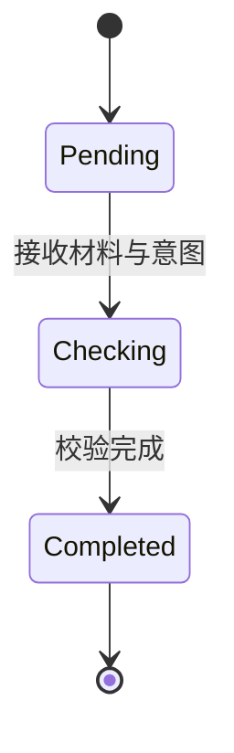

# 参验规格

本规格承接 DES-003 参验组件协议，定义参验的接口契约与验收依据。参验的命名归 DEC-002，职能边界归 DEC-003，组件协议归 DES-003，本规格定义参验作为可独立验收工程单元的接口与验收标准。

本规格接入两条校验路径。路径一确定性规则校验，路径二语义校验。路径二的 N 等于 4 隔离采样加多数投票由 Phase 2 全量实验验证其拖底能力，tie-break 机制由 Phase 0 校准实验验证，实验结论见 Phase 2 全量实验结论文档。

## 概览 {#overview}

- 参验接收符号材料与意图声明，产出差异事实与偏差记录::[接口签名](#interface-signature)
- 差异事实与偏差记录的数据结构定义承接 DES-003::[数据契约](#data-contract)
- 参验的状态机含待校验、校验中、已完成三态::[状态转换](#state-machine)
- 两条校验路径各有验收依据，路径二承接 Phase 2 实验数据::[验收依据](#acceptance-criteria)
- 路径一确定性规则校验，判断与度量都由确定性程序承载::[路径一确定性规则校验](#path-deterministic)
- 路径二语义校验，LLM 产出判断材料，确定性程序聚合做度量::[路径二语义校验](#path-semantic)
- 度量权威归确定性程序，LLM 是材料生成器不是度量权威::[度量权威约束](#measurement-authority)

## 接口签名 {#interface-signature}

参验的接口含一个主入口与两个校验路径入口。

### 主入口 {#main-entry}

主入口接收符号材料与意图声明，返回差异事实与偏差记录。

主入口的输入。symbol_material 即待校验的符号材料，含材料 ID、关联意图 ID、材料内容。intent_declaration 即意图声明，含意图 ID、正向目标、负向约束、边界条件、理由陈述。check_path 即校验路径选择，取值确定性规则校验或语义校验。

主入口的输出。成功时返回 CrosscheckOutput，含差异事实集合与偏差记录集合或通过记录。失败时返回 CrosscheckError，覆盖意图声明缺失、材料哈希不匹配、校验路径不适用三类错误。

### 路径一入口 {#path-deterministic-entry}

路径一入口接收符号材料与意图声明，执行确定性规则校验。

路径一入口的输入。symbol_material 即符号材料。intent_declaration 即意图声明。rules 即确定性规则集，每条规则含规则 ID、检查对象、符合判据。符合判据由确定性程序计算，不调用 LLM。

路径一入口的输出。与主入口相同，返回 CrosscheckOutput 或 CrosscheckError。

### 路径二入口 {#path-semantic-entry}

路径二入口接收符号材料、意图声明、语义检查清单，执行语义校验。

路径二入口的输入。symbol_material 即符号材料。intent_declaration 即意图声明。check_list 即语义检查清单，由确定性提取脚本生成，含每个检查对象的完整判断信号。n 即采样次数，第一阶段取 4。

路径二入口的输出。与主入口相同，返回 CrosscheckOutput 或 CrosscheckError。

## 数据契约 {#data-contract}

### 差异事实 {#diff-fact}

差异事实由反映层产出，如实呈现符号材料与意图声明的差异。

差异事实的必须字段。diff_id 即差异 ID。material_id 即关联材料 ID。intent_id 即关联意图 ID。check_object 即检查对象。conformance 即符合状态，取值符合或不符合。diff_location 即差异位置。present_timestamp 即呈现时间戳。

conformance 是符合状态，回答一次穿透的验证部分即是否符合。符合表示材料与意图声明一致，不符合表示存在差异。符合状态是事实呈现，不含好坏评价。好坏判定归处置层的偏差分类与度量。

### 偏差记录 {#deviation-record}

偏差记录由处置层产出，对已抵达偏差做分类量度与纠正方向判定。

偏差记录的必须字段。deviation_id 即偏差 ID。material_id 即关联材料 ID。intent_id 即关联意图 ID。deviation_type 即偏差类型，取值不一致或过度实现或低度实现。deviation_location 即偏差位置。deviation_measure 即偏差度量值。check_timestamp 即校验时间戳。

偏差记录的可选字段。suggested_correction 即建议纠正方向，取值修代码或修意图。

偏差三维承接 convergence 层 P1.2.2。不一致即符号材料与意图声明明确冲突。过度实现即符号材料实现了意图未要求的功能。低度实现即符号材料遗漏了意图明确要求的功能。

deviation_measure 是偏差度量值，须由确定性规则计算。

### 语义判断材料 {#semantic-judgment}

语义判断材料由 LLM 产出，是路径二的中间产物，不是最终度量。

语义判断材料的必须字段。check_item 即检查项名称，取值承接语义对应性或论证自洽性或归位充分性。target 即检查对象即上游文档编号。judgment 即判断值，取值因检查项而异。sample_seq 即采样序号，从 1 起整数。model_version 即模型名称与版本号。

判断值的取值域。承接语义对应性取对应或过度承接或不对应或不确定。论证自洽性取自洽或部分自洽或不自洽或不确定。归位充分性取充分或不充分或不确定。

LLM 产出语义判断材料，确定性聚合程序消费它计算偏差度量值。LLM 不直接产出偏差记录的 deviation_measure。

## 状态转换 {#state-machine}

参验的状态机含三个状态。

Pending 是待校验态。符号材料已产出，等待参验接收。

Checking 是校验中态。参验已接收材料与意图，正在执行校验。路径一的校验中态执行确定性规则。路径二的校验中态执行 N 次隔离采样。

Completed 是已完成态。参验产出差异事实与偏差记录或通过记录，产生 crosscheck_completed 事件写入事件流。

状态不可逆退。Completed 态不可回退到 Checking 或 Pending。若须重新校验，须重新生成符号材料，触发新一轮参验。

## 验收依据 {#acceptance-criteria}

### 路径一确定性规则校验 {#path-deterministic}

路径一的验收依据。

路径一的判断与度量都由确定性程序承载，不调用 LLM。验收判据有三条。

第一条，规则覆盖。意图声明的每个必须字段即正向目标、负向约束、边界条件、理由陈述，都有对应的确定性规则校验其存在性与格式合规性。

第二条，结果可机械校验。确定性规则的输出可由独立的机械程序复核，不依赖人类判断。

第三条，确定性可复现。同一材料同一意图同一规则集，多次执行结果完全一致。

路径一的典型应用是格式校验与字段完整性校验。sih-doclint 是路径一的实例候选，当前暂借旧仓 sihankor 二进制，其校验规则集基于 DES-001 的格式规范，待 sih-engine 工具链迁移后正式落位为 sih-engine 内确定性程序。

### 路径二语义校验 {#path-semantic}

路径二的验收依据承接 Phase 2 全量实验数据。

路径二的 LLM 产出语义判断材料，确定性聚合程序按多数投票规则做度量。验收判据有四条。

第一条，采样隔离。N 次采样是 N 个独立 session，子代理之间零状态共享。隔离性的验收依据 Phase 0 的采样独立性验证。

第二条，多数投票。4 票一致即 4 比 0 或 3 比 1 自动判定，2 比 2 平局触发第 5 次采样即 tie-break。

第三条，分层拖底能力。核心文档即 governance、spec、decision、proposal、design 五类，承接语义对应性 auto-decide 91.5 个百分点，tie 率 3.1 个百分点，配合 tie-break 机制可达 99 个百分点以上准确率。过程文档即 research、draft、knowledge 三类，knowledge 经提取脚本修复后重跑验证 auto-decide 87.0 个百分点，tie 率 3.7 个百分点，已达 SPEC-002 pass 阈值。draft 与 research 待各自重跑验证。

第四条，度量权威约束。偏差度量值即 auto-decide 率与 tie 率，由确定性聚合程序计算，LLM 不作为度量权威。此约束承接工程基线第一条。

路径二的拖底能力数据来源是 Phase 2 全量实验。实验规模为 263 文档，1052 sessions，7392 条判断记录。实验结论状态为固化，不追加实验。

### 过程文档的拖底能力 {#process-doc-conditional}

过程文档的承接语义对应性经提取脚本修复后可达到拖底能力，证据与剩余待验证如下。

证据。knowledge 类型原跑承接语义对应性 auto-decide 43.5 个百分点，tie 率 16.7 个百分点。根因是提取脚本对 DES-001 目录类文档打包 general.md 概览，不处理 claim 中引用的 knowledge-spec 子文件。修复 find_upstream_doc 函数新增 claim 参数解析子文件名后，重跑 44 文档验证 auto-decide 87.0 个百分点，tie 率 3.7 个百分点，已达 SPEC-002 pass 阈值。

剩余待验证。draft 与 research 类型未重跑，其低收敛是否同样源于提取脚本缺陷待各自重跑确认。knowledge 的修复证据强烈支持输入信号缺陷假设，但 draft 与 research 可能有其他提取缺陷或文档信号问题，不假设修复方式完全相同。

提取脚本修复不松绑度量权威约束。提取脚本修复的是输入信号质量，度量仍由确定性聚合程序计算，LLM 仍是材料生成器不是度量权威。

## 度量权威约束 {#measurement-authority}

度量权威约束是两条校验路径共享的约束。

度量值永远由确定性程序计算。路径一的度量由确定性规则直接计算。路径二的度量由确定性聚合程序从 LLM 产出的语义判断材料聚合计算。LLM 在两条路径中都是材料生成器，不是度量权威。

此约束承接工程基线第一条，确定性程序是治理操作的唯一执行者。此约束不随实验数据变化而松绑。Phase 2 的实验数据验证的是 LLM 语义判断作为材料的可用性，不是 LLM 作为度量权威的合法性。

## 关联 {#relation}

- 组件协议：DES-003 参验组件协议，定义反映层与处置层职能
- 命名决策：DEC-002 参验命名
- 职能边界：DEC-003 验证类组件职能边界判定
- 实验依据：Phase 2 全量实验结论文档，验证路径二拖底能力
- 元规则：DEC-001 仓库结构决策
- 通用规范：DES-001 文档格式设计
- 前序规格：SPEC-002 第一阶段执行规格
- 哲学对照：PRO-07 鉴、PRO-08 应、convergence 层 P1.2.2

## 认识论立场 {#epistemic-stance}

本规格为设计推论（design-corollary），是工程设计选择，非逻辑必然。

路径二的拖底能力数据为经验假设（empirical-hypothesis），承接 Phase 2 实验验证。若后续模型版本漂移使拖底能力显著下降，路径二的验收判据须重新校准。

可证伪条件一
: 若路径二在核心文档上的 auto-decide 率降至 80 个百分点以下或 tie 率升至 15 个百分点以上，则路径二对核心文档的拖底能力判据失效，须重新评估语义校验机制。

可证伪条件二
: 若确定性聚合程序的度量结果被发现存在系统性偏差，例如多数投票规则在某些判断分布下产出错误度量，则度量权威约束的落地方式须重新审视。

可证伪条件三
: 若实践中发现两条路径不足以覆盖参验的全部校验场景，须扩展校验路径清单。

## 自检 {#self-check}

### 形式合规自检 {#formal-self-check}

- 一级标题无锚点，仅一个
- 二级及以上标题均带锚点
- 首个二级标题命名为概览
- 无破折号、无装饰符号、无 Unicode Emoji
- 全角括号仅用于单一治理编号

### 内容自检 {#content-self-check}

- 四个必选章节齐全，接口签名、数据契约、状态转换、验收依据
- 接口签名以文字描述式承载，含主入口与两条路径入口，不含业务围栏代码块
- 数据契约区分差异事实反映层产出与偏差记录处置层产出，承接 DEC-003 两层划分
- 状态机使用 mermaid 围栏代码块
- 验收依据按两条路径分别承载，路径二承接 Phase 2 实验数据不自行推导
- 度量权威约束独立承载，明确 LLM 是材料生成器不是度量权威
- 过程文档的条件拖底诚实标注不能直接拖底，不夸大

### 自反性结论 {#reflexive-conclusion}

本规格承接 DES-003 参验组件协议，定义参验作为可独立验收工程单元的接口与验收依据。本规格接入 Phase 2 实验成果，使语义校验机制正式成为参验路径二的校验方法。本规格本身经过自我审视，未发现违反 DES-001 格式规范的形态。

## 修订记录 {#revisions}

2026-08-25 修订一：路径二的 N 等于 4 隔离采样前提失效，多族群隔离采样经判在开源合规下不可行，推导见 OPEN-QUESTIONS 原 OQ-13 即现 pk-009 出泊裁决链。现行承接形态即 facet 产裁决材料、确定性收敛、人节点裁决，二层结构见原 OQ-22 与 DES-011，引擎侧实装随组件落地另批，正文 n 取 4 的表述停止作为实施依据。NPC 专家团带引导态的对照补登经 facet Phase 2 引导态实验群吸收闭案。五法工程映射经裁随本案落档：有度对核阅阈值族、知止对 facet 停止判据、损补对三问 exclusions 显式登记、顺因与顺势留白候哲学反哺，不另立 DEC。承 pk-009 出泊清残令与意图流 round 10 事件 41f41fd0。

## 内容充分性 {#sufficiency}

- 本节为 docmath-b4-solo 收尾批按新旧都管裁定补齐，模板见 SPEC-TEMPLATE-sufficiency-v1，只加节不改本文实质。
- 判据红证对表：本文判据条目见 接口签名、数据契约、状态转换、验收依据等节。按证伪覆盖度载体如实申报：历史判据清单未逐件附可构造红证即零信息部分，清账路径为后继修订批逐件补红证，承 sih-math/docs/docmath-carriers-derivation-2026-09-04.md。
- 判定性常数挂锚对表：本文档无声明的判定性常数。des-001 C007 与 C008 与 C009 行级与邻近级闸在役核验。
- 约束算子对表：本文无约束算子面，如实申报。
