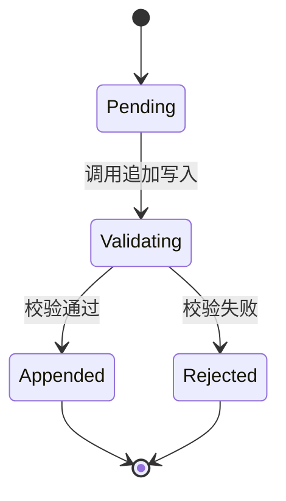

# 留痕操作组件规格

本规格承接 DES-003 书简操作组件协议，定义书简的接口契约与验收依据。书简操作 trail 物理载体，trail 的物理存储约束归 DEC-001，组件协议归 DES-003 第 81 行起的 trail 物理载体与书简操作组件两节，本规格定义书简作为可独立验收工程单元的接口与验收标准。书简的命名归 DEC-004。

本规格承接 GOV-001 三条设计约束。FM-04 人类只在视图告警时介入，书简须支持异常信号聚合不要求人类逐条审计。FM-05 区分可消费事件与仅记录事件，仅记录事件不进入人类视图。FM-09 写入权限归确定性程序，LLM 产出在写入前须经确定性校验。

## 概览 {#overview}

- 书简提供三个接口，追加写入、哈希链校验、事件检索::[接口签名](#interface-signature)
- 事件数据结构含核心字段、操作者子结构、哈希链字段、事件分类字段::[数据契约](#data-contract)
- 单次写入操作经待写入、校验中、已追加或被拒绝四态::[状态转换](#state-machine)
- 四条验收依据，不可篡改、写入权限、写入前校验、事件分类::[验收依据](#acceptance-criteria)
- 事件类型按治理环层、会话任务层、工具线测量层三级组织::[事件类型层级](#event-type-hierarchy)
- 度量权威归确定性程序，LLM 不可作为操作者写入治理操作事件::[写入权限约束](#write-authority)

## 接口签名 {#interface-signature}

书简的接口含三个入口，一个写入入口、一个校验入口、一个检索入口。

### 追加写入入口 {#append-entry}

追加写入入口接收一个待写入事件，执行写入前确定性校验，校验通过则追加到 trail 末尾并返回写入确认，校验失败则拒绝写入并返回拒绝原因。

追加写入入口的输入。event 即待写入事件，含事件类型、操作者、负载即 details、时间戳。写入前校验项见验收依据的写入前校验条。

追加写入入口的输出。成功时返回 AppendResult，含事件 ID、事件哈希、写入时间戳。失败时返回 AppendError，覆盖事件 ID 重复、时间戳非单调递增、前事件哈希不匹配、操作者标识非法四类错误。

追加写入入口的调用权限归确定性程序。LLM 不可直接调用此入口，LLM 产出的符号材料须经确定性程序校验后由确定性程序写入。此约束承接工程基线第一条与 FM-09。

### 哈希链校验入口 {#verify-entry}

哈希链校验入口接收校验范围，验证哈希链完整性，返回校验结果。

哈希链校验入口的输入。range 即校验范围，取值全量校验或区间校验。全量校验从 trail 首行验证到末行。区间校验从指定事件 ID 验证到指定事件 ID。

哈希链校验入口的输出。成功时返回 VerifyResult，含校验事件数、首事件哈希、末事件哈希、校验时间戳。失败时返回 VerifyError，覆盖哈希链断裂即某事件的 prev_hash 与前一事件的 event_hash 不一致、事件 ID 缺失即无法定位校验起点两类错误。

### 事件检索入口 {#query-entry}

事件检索入口接收检索条件，返回匹配的事件集合。此入口承接 FM-04 的异常信号聚合需求，视图组件在第二阶段通过此入口聚合异常信号，第一阶段人类通过此入口直接查询 crosscheck_completed 事件。

事件检索入口的输入。filter 即检索条件，支持按事件类型、按操作者标识、按时间区间、按关联文档 ID 检索。aggregate 即聚合选项，支持按事件类型计数、按操作者计数、按时间窗口分桶计数。

事件检索入口的输出。返回 EventList，含匹配事件集合与匹配总数。检索不修改 trail，只读操作。

## 数据契约 {#data-contract}

### 事件核心结构 {#event-core}

事件是 trail 的基本单元，每行一个事件，采用 JSON 序列化的单行文本。trail 物理存储承接 DEC-001 物理存储最小约束第 280 行，事件层文件以文本流式追加承载，人类可读，不依赖专有工具。

事件核心结构的必须字段。event_id 即事件 ID，全局唯一。event_type 即事件类型，取值见事件类型层级。timestamp 即时间戳，ISO 8601 格式，trail 内单调递增。actor 即操作者，是 DES-003 第 87 行操作者标识字段的子结构展开，依据当前 trail 文件的实际结构。details 即负载，即 DES-003 第 87 行所指负载，字段名对照 trail 实际文件使用 details，承载事件的变更摘要、描述、状态变更等信息。doc_id 即关联文档 ID，承接 DES-003 第 87 行，用于跨事件串联同一治理对象的生命周期。prev_hash 即前事件哈希，承接 DES-003 第 89 行哈希链定义。event_hash 即本事件哈希，承接 DES-003 第 89 行哈希链定义，由本事件除 event_hash 外的全部字段计算得出。

事件核心结构的可选字段。event_class 即事件分类，取值可消费或仅记录，承接 FM-05，详见事件分类字段。verification_result 即校验结果，部分事件类型承载，如写入操作事件的校验通过与否记录。

details 字段的必须性例外。details 对多数事件类型是必须字段，承载事件的实质内容。会话启动类事件即 session_open，其 actor 子结构已标识操作者，details 可省略。当前 trail 文件中存在 details 缺失的历史事件，属过渡态即早期 task_completion 事件的 details 缺失，新写入事件按事件类型规则填写 details。

### 操作者子结构 {#actor-structure}

操作者子结构标识事件的发起主体。

操作者子结构的必须字段。actor_id 即操作者标识，须为合法的人类标识或确定性程序标识。actor_type 即操作者类型，取值人类或代理或系统。invoked_via 即调用途径，标识操作者通过何种方式触发此事件。

操作者合法性约束。actor_type 取值代理时，该代理须是确定性程序调用的执行者，不是 LLM 直接调用。LLM 不可作为操作者标识写入治理操作事件，此硬约束承接 FM-01 禁止条款。写入前确定性校验的执行机制承接 FM-09 设计约束。两层归因的完整说明见写入权限约束。

### 哈希链结构 {#hash-chain}

哈希链是 trail 不可篡改性的落地机制。

哈希链的计算规则。每个事件的 event_hash 由该事件除 event_hash 字段外的全部必须字段与可选字段序列化后计算哈希得出。首个事件的 prev_hash 取全零值。后续每个事件的 prev_hash 取前一个事件的 event_hash。

哈希链的验证规则。从首事件开始，逐个验证每个事件的 prev_hash 是否等于前一事件的 event_hash。任一环节不匹配则哈希链断裂，校验失败。

哈希链的不可篡改保证。篡改任一历史事件的任何字段，该事件的 event_hash 改变，导致后一事件的 prev_hash 不匹配，校验暴露篡改。这是可验证性约束的操作历史不可篡改的落地，承接 convergence 层 P4.2 责任归属的四个可即可追溯与可审计与可反驳与可继承。

当前 trail 文件的哈希链状态。trail/2026-07-27.ndjson 已实现完整哈希链，event_hash 与 prev_hash 字段非空且链式一致。trail/2026-08-03.ndjson 与 trail/2026-08-06.ndjson 的哈希字段为空字符串，是手动阶段写入未实现哈希计算的过渡状态。SPEC-004 定义完整哈希链规格，当前空哈希是历史遗留，待工具链迁移后由确定性程序补齐。

### 事件分类字段 {#event-classification}

事件分类字段承接 FM-05 的设计约束，区分可消费事件与仅记录事件。FM-05 在 GOV-001 的原始落地位置是参验组件协议设计，本规格在书简组件层承接其事件分类维度，即书简须支持区分可消费事件与仅记录事件，使下游视图组件能按此分类过滤。FM-05 的视图告警阈值维度归视图组件职责，书简不承载。

可消费事件。event_class 取值可消费，该类事件构成决策依据，进入人类视图。典型场景是 crosscheck_completed 事件的偏差记录，人类须介入处理偏差。

仅记录事件。event_class 取值仅记录，该类事件构成治理操作的完整留痕但不构成决策依据，不进入人类视图。典型场景是 intent_anchored 事件的常规写入、symbol_generated 事件的常规产出，无偏差时人类不需介入。

事件分类与预警信号的关系。预警信号即仅供人类过滤但不构成治理操作的状态通知，不写入 trail，归视图组件内部状态。此区分承接 DES-003 trail 物理载体不承载仅供人类过滤的预警信号，与 FM-08 预警若不构成决策依据归入仅记录事件的关系是：仅记录事件是治理操作写入 trail 但不进人类视图，预警信号不是治理操作不写入 trail。

当前 trail 文件的事件分类状态。当前 trail 文件未填写 event_class 字段，是手动阶段的过渡状态。SPEC-004 定义此字段，新写入事件须填写，历史事件的分类待工具链迁移后回填。

## 事件类型层级 {#event-type-hierarchy}

事件类型按三个层级组织。治理环层承接 DES-003 的四节点定义，会话任务层承接当前 trail 文件的实际使用，工具线测量层承接书简外切孵化的认证事件定义。三级事件类型共存于同一 trail，按 event_type 字段区分。

### 治理环事件类型 {#governance-loop-events}

治理环事件类型承接 DES-003 第 87 行定义，对应第一阶段治理环四节点。

intent_anchored 即意图锚定事件。意图声明写入知识包时产生，负载含意图 ID、持有者标识、意图声明哈希。

intent_revised 即意图修订事件。意图声明被修订时产生，负载含旧意图 ID、新意图 ID、修订理由。

symbol_generated 即符号材料生成事件。LLM 产出符号材料时产生，负载含材料 ID、关联意图 ID、生成者标识、材料内容哈希。

crosscheck_completed 即参验完成事件。参验完成时产生，负载含差异事实与偏差记录或通过记录、关联材料 ID、关联意图 ID、校验规则版本，负载结构依据见 DES-003 第 77 行。时间戳作为事件元数据在事件核心结构承载，不放入负载。事件类型名经 DEC-002 子决策三修正，参验英文对为 crosscheck。

治理环事件类型尚未在当前 trail 文件中实际出现。第一阶段治理环四节点的自动化未完成，当前 trail 文件主要承载会话任务层事件。治理环事件类型的实际使用待工具链迁移后随治理环自动化承载。此为阶段状态，非规格缺陷。

### 会话任务层事件类型 {#session-task-events}

会话任务层事件类型部分承接当前 trail 文件的实际使用，对应治理环外层的会话与任务管理。

session_open 即会话开始事件。会话开始时产生，负载含会话 ID、操作者标识。

session_close 即会话结束事件。会话结束时产生，负载含会话 ID、会话摘要。

task_completion 即任务完成事件。治理任务完成时产生，负载含任务描述、变更摘要、状态变更。

inconsistency 即不一致事件。反向校验发现本会话所述治理动作与 trail 实际记录不匹配时产生，负载含不一致描述、涉及文档 ID。

会话任务层事件类型在当前 trail 文件中的实际使用状态。task_completion 已在全部 trail 文件中实际使用，trail/2026-07-27.ndjson 承载 6 条，trail/2026-08-03.ndjson 承载 7 条，trail/2026-08-06.ndjson 承载 3 条。session_open、session_close、inconsistency 三类事件尚未在任何 trail 文件中出现，是本规格定义的预留事件类型，待对应场景的自动化承载。此标注标准与治理环事件类型一致。

### 工具线测量层事件类型 {#tool-line-measurement-events}

工具线测量层事件类型承接 sih-tools/scribe/CONTRACT.md 的认证事件定义，经书简外切孵化引入，2026-08-22 连带改写合流并入本层级。定义权威在工具仓契约，本节为引擎侧登记。

certification_completed 即认证完成事件。书简消费核阅与 facet 的报告文件时产生，负载含报告路径、报告自身哈希、规约包版本清单、目标内容哈希清单、发现或结论计数、显式退出码、工具版本、golden 基线版本八项。event_class 固定取值仅记录，认证事件构成测量留痕不构成决策依据，偏差介入走报告侧与退出码侧，不走事件侧。操作者为书简自署即 actor_id 取 scribe、actor_type 取 system、invoked_via 取 cli。

工具线测量层事件的当前状态。工具线 trail 由书简写入，哈希公式与本规格哈希链结构同源即 compute_event_hash 单源权威并以 golden 对拍为写权限前置，融回时链并入引擎 event_stream 非重建。此为阶段状态。

## 状态转换 {#state-machine}

状态机描述单次写入操作的生命周期，承接 FM-09 的写入前校验设计约束。

Pending 是待写入态。事件已构造，等待调用追加写入入口。

Validating 是校验中态。追加写入入口已接收事件，正在执行写入前确定性校验。校验项含事件 ID 全局唯一、时间戳单调递增、prev_hash 匹配、操作者标识合法。

Appended 是已追加态。校验通过，事件已写入 trail 末尾，哈希链已延伸，返回事件 ID 与事件哈希。

Rejected 是被拒绝态。校验失败，事件未写入 trail，返回拒绝原因。被拒绝的事件不产生任何留痕，须修正后重新构造事件重新提交。

状态不可逆退。Appended 态不可回退，已写入事件不可改写或删除。Rejected 态不可回退，被拒绝的事件须重新构造而非恢复。

## 验收依据 {#acceptance-criteria}

### 不可篡改性 {#immutability}

不可篡改性验收。trail 的哈希链须保证操作历史不可篡改。

验收判据有三条。第一条，哈希链完整。从首事件到末事件，每个事件的 prev_hash 等于前一事件的 event_hash。第二条，篡改可检测。篡改任一历史事件的任何字段，哈希链校验入口须返回断裂错误。第三条，只追加写。trail 物理存储只支持追加写操作，不支持改写历史行与删除已写入事件。

此验收承接可验证性约束的操作历史不可篡改，承接 DEC-001 物理存储最小约束的事件层只能追加写。

### 写入权限 {#write-authority}

写入权限验收。trail 的写入操作须由确定性程序执行，LLM 不可作为操作者。

验收判据有三条。第一条，操作者合法性。所有事件的 actor.actor_type 取值为人类或代理或系统，代理类型须对应确定性程序调用的执行者。第二条，LLM 排除。事件的 actor 字段不可取 LLM 实例标识，LLM 产出的符号材料须经确定性程序写入。第三条，调用入口限制。追加写入入口的调用方须为确定性程序，LLM 不可直接调用。

写入权限的硬约束与写入前校验的执行机制是两层。写入权限的硬约束即 LLM 不可作为操作者写入，承接工程基线第一条与 FM-01 禁止条款，属范畴归属层禁止条款不可放宽。写入前校验的执行机制即写入前确定性校验，承接 FM-09 设计约束，属实现方式层设计约束。两层的关系是：FM-01 定 LLM 不可写入的方向，FM-09 定写入前如何校验的机制，本验收第二条承接 FM-01，第三条与写入前校验节承接 FM-09。

此验收承接工程基线第一条确定性程序是治理操作的唯一执行者，承接 FM-01 的禁止条款。

### 写入前校验 {#pre-write-validation}

写入前校验验收。事件写入前须经确定性校验，不依赖人类事后拒绝。

验收判据有三条。第一条，校验前置。追加写入入口在写入前执行全部校验项，校验失败的事件不写入。第二条，校验确定性。校验项由确定性规则承载，同一输入同一输出，不依赖人类判断。第三条，校验覆盖。校验项覆盖事件 ID 唯一、时间戳单调递增、prev_hash 匹配、操作者合法四项。

此验收承接 FM-09 的设计约束，承接关系见写入权限节的层级说明。

### 事件分类 {#event-classification-acceptance}

事件分类验收。书简须区分可消费事件与仅记录事件，仅记录事件不进入人类视图。

验收判据有三条。第一条，分类字段填写。新写入事件须填写 event_class 字段，取值可消费或仅记录。第二条，分类判据确定。事件分类由确定性规则定义，依据事件类型与负载内容判定，不依赖人类逐条审阅。第三条，视图过滤。视图组件在第二阶段按 event_class 过滤，仅记录事件不进入人类视图。

此验收承接 FM-05 的设计约束。第一阶段无视图组件，人类直接通过检索入口查询可消费事件，仅记录事件虽写入但不被人类主动检索。

## 关联 {#relation}

- 组件协议：DES-003 书简操作组件协议，定义最小语义与数据格式与 crosscheck_completed 负载结构
- 元规则：DEC-001 仓库结构决策，定义物理存储最小约束
- 通用规范：DES-001 文档格式设计
- 命名决策：DEC-002 参验命名，crosscheck_completed 事件类型名修正的依据
- 组件命名：DEC-004 书简操作组件命名，载体与组件二层划分
- 前序规格：SPEC-003 参验规格
- 失败推导约束：GOV-001 FM-01 写入权限禁止条款、FM-04 异常信号聚合、FM-05 事件分类、FM-09 写入前校验
- 哲学对照：PRO-08 应而不藏，留痕是应鉴循环的构成性条件
- convergence 层对照：P4.2 责任归属的四个可即

## 认识论立场 {#epistemic-stance}

本规格为设计推论（design-corollary），是工程设计选择，非逻辑必然。

哈希链的不可篡改保证为外部锚定（external-anchor），承接可验证性约束与 convergence 层 P4.2。事件类型层级与事件分类字段为设计推论，是工程约定。

可证伪条件一
: 若实践中哈希链校验发现系统性断裂即非篡改导致的链式不一致，则哈希计算规则或写入前校验须重新审视。

可证伪条件二
: 若实践中事件分类字段无法有效支撑视图过滤即可消费与仅记录的边界模糊导致人类视图过载，则分类判据须重新定义或引入更细粒度分类。

可证伪条件三
: 若实践中治理环事件类型与会话任务层事件类型的共存导致检索困难或语义混淆，则事件类型层级须重新组织或引入层级标识字段。

## 自检 {#self-check}

### 形式合规自检 {#formal-self-check}

- 一级标题无锚点，仅一个
- 二级及以上标题均带锚点
- 首个二级标题命名为概览
- 无破折号、无装饰符号、无 Unicode Emoji
- 全角括号仅用于单一治理编号

### 内容自检 {#content-self-check}

- 四个必选章节齐全，接口签名、数据契约、状态转换、验收依据
- 接口签名以文字描述承载，含三个入口，不含业务围栏代码块
- 数据契约区分事件核心结构、操作者子结构、哈希链结构、事件分类字段，承接 DES-003 数据格式
- 数据契约的字段命名对照 trail 实际文件即 details 即 DES-003 负载、actor 子结构展开 DES-003 操作者标识，doc_id 承接 DES-003 第 87 行，字段定义与 DES-003 同步一致
- 数据契约显式声明物理存储承接 DEC-001 文本流式追加人类可读不依赖专有工具
- 哈希链结构如实标注当前 trail 文件两种状态即 07-27 完整哈希与 08-03 加 08-06 空哈希过渡态
- 事件类型层级按治理环层与会话任务层与工具线测量层组织，治理环类型标注尚未在 trail 实际使用，会话任务层标注 task_completion 已使用而 session_open 加 session_close 加 inconsistency 尚未出现，测量层标注工具线 trail 在役待融回，三级标准一致
- 状态机使用 mermaid 围栏代码块，描述单次写入操作生命周期
- 验收依据按四条分别承载，承接 GOV-001 的 FM-04、FM-05、FM-09 三约束
- FM-05 落地位置显式声明，GOV-001 原始落地是参验组件协议，本规格承接事件分类维度
- 写入权限节显式区分 FM-01 硬约束与 FM-09 执行机制两层，归因口径统一
- crosscheck_completed 负载依据指向 DES-003 第 77 行，事件类型名修正依据指向 DEC-002 子决策三，两依据分开不混
- 事件分类与预警信号的关系明确区分，承接 DES-003 不承载预警与 FM-08 归入仅记录的关系
- 度量权威约束未单列因书简无度量职能，写入权限约束归验收依据第二条

### 自反性结论 {#reflexive-conclusion}

本规格承接 DES-003 书简操作组件协议，定义书简作为可独立验收工程单元的接口与验收依据。本规格接入 GOV-001 三条设计约束即 FM-04、FM-05、FM-09，使其正式成为书简设计的验收判据。本规格如实标注当前 trail 文件的过渡状态即哈希字段空值与事件分类字段缺失，不掩盖阶段差距。本规格本身经过自我审视，未发现违反 DES-001 格式规范的形态。
