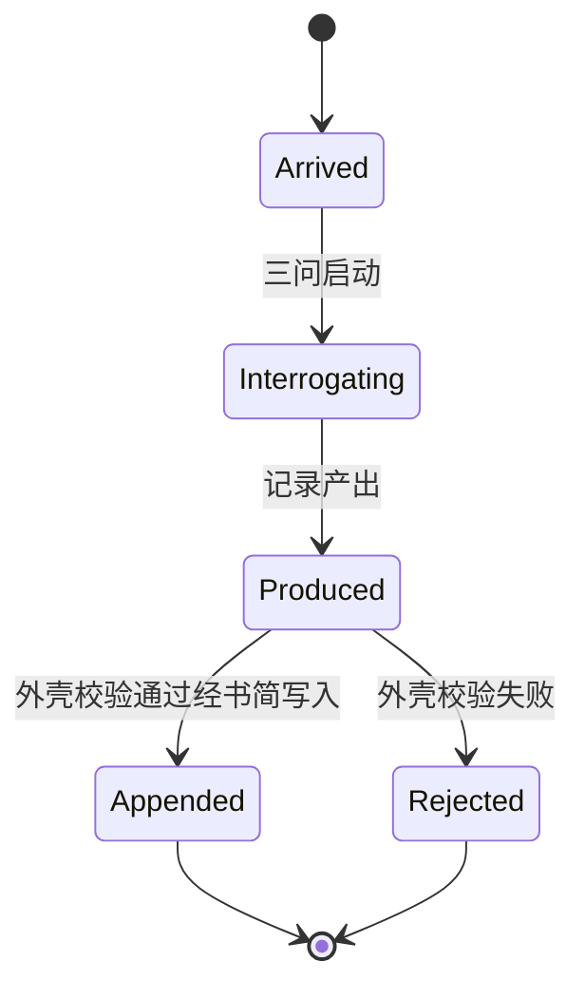

# 三问接口与锚点格式规格

本规格承接 DEC-006 三问组件正式化决策与 DES-013 三问组件设计，定义三问的输入输出契约、推理锚点格式、持久化接线与验收依据。三问的命名归 DEC-006，三层诘察协议与说话口接线归 DES-013，事件流载体归 SPEC-004，本规格定义三问作为可独立验收工程单元的接口与验收标准。

本规格只约束三层诘察的输入输出契约，不约束其认知内部。三层诘察是 LLM 认知过程，提示词编排、内部分轮、推演时序不在本规格定义域内。向内诘察严禁向用户发问，此为契约级刚性约束，输出记录不含任何问题载体字段，产出即收窄后的契约与锚点，承接 00 自愈不成立即 AI 主动审视自己推理过程的工程化。

旧仓三问接口规格与锚点持久化格式两份文档为沉默参考。锚点格式从旧仓七字段模式重推导，不直接迁移，不挂旧仓文档编号与路径。本规格为契约先行定义，本批零代码，确定性外壳与 SPEC-004 事件类型层级的增补随实现批执行。

## 概览 {#overview}

- 输入经说话口到达，输入记录含会话语境与原始输入，形态为 JSON::[意图输入接口](#intent-input-entry)
- 输出是一份记录，含意图契约、推理锚点数组、轮次标记、认知域契约、调用计量::[提炼输出接口](#refine-output-entry)
- 输入记录与输出记录的字段逐一列出，必填性逐一标注::[数据契约](#data-contract)
- 推理锚点九字段从旧仓七字段模式重推导，血统三件套即哲学引文、理据、证据行号保留为一级字段::[推理锚点格式](#anchor-format)
- 低置信节点必须保留在锚点数组并附置信度字段，不设剔除阈值::[禁熔断与置信度](#no-fuse-confidence)
- 持久化经书简 append 写入事件流，三问不独立持有持久化格式，事件类型建议 intent_refined 归仅记录::[持久化接线](#persistence)
- 单次提炼操作经意图已到达、诘察中、记录已产出、已入流或被拒绝五态::[状态转换](#state-machine)
- 确定性外壳为将来工具面，给三值退出码与错误四类，实现批另跑::[确定性外壳](#deterministic-shell)
- 五条验收依据，血统完备、禁熔断、认知域深度、输出形态、调用计量::[验收依据](#acceptance-criteria)

## 接口签名 {#interface-signature}

三问的接口含两个契约面与一个将来工具面。两个契约面即意图输入与提炼输出，由本节定义。将来工具面即确定性外壳的写入前校验接口，见确定性外壳节。

### 意图输入接口 {#intent-input-entry}

意图输入接口接收经说话口到达的自然语言意图，输入形态为 JSON，记录结构见输入记录结构节。手动期正式载体为升格后的 intent-refine skill，说话口接线与 sih 触发协议的协同细节归 DES-013。

意图输入接口无独立输出。输入即触发，三问的产出走提炼输出接口。

### 提炼输出接口 {#refine-output-entry}

提炼输出接口返回一份输出记录，记录形态为 JSON，含意图契约、推理锚点数组、轮次标记、认知域契约、调用计量五部分，记录结构见输出记录结构节。

记录产出后经确定性外壳校验，由书简 append 写入事件流，写入路径见持久化接线节。校验失败的记录不入流，须修正后重新提炼重新提交，状态见状态转换节。

## 数据契约 {#data-contract}

数据契约定义输入记录与输出记录的字段结构。字段逐一列出，必填性逐一标注。

### 输入记录结构 {#input-record}

输入记录的必须字段两项。session_id 即会话标识，字符串，与事件流会话语境同源，输出记录沿用此标识对齐。raw_input 即原始输入，字符串，用户经说话口递交的自然语言意图全文，逐字快照语义即不作预处理，后续回溯以原文为入口。

输入记录的可选字段一项。session_context 即会话语境，对象，承载与本次意图直接相关的语境指针，子字段含 doc_id 即指向的治理文档标识、rule_sources 即本次已加载的约束出处清单。语境只承载指针不复制正文，防信息洪流，承接工程基线第二条。

输入记录不含其他字段。输入长度上限与字符约束不在本规格钉死，归实现批。

### 输出记录结构 {#output-record}

输出记录的必须字段八项，逐项如下。

session_id 即会话标识，逐字沿用输入记录的会话标识，记录自包含即脱离事件流仍可寻址会话。

raw_input 即原始输入快照，逐字复制输入记录的原始输入，固化后不可修改，回放与核验以原文为入口。

round 即轮次标记，整数，本次意图提炼在会话内的序号，从 1 起。同会话内回流信号触发的再提炼递增，单轮即典型态。

intent_contract 即意图契约，对象，收窄后的精确生成契约，字段见意图契约字段节。

domain_contract 即认知域契约，对象，目标域与支撑域的深度限制，字段见认知域契约字段节。

anchors 即推理锚点数组，每元素是一颗推理锚点，格式见推理锚点格式节。长度下限一，即一问至少析出一条显层命题。

calls_in 即进入计数，整数，进入三问时点的会话内 LLM 调用计数。

calls_out 即离开计数，整数，记录产出时点的会话内 LLM 调用计数。

调用计数的口径细则与度量方案归 DES-013，本规格只钉两字段的存在与必填性。两字段的差值即三问自身消耗的调用量，工程基线第五条要求三问只约束已有调用不增加调用总量，若差值系统性为正即触发 DEC-006 可证伪条件二。

### 意图契约字段 {#intent-contract-fields}

意图契约承接 intent-refine skill 已验证的提炼三动作产出形态即意图边界、任务格式、约束注入，重推导为四子字段。

goal 即正向目标，字符串，本次生成做什么，一句话。

exclusions 即显式排除项，数组，元素为字符串，本次生成不做什么。无排除时为空数组，不得缺省，显式声明排除是收窄的负向半边。

output_format 即任务格式，字符串，该任务类型的产出形态约束，如提案需候选与拒绝理由、决策需决策集与备选案。

injected_constraints 即约束注入，数组，元素为字符串，每项是一条约束的出处即哲学仓命题或已立治理文档。承接从命题出发生成的前向约束，出处须可定位可核验。

意图契约是收窄后的精确生成契约，不是问题清单。严禁外问的契约级落地即此对象不含任何问题载体字段，任何以问题形态填充契约的行为即契约违例。

### 认知域契约字段 {#domain-contract-fields}

认知域契约承接目标域与支撑域二层划分。目标域即本次诘察的最终意图所在，支撑域即辅助推理的旁支命题所在。

target_domain 即目标域，对象。scope 即范围陈述，字符串。max_depth 即深度上限，整数。

support_domain 即支撑域，对象。scope 即范围陈述，字符串。max_depth 即深度上限，整数。

深度限制双检。第一检声明上限，support_domain 的 max_depth 不得超过 target_domain 的 max_depth。第二检实际深度，记录内全部支撑域锚点的 depth 最大值不得超过全部目标域锚点的 depth 最大值。单检声明则实际可越界，单检实际则无上限防护，双检互锁。此约束承接道四间隙不可消除的工程化即深度限制不消除旁支只约束其发散。

### 推理锚点格式 {#anchor-format}

推理锚点是三问的责载体，每个推演节点必须产出锚点并移交。锚点格式从旧仓七字段模式重推导。旧模式七段即标识、会话、契约挂靠、时间戳、触发、前驱、负载，本规格保留标识与内容两段的紧凑性，负载的未定形内容拆解为命题文本与血统三件套的定形字段，会话与时间戳上移至记录与事件两级，契约挂靠与触发与前驱不迁移。锚点字段九个，逐项如下。

anchor_seq 即锚点序号，整数，记录内从 0 起单调递增。跨记录寻址经事件 ID 加锚点序号组合，锚点自身不持有全局标识格式。

text 即命题文本，字符串，该推演节点析出的命题陈述。显层诉求、隐含前提、细化子命题均以一句话承载。

inquiry_stage 即诘察阶段，枚举 first、second、third。一问析出显层记 first，二问挖掘隐含记 second，三问递归细化记 third，三问内的更深递归仍记 third。

domain_tag 即域标签，枚举 target、support，与认知域契约对应，每颗锚点归其一。

depth 即深度，整数，显层命题记 0，每递归细化一层增一，供深度双检第二检机械计算。

philosophy_ref 即哲学引文，对象。source 即哲学仓出处，字符串，取哲学仓文件路径加节名或已立命题编号。quote 即原文摘录，字符串，逐字摘录。血统第一件。

rationale 即理据，字符串，该命题为何成立、如何参与意图收窄。血统第二件。

evidence 即证据行号，字符串，指向可机械定位的文本位置，取原始输入行号或仓内文件路径加行号区间。血统第三件。

confidence 即置信度，数值，取值区间 0.0 到 1.0，禁熔断的载体字段，低置信如实取低值。

血统三件套的核验性。哲学引文的摘录须与哲学仓原文逐字一致，出处须指向存在的文件与节，证据行号须落在所指文本的实际区间内。三者均可由确定性程序机械核验，不可核验的血统即确定性外壳的血统不可核验类错误。血统必填即无出处的命题没有锚点资格，承接从命题出发生成的构成性约束。同一会话的多颗锚点可引同一命题，引文不要求每节点独占。

锚点不持有的字段。锚点不持有会话标识与时间戳，记录与事件两级承载。锚点不持有链式字段即前驱指针与跨会话指针，哈希链与排序归书简，承接 SPEC-004。锚点不持有父节点指针，推演树形不持久化，审计以节点血统承载不以树形承载。锚点不持有触发条件与状态快照，旧仓状态机与渐进契约机制不迁移。

### 禁熔断与置信度 {#no-fuse-confidence}

禁熔断为刚性约束，承接 DEC-006 责权拆分。低置信节点必须保留在锚点数组，不得因置信度低而剔除、合并或降格。置信度字段如实取值，不设剔除阈值，即任何置信度的锚点都进入数组。

禁熔断保障推演因果链路完整，低置信节点是鉴层抽检与回放比对的重点对象而非删除对象。禁熔断的违例即节点缺失不由外壳机械判定，缺失的节点不在记录内无从发现，此限制如实声明，由鉴层抽检守护，外壳只校验在场节点的血统可核验性。

## 持久化接线 {#persistence}

### 事件类型与分类 {#event-type}

三问不独立持有持久化格式。推理锚点随输出记录整体持久化，路径是输出记录序列化装入 intent_refined 事件的 details 字段，经书简 append 写入事件流。

intent_refined 是本规格建议的新事件类型，归属 SPEC-004 事件类型层级的治理环层，时序位于意图锚定与符号材料生成之间。event_class 固定取值仅记录，意图提炼的常规产出构成治理操作的完整留痕但不构成决策依据，不进入人类视图，人类不逐条审阅意图提炼记录，承接工程基线第三条人类注意力只投向异常信号。异常介入走鉴层抽检与回放比对，不走事件侧。

SPEC-004 事件类型层级的增补即 intent_refined 条目的正式登记，随实现批执行，本批不改 SPEC-004。本节为建议位，实现批若裁定归层不同，以实现批修订为准。

### 经书简写入 {#scribe-append}

写入权限承接 DEC-006 责权拆分。三问不持有写入权限，输出记录经确定性外壳校验后由确定性程序调用书简追加写入入口写入，LLM 不可作为操作者写入，承接工程基线第一条与 SPEC-004 写入权限约束。确定性外壳将来若外切为独立工具，其写入仍须经书简，不留双写入口。

事件的封套字段即事件标识、事件类型、操作者、时间戳、关联文档标识、哈希链字段，承接 SPEC-004 事件核心结构，本规格不重复定义。手动期记录由代理经升格 skill 产出，写入仍走书简。

## 状态转换 {#state-machine}

状态机描述单次提炼操作的生命周期，即意图到达至记录入流的可观测过程。诘察内部不在状态机定义域。

Arrived 是意图已到达态。输入记录经说话口到达，等待三问启动。

Interrogating 是诘察中态。三层诘察执行中，此态的内部过程不受本规格约束。

Produced 是记录已产出态。输出记录已生成，待确定性外壳校验。

Appended 是已入流态。校验通过，记录经书简写入事件流，intent_refined 事件产生。

Rejected 是被拒绝态。外壳校验失败即错误四类任一命中，记录未入流，须修正后重新提炼重新提交。

状态不可逆退。Appended 态不可回退，已入流记录不可改写。Rejected 态不可回退，被拒绝记录须重新提炼而非恢复。回流信号触发的再提炼是 round 递增的新一轮记录，不是旧记录的恢复。

## 确定性外壳 {#deterministic-shell}

确定性外壳是三问将来外切的确定性程序，职能是输出记录的写入前校验与经书简写入。外壳不执行诘察、不生成记录、不裁决记录内容真伪，只核验结构与血统的可核验性。本节为将来工具面的契约先行定义，实现批另跑，本批零代码。

### 三值退出码 {#exit-codes}

退出码三值。零即记录校验通过且经书简写入成功。一即校验发现违例，错误四类任一命中，记录未入流。二即工具自身异常，含输入记录不存在与 JSON 形态不可解析。

退出码承载结果不承载裁决，记录是否采信归鉴层。

### 错误四类 {#error-categories}

第一类形态错误。必填字段缺失或类型不符，覆盖输出记录八字段、锚点九字段、意图契约四子字段、认知域契约两域的存在性与类型校验。

第二类契约违例。锚点数组为空、认知域深度双检任一失败、诘察阶段或域标签取值越出枚举。

第三类血统不可核验。哲学引文出处不存在或摘录与原文不一致、证据行号越界或不可定位。

第四类调用计量异常。calls_in 与 calls_out 缺失、非整数、或 calls_out 小于 calls_in。

禁熔断不在外壳可判定域，缺失节点不在记录内无从校验，此限制承接禁熔断与置信度节，由鉴层抽检守护。

## 验收依据 {#acceptance-criteria}

### 血统完备性 {#lineage-completeness}

血统完备性验收。每颗锚点的血统三件套齐备且可机械核验。

验收判据有三条。第一条，三件套必填，哲学引文、理据、证据行号任一缺失即形态错误，外壳拒绝。第二条，引文可比对，哲学引文的摘录与哲学仓原文逐字一致，出处指向存在的文件与节。第三条，行号可定位，证据行号落在所指文本的实际区间内，机械复核不依赖人类判断。

### 禁熔断 {#no-fuse}

禁熔断验收。低置信节点保留在锚点数组。

验收判据有三条。第一条，无剔除阈值，置信度任何取值的锚点均进入数组，规格与外壳均不设剔除线。第二条，低置信如实，置信度字段取值反映实际判断，低置信节点不得被拔高。第三条，抽检守护，禁熔断违例即节点缺失由鉴层抽检与回放比对守护，比对基准是轮次记录与原始输入快照。

### 认知域深度 {#domain-depth}

认知域深度验收。支撑域深度不得超过目标域深度。

验收判据有两条。第一条，声明上限，support_domain 的 max_depth 不超过 target_domain 的 max_depth，外壳静态计算。第二条，实际深度，全部支撑域锚点的最大 depth 不超过全部目标域锚点的最大 depth，外壳静态计算。双检任一失败即契约违例类错误。

### 输出形态 {#output-shape}

输出形态验收。输出是契约与锚点，不是问题清单。

验收判据有三条。第一条，严禁外问，输出记录不含问题载体字段，意图契约的字段值不得是疑问形态。第二条，契约完备，意图契约四子字段齐备，无排除时排除项以空数组显式声明。第三条，快照固化，raw_input 逐字快照且固化后不可修改，回放以原文为入口，契约与原文的对照可复核。

### 调用计量 {#call-count}

调用计量验收。记录必含调用计数字段，供 DEC-006 LLM 边界决策的度量与 DES-013 的度量方案消费。

验收判据有三条。第一条，字段必填，calls_in 与 calls_out 必填且为整数。第二条，单调，calls_out 不小于 calls_in。第三条，口径归设计，计数口径细则与度量方案归 DES-013，若实测差值系统性为正即三问实际增加了 LLM 调用总量，违反工程基线第五条，触发 DEC-006 可证伪条件二，组件形态须重审。

## 关联 {#relation}

- 正式化决策：DEC-006 三问组件正式化，形态裁定、责权拆分、LLM 边界、说话口接线的权威源
- 组件设计：DES-013 三问组件设计，三层诘察协议、调用计量口径、skill 载体协同
- 载体规格：SPEC-004 事件流规格，书简接口、事件分类、事件类型层级
- 组件协议：DES-003 第一阶段组件协议，书简操作组件协议
- 提案源：PRO-003 三问组件设计方向提案，候选三裁决与锚点模式实证补充
- 手动载体：sihankor-intent-refine skill，升格修订随本批执行
- 沉默参考：旧仓三问接口规格与锚点持久化格式两份文档，七字段模式出处，重推导不迁移
- 哲学对照：PRO-08 应几为主与留痕构成性、00 自愈不成立即向内诘察、道四间隙不可消除即识别记录不消除
- convergence 层对照：P3.2 外化管理，锚点血统与调用计量的可核验性对照基础

## 认识论立场 {#epistemic-stance}

本规格为设计推论（design-corollary），是工程设计选择，非逻辑必然。

锚点血统三件套与禁熔断为外部锚定（external-anchor），承接 PRO-08 留痕构成性与可验证性约束，convergence 层 P3.2 外化管理为其对照基础。九字段集、深度双检、事件类型建议为设计推论，是工程约定。

可证伪条件一
: 若血统三件套与意图契约的必填项在实测中普遍退化为形式填写，即引文与原文不一致、排除项恒空数组、约束注入恒同一条，则字段集须重推导或引入写入前强制核验。

可证伪条件二
: 若调用计量差值系统性为正，即三问实际增加 LLM 调用总量，违反工程基线第五条，触发 DEC-006 可证伪条件二，组件形态须回退重审。

可证伪条件三
: 若认知域深度双检在实践中频繁误伤合法支撑推理，即合理旁支被深度上限压浅，则深度口径须重新校准。

## 自检 {#self-check}

### 形式合规自检 {#formal-self-check}

- 一级标题无锚点，仅一个
- 二级及以上标题均带锚点
- 首个二级标题命名为概览
- 无破折号、无装饰符号、无 Unicode Emoji
- 全角括号仅用于论证引用

### 内容自检 {#content-self-check}

- 四个必选章节齐全，接口签名、数据契约、状态转换、验收依据
- 输入经说话口到达，输入记录两必须字段加一可选字段，形态为 JSON
- 三层诘察只约束输入输出契约不约束认知内部，严禁外问以输出记录不含问题载体字段落地
- 输出记录八字段逐一列出，意图契约四子字段、认知域契约双域、锚点数组、轮次标记、调用计量两字段
- 锚点九字段从旧仓七字段模式重推导，血统三件套即哲学引文、理据、证据行号保留为一级字段且必填可机械核验
- 持久化经书简 append 写入事件流，三问不独立持有持久化格式，intent_refined 建议归治理环层，event_class 固定取值仅记录
- SPEC-004 事件类型层级增补随实现批执行，本批不改 SPEC-004
- 支撑域深度不得超过目标域深度，声明上限与实际深度双检
- 禁熔断即低置信节点必留并附置信度字段，不设剔除阈值，外壳不可判定域如实声明
- 确定性外壳给三值退出码与错误四类，注明实现批另跑本批零代码
- 旧仓链式字段、契约挂靠、触发条件、状态机、旁路、命题来源分类均不迁移，不迁移项在锚点格式节显式声明
- 调用计量口径归 DES-013，本规格只钉字段存在与必填性

### 自反性结论 {#reflexive-conclusion}

本规格承接 DEC-006 与 DES-013 的分工，把三问的输入输出契约与推理锚点格式钉死为可独立验收的工程单元。本规格如实标注本批零代码与实现批边界，即确定性外壳与 SPEC-004 事件类型层级增补不在本批执行。本规格本身经过自我审视，未发现违反 DES-001 格式规范的形态。

## 内容充分性 {#sufficiency}

- 本节为 docmath-b4-solo 收尾批按新旧都管裁定补齐，模板见 SPEC-TEMPLATE-sufficiency-v1，只加节不改本文实质。
- 判据红证对表：本文判据条目见 接口签名、数据契约、持久化接线、状态转换等节。按证伪覆盖度载体如实申报：历史判据清单未逐件附可构造红证即零信息部分，清账路径为后继修订批逐件补红证，承 sih-math/docs/docmath-carriers-derivation-2026-09-04.md。
- 判定性常数挂锚对表：本文档无声明的判定性常数。des-001 C007 与 C008 与 C009 行级与邻近级闸在役核验。
- 约束算子对表：本文无约束算子面，如实申报。
