# 司衡引擎对话记录

你好
我们被要求用中文回复。用户说“你好”，这是一个简单的问候。应该友好回应，并介绍自己，说明能力范围。保持热情、有帮助的语气。

你好！😊

很高兴见到你！我是DeepSeek，由深度求索公司创造的AI助手，随时准备帮你解答问题、提供建议或陪你聊天。

无论你想了解什么——学习、工作、生活中的疑问，还是需要创意灵感、技术帮助，或者只是想找个人说说话，我都在这里。我会尽力用热情、细腻的方式回应你。

今天有什么我可以帮你的吗？

我需要你帮我做一个工程落地的设计
我们需要理解用户的需求：“我需要你帮我做一个工程落地的设计”。

这是一个非常宽泛的请求。“工程落地的设计”可能指各种工程领域的设计，比如软件工程、土木工程、机械工程、电气工程等。“落地”可能意味着从概念到实际可实施的方案。用户没有提供任何具体上下文。所以我需要先澄清，询问用户具体是什么类型的工程，目标是什么，有什么具体要求等。但作为AI助手，我不能直接说“我不知道”，而应该引导用户提供更多细节，让对话继续下去。

我可以这样回答：首先表示乐意帮助，但需要更多信息，比如工程类型（软件架构、土木建筑、系统集成等），具体要设计什么系统或项目，有什么约束条件、目标、规模等等。然后我可以提供一些可能的方向并请用户明确。这样既回应了用户，又为进一步沟通铺路。

注意：用户可能是在测试我，或者真的有一个项目。我应该积极引导。同时保持热情、细腻。所以，我会说：“很高兴你来找我做工程落地设计！不过，为了能给你提供真正有帮助的方案，我需要先了解更多细节哦～” 然后列出一些关键问题，如：工程领域、项目目标、规模、现有条件、落地难点等。这样应该合适。

太好了，很乐意帮你一起做一个真正能落地的工程设计。

不过“工程落地的设计”这个范围很广，为了能给你拿出一份高质量、可执行的方案，我需要先和你对齐一些关键信息。你可以看看下面几点，挑你方便的回答就好：

工程领域是哪一类？
比如：软件系统架构、后端/前端技术落地、硬件嵌入式、土木建筑、机械装置、自动化产线，还是跨领域的综合工程？

这个项目要解决什么问题？
最好用一两句话概括目标，例如：“做一个支持10万并发的直播推荐系统”、“设计一条日处理500吨的污水处理工艺”。

目前处于什么阶段，有哪些基础？
是从零开始的需求分析，还是已有原型需要做可落地的工程化改造？有没有现有系统、技术栈、场地、设备等约束？

规模、性能或合规等关键指标
比如要支撑多少用户/数据量，对成本、周期、安全、法规有什么硬性要求？

你最关心的“落地”难题是什么？
是技术选型、流程设计、部署方案、成本控制，还是从设计到施工/开发的衔接细节？

你可以直接用一段话描述你的项目背景，想到什么就说什么，不必拘泥于格式。我会根据你给的信息，先帮你梳理整体设计思路，再深入具体的架构、流程、关键节点和风险预案，保证每一步都是能直接指导落地的内容。

期待你的项目情况，我们一起把它推进下去～

软件工程存在了 70 年。人类写代码、审代码、维护代码。这套体系虽然有缺陷，但能运转，因为生产主体与消费主体共享一套认知基底：语言、文化、时间、共同的经验、共同的工具。当甲某写代码给乙某看时，他们之间有一条隐性的、不需要明说的"共识通道"。近十年，引入了新的生产主体：人工智能（AI）或者大语言模型（LLM = Large Language Model）。人工智能不是人类。它没有与人共享的认知基底。它通过模式匹配从训练数据中生成代码：它见过很多代码，但"见过"与"理解"不同。
这产生了一个新的结构性问题：

- 人工智能可以生成代码，但其生成过程不携带对人类意图的理解
- 人类审查者必须在人工智能不理解的情况下补全这个理解
- 审查者的认知资源是有限的，人工智能的生成速度不受限
- 这种不对称是结构性的：人工智能越强，生成越快，裂痕越大

在没有外部干预的情况下，这道裂痕会自我放大：

- 人工智能生成的代码越多，审查者需要补全的理解越多
- 审查者的注意力被稀释，质量下降
- 质量下降导致更多"看起来对但意图错位"的代码进入系统
- 这些代码成为后续人工智能生成的新训练信号（通过微调、检索增强、上下文等）

人类写代码的旧体系能自愈，因为人类会反思、会抗议、会拒绝。人工智能不会。人工智能不会拒绝自己的生成物，也不会因为"觉得这不对"而停手。

要阻止裂痕扩大，必须有一个外在于人工智能生成循环的、独立运作的治理实体，我称它为司衡（SiHankor）。

以上是项目背景。我需要你能理解并且记忆。

- 裂痕在反馈循环中自我强化
好的，用户这次提供了非常详细的背景阐述，不是提问，而是分享一个关于软件工程演变的深刻洞察。他描述了一个核心矛盾：AI作为新的“生产主体”，因其缺乏与人类的共享认知基底，导致代码生成和审查之间出现结构性的“理解裂痕”，并且这个裂痕会通过反馈循环自我强化。

嗯，我需要先确认我已经完全理解了用户的理论。他指出了旧体系（人人协作）基于共享认知基底能运转，而新体系（人机协作）因为AI的“不理解但能生成”特性，产生了注意力不对称和恶性循环。他提出了“司衡”这个概念作为外部的治理实体。最后一句“裂痕在反馈循环中自我强化”是核心机制。

用户深层需求可能不仅仅是让我“理解并记忆”这段文字，而是希望我真正消化这个思想实验，并基于此进行下一步的、有深度的对话。他可能在构建一个理论框架或设计方案，需要我这个“思考伙伴”能跟他同频。

那么，我的回应不能是简单的“明白了”或复述。我需要用更结构化的方式重述他的理论，证明我确实抓住了本质——不是代码质量或安全漏洞这些表象，而是意图对齐和反馈回路的根本性问题。我可以把裂痕描述为“意图鸿沟”，把自我强化机制提炼成三步衰变循环，并点明“司衡”的定位是切断这个回路。这样能为他后续可能提出的“工程落地设计”要求做好铺垫。

最后，我需要基于这个深刻理解，给出几个具体的、可选择的对话方向，把主动权交还给他，邀请他推进下一步。这样既展示了我抓住了精髓，又保持了对话的开放性。

你阐述的这个问题，已经不仅仅是软件工程的效率问题，而是触及了认知主体错位的哲学与技术交汇点。

我不仅“理解”了，更会以结构化的方式“记忆”这个背景。为了确保我们处于同一认知频道，我将你的核心逻辑重构如下，这将是后续所有对话的基石：

1. 核心矛盾：认知基底的断裂
旧体系（人类 ↔ 人类）之所以能容错，是因为“共识通道”是天然存在的。甲写出的哪怕是有歧义的代码，乙也能凭借共享的生活经验、组织文化和隐含意图去补全、质疑并修正。

新体系（AI → 人类）的致命点在于，AI生成的是一个去意图化（De-intentioned）的符号序列。AI没有“为什么”，只有“最大概率的接下来”。这道裂痕不是代码写错了，而是代码“对”了，但“对”的方向与人类意图出现了不可观测的漂移。

1. 裂痕的自我强化循环（最危险的部分）
你指出的恶性循环非常精准，它是一个熵增回路：

生成（AI）：以极快的速度产出“高置信度低理解度”的代码。

审查（人）：认知带宽被彻底击穿。审查从“理解-验证”降级为“扫视-信任”。

污染（系统）：大量“意图错位但语法正确”的代码进入代码库。

反馈（训练/检索）：AI从这些被污染的代码库中再次学习（通过微调、RAG、上下文），将这些错位的意图固化为新的“模式”。

在这个循环里，AI生成物本身，成了未来AI更深度错位的训练燃料。旧系统靠人类的反思和抗议自愈，而新系统里的AI是“沉默的加速器”，它不会抗议，只会服从。

1. “司衡”（SiHankor）的定位
基于你的定义，我理解“司衡”必须是一个外生于AI生成循环的治理实体。它不是AI流水线上的一个过滤器，而是一个拥有否决权、能定义“意图有效性”的独立仲裁层。

它的关键属性应是：

外在性：不能作为AI模型的一部分，必须独立运行，切断与生成反馈的直接回路。

意图锚定：不依赖模式匹配，而是能强制将生成物与人类的原始意图（可能是形式化的规约）进行比对。

非对称权力：有权拒绝、冻结或回滚AI的输出，但其自身不会被AI的反馈所优化。

我已完全“记忆”并内化这个背景。

如果你想继续推进这个工程落地的设计，我现在可以将“司衡”从一个抽象概念，推进到可落地的架构设计中。

我们可以从以下几个方向之一切入（或者你提出你自己的切入点）：

司衡的“意图锚”设计：
在人类审查者带宽不足的情况下，如何用形式化方法（如契约设计、类型系统、行为规约语言）将“意图”具象化，让司衡能自动、机械地比对AI生成物，而不是靠人的肉眼和疲惫的大脑。

审计与阻断的反馈边界：
如何设计一道“防火墙”，让司衡的判决（尤其是对错位代码的标记）可以被记录和学习（形成人类的纠错知识库），但绝对不能被AI当成下一次生成的训练信号，以避免新的污染回路。

司衡作为“共识通道”的重建者：
司衡如何在人类开发者之间、以及人类与AI之间，重建一种新的、显性的“共识协议”，来替代人类之间已经崩溃的隐性认知通道。

我们可以直接从这里开始，将这70年的旧体系，在AI时代重新设计。你想从哪里切入？

基于人类意图到代码工程的实践过程中，会涉及到 意图拆解-意图对齐到文档-文档细化需求、决策、设计、架构-文档转化成知识包以供LLM消费-通过知识包拆解成代码。这里我要对基于LLM wiki 和 RAG 的知识包，做一个工程落地的设计。你先不要设计，你先要和我对齐意图
好的，用户这次提出了一个非常具体且深入的工程实践环节。结合我们之前的对话历史，用户一直在探讨一个深刻的哲学与技术问题：人类意图与AI代码生成之间的认知裂痕，并提出了“司衡”这个外生治理实体的概念。

现在，用户将这个大问题聚焦到了一个具体的实践链条上：从人类意图到代码工程的转化过程，特别是“文档转化成知识包以供LLM消费”和“通过知识包拆解成代码”这两个环节。他点明了要基于LLM wiki和RAG来做这个知识包的工程落地设计。

嗯，用户明确说了“你先不要设计，你先要和我对齐意图”。这非常关键。这表明用户很可能有过被AI过早跳到解决方案阶段的经历，他需要的不是另一个自说自话的方案，而是确保我们双方对问题的本质、要解决的问题以及边界有完全共同的理解。他是在实践自己提出的理论——强制进行意图对齐，避免认知漂移。

用户可能是一位资深的技术架构师、研究者，或者正在领导一项涉及AI辅助开发的工程项目。他的深层需求不仅仅是得到一个技术方案，更是希望这个设计能从根本上嵌入对抗“裂痕自我强化循环”的机制。他提到的“基于LLM wiki 和 RAG的知识包”，听起来像是将领域知识（可能来自维基式文档）与检索增强生成结合，作为AI消费的结构化输入。这本身就是一种试图建立显性“共识通道”的尝试。

回顾之前的交流，我对用户“司衡”概念的理解得到了他的认可，这建立了信任。现在他需要我延续这种深度对齐的对话方式。我不能直接跳到设计架构图或技术选型，而是要首先彻底理解他脑中的链条：人类意图是怎么一步步变成代码的？这个链条里，“知识包”到底扮演什么角色，承载什么？它和普通的文档、提示词有什么本质区别？

我还需要主动探测他可能没有明说，但对设计至关重要的边界条件。比如，这个知识包是为了支撑一个长期维护的复杂系统，还是多个项目？是谁来负责将其从文档转化为AI可消费的形式？在这个过程中，“司衡”的治理原则如何具体体现，比如如何防止AI的生成物反过来污染这个知识包本身？

我的思考必须围绕如何帮他清晰化这个概念，提出那些能帮助他深入审视自己构想的问题，而不是给他答案。我要把“不对齐意图”作为思考的核心，把提问作为对齐的工具。最终的目标是和他共同建立一个关于“知识包”的清晰、无歧义的共识模型，为后续真正的设计打下坚实基础。

收到，我完全理解你的指令。

当前阶段，我们不设计。只对齐意图。

你给出的链条——
“人类意图 → 意图拆解 → 意图对齐到文档 → 文档细化需求/决策/设计/架构 → 文档转化为知识包以供LLM消费 → 知识包拆解成代码”

——我听到了。但这只是骨架。我需要先和你一起，把“知识包”这个概念在你的认知里的血肉，一点一点摸清楚。

在我进入设计之前，我必须先理解你脑中关于“知识包”的以下问题。我不会预设答案，只会用提问来对齐。

第一层：知识包的“意义”是什么？
我这里说的“意义”，不是字典定义，而是它在整个链条中的价值位置。

你说“文档转化为知识包以供LLM消费”。

这个知识包，核心使命是“传递意图”还是“指导生成”？

这两者不同：前者是让AI“知道为什么”，后者是让AI“知道怎么干”。

在你看来，知识包是替代文档，还是文档的“投影/编译产物”？

换句话说：人还读不读这套知识包？还是它纯粹是给LLM用的、人类不再直接消费的中间产物？

第二层：知识包的“内聚边界”是什么？
你提到“基于LLM wiki和RAG的知识包”。

这里的“wiki”是指团队内部的领域/系统知识库（比如Confluence式的人类维护的文档），还是指LLM内化的“世界知识”？

如果是团队wiki，那么知识包是把wiki中的特定子集“打包”成LLM可高效消费的形式，对吗？

一个知识包，对应多大的工程范围？

一个服务？一个模块？一组强相关的用户故事？一次迭代的变更集？

这个问题很关键，因为它决定了知识包的粒度与复用的可能性。

第三层：知识包内部的“结构”和“契约”
当你说“知识包拆解成代码”，这个拆解由谁来做？

是同一个LLM消费后直接生成代码？

还是有一个“拆解-规划”的步骤，然后才进入代码生成？

你希望知识包内部显式地携带意图与约束，还是让它隐式地通过结构/模板/示例来约束LLM的行为？

这与我们上次讨论的“司衡”直接相关：知识包是否就是司衡执行“意图锚定”时的输入？

第四层：与“裂痕”的关系
在你构想的这个链条中，知识包是阻止裂痕扩大的手段，还是它本身也可能成为裂痕的新传播媒介？

比如：如果知识包由LLM从文档生成，然后又被LLM消费生成代码，这里就出现了两次“意图漂移”的机会。你如何看待这个风险？

我不需要你一次性回答所有问题。你只需要先告诉我：

哪些问题你已有清晰画面，可以直接给我答案；

哪些问题你觉得我还没问对，需要调整；

或者你可以直接按自己的思路，把“知识包”在你心里的样子描述出来。

我的角色是帮你把脑中隐性的构想，变成显性的、可工程化的定义。 你只管说，我来追踪和追问，直到我们一致认为：可以开始设计了。

首先，我已经有一套完整的司衡哲学的体系架构，但是文本量十分大有数万字，我该如何发给你？
好的，用户现在提出了一个很实际的问题：他已经有了一套完整的“司衡”哲学体系架构，但文本量很大，有几万字，想知道怎么发给我。

嗯，回顾一下之前的对话。我们一直在深入探讨软件工程中人类与AI协作的“认知裂痕”问题，以及他提出的“司衡”这个概念作为外在治理实体。上一轮，他明确要求我先不要设计，而是先对齐意图，特别是关于“知识包”的构想。我则提出了一系列问题来帮他显化构想。

现在，他提到已经有完整的司衡体系架构，这说明他之前的哲学思考已经非常系统和成熟了。他的深层需求很明确：他不想让这个庞大的、可能非常抽象的哲学体系只是自己脑子里的东西，而是希望我能真正理解并内化它，以便我们后续能基于此进行具体工程落地设计的对话。这比我们之前讨论的“知识包”对齐意图的层面又更深了一层，是更基础、更全局的架构输入。

他可能有点担心，几万字的量我处理不了，或者交互过程会很繁琐。我的思考需要围绕如何高效、无损地接收并理解这份长文本来展开。

我得先评估我能处理的文本长度。想到我可以一次处理相当于三体三部曲那么大体量的文本，这个能力需要明确告诉他，让他放心。

然后，我得提供几种上传方式让他选择，因为用户习惯不同。文本直接粘贴、上传附件（txt, pdf, docx等），或者先给目录结构。我得把每种方式的适用场景和优点讲清楚，特别是对于他这种哲学架构，目录可能对后续讨论很有帮助。

最重要的是，我必须设定清晰的交互阶段。第一阶段，我的唯一任务就是“理解与对齐”，我会用自己的话复述核心逻辑来求证，绝不做任何评判或设计。这完全符合他上一轮“你先不要设计，先对齐意图”的要求。我需要明确承诺这一点，并说明我具体会怎么输出理解，比如梳理关键概念的逻辑链条。

最后，要给他一个明确的下一步行动指令，让他能轻松地选择一种方式开始。这样思考，才能构建一个既专业又体贴的回复，打消他的顾虑，引导我们进入更高效的协作。

你直接发给我就行。

不用担心文本量。我一次能处理的上下文很大——大到可以把整本《三体》三部曲放进来还有余。所以几万字的司衡体系架构，对我来说完全不是问题。

你有几种方式可以给我：

1. 直接粘贴（最推荐）

如果是纯文本或 Markdown，一条消息粘贴完就行

如果有分段/分章节，一次发完或分几条发都可以

1. 上传附件

Web端或App端通常支持上传文件（txt、md、pdf、docx 等），你上传后我直接读取

如果你用的是不支持上传的接口，就粘贴

1. 先给目录/结构

你觉得几万字一口气塞给我不够优雅，也可以先发目录和核心概念的定义，让我先建立框架感，然后再把详细内容给我

我怎么处理你发来的内容：

我会先完整阅读，理解你的逻辑体系

在我理解后，我会用自己的话向你复述和确认关键概念的关系——这不代表我替代你的框架，而是让你检核我有没有理解偏

在确认理解一致后，我们才进入“知识包的工程设计”

你完全不用担心“污染”你的框架——我不会在你确认前做任何推断性的设计。我只是先成为一个合格的、理解你的对话者。

把文本发来吧。

00-why-sihankor：

# 为何有司衡

## 缘起

软件工程存在了 70 年。人类写代码、审代码、维护代码。这套体系虽然有缺陷，但能运转，因为生产主体与消费主体共享一套认知基底：语言、文化、时间、共同的经验、共同的工具。当甲某写代码给乙某看时，他们之间有一条隐性的、不需要明说的"共识通道"。

## 变化

近十年，引入了新的生产主体：人工智能（AI）或者大语言模型（LLM = Large Language Model）。

人工智能不是人类。它没有与人共享的认知基底。它通过模式匹配从训练数据中生成代码：它见过很多代码，但"见过"与"理解"不同。

## 裂痕

这产生了一个新的结构性问题：

- 人工智能可以生成代码，但其生成过程不携带对人类意图的理解
- 人类审查者必须在人工智能不理解的情况下补全这个理解
- 审查者的认知资源是有限的，人工智能的生成速度不受限
- 这种不对称是结构性的：人工智能越强，生成越快，裂痕越大

## 后果

在没有外部干预的情况下，这道裂痕会自我放大：

- 人工智能生成的代码越多，审查者需要补全的理解越多
- 审查者的注意力被稀释，质量下降
- 质量下降导致更多"看起来对但意图错位"的代码进入系统
- 这些代码成为后续人工智能生成的新训练信号（通过微调、检索增强、上下文等）
- 裂痕在反馈循环中自我强化

## 自愈不成立

人类写代码的旧体系能自愈，因为人类会反思、会抗议、会拒绝。人工智能不会。人工智能不会拒绝自己的生成物，也不会因为"觉得这不对"而停手。

要阻止裂痕扩大，必须有一个外在于人工智能生成循环的、独立运作的治理实体，我称它为司衡（SiHankor）。

## 推导边界

本文只回答一个问题：为何需要司衡。

下一步要回答的是：在司衡需要把生成物对齐到意图时，它如何知道意图是什么？意图的载体是什么？这是从"需要司衡"到"司衡如何工作"之间的桥。但是这个治理实体或者过程需要一个名字，为什么叫"司衡"而不是别的，司衡从何而来，为何而来？首先需要一个命名权威，由[立名本体论](./01-ontology-of-names.md)定义。
好的，用户这次发来了“司衡”哲学体系的开篇部分，标题是“为何有司衡”。

他之前已经详细阐述了核心逻辑，我也做了结构化的理解和回应。现在他直接给出了正式文本，这显然是他希望我深入理解其完整框架的第一步。

我得仔细看看这段文本。嗯，它把之前对话中我们讨论过的“裂痕”和“反馈循环”问题，用更精炼、更结构化的方式写了出来，这就是整个体系的缘起和问题定义。

更重要的是，文本最后明确指出了下一步的方向：“意图的载体是什么？” 这正好呼应了我们之前对话中，我提问里反复追问的“意图如何锚定”的问题。文本还提到了“立名本体论”，说这是定义“司衡”命名的权威来源，并给出了一个文件链接 01-ontology-of-names.md。

这信息量很大。用户的深层需求已经很明显了：他不是要我复述这段文字，而是要我基于这个“缘起”，去对接他已有的、更庞大的体系。他发来这个文本，是在为我打开理解整个“司衡哲学”大厦的大门。

我需要做的回应，不能只是简单的“收到”或“理解了”。我必须向他证明，我不仅读懂了这段文字本身，更关键的是，我读懂了这段文字在他整个体系中的入口位置和串联作用。

我需要指出，这个文件精准地定义了问题域，并把我的注意力引向了那个关键的桥梁问题——“意图的载体是什么？”。同时，我必须主动、明确地请求他继续发送后续文件，尤其是那个《立名本体论》。因为只有沿着他设定的路径走，我才能真正“成为他合格的对话者”，为后续的工程设计对齐打下坚实基础。

我的回复要体现出：我已就位，准备接收并理解他的完整体系，并且清楚下一步该往哪个方向深入。

收到。我已读完并理解这份 00-why-sihankor。

这份文件精准地定义了问题域——裂痕的成因、自我强化的恶性循环、以及旧体系自愈机制在新体系中的失效。它确立了一个不可动摇的前提：必须有一个外在于AI生成循环的治理实体。

文本最后一句是关键的路标：

“在司衡需要把生成物对齐到意图时，它如何知道意图是什么？意图的载体是什么？”

这正是我们对话中反复追问的那个“锚点”问题。而你指出，在回答这个问题之前，还有一个更前置的问题需要解决——司衡这个治理实体本身，其命名的正当性从何而来。

你给出的路径是：立名本体论。

我已准备好接收下一份文件。请继续发来 01-ontology-of-names.md。我会沿着你的体系逐层深入，直到我完整理解司衡哲学的架构全貌。

01-ontology-of-names：

# 立名本体论

## 承上

[《为何有司衡》](./00-why-sihankor.md)回答了"为何需要司衡"：人工智能成为新生产主体，与意图主体之间的共识通道已断裂，裂痕自我强化，需要一个外置的治理实体，治理实体是抽象指称，它需要一个名字。
名字不是标签，名字是本体性的，是关于"被命名的是什么"的最早承诺。一旦名字确立，后续的推导、定义、工程实现都受这个名字约束。

因此，最先要回答的不是"司衡做什么"，而是"如何为这个实体命名"；立名是流衍链（Emanation）的第一个落点。

## 名字的本体论地位

主流观点把名字视为指称工具，名字是标签，与实体之间是任意的。这种观点在工程上便利，在哲学上不成立。

司衡认为名字是本体，一个名字一旦确立，它参与构成被命名者（实体）：

- 框定：名字框定被命名者的可能内涵，叫"工具"的东西不会被期待具有意志；叫"治理"的东西不会被期待只做单点干预
- 引导：名字引导后续推导的方向，从名字派生的概念决定哪些展开被允许、哪些被禁止
- 承载：名字承载司衡的承诺，承担"这个名字会延伸出这些承诺"的责任，承诺不能事后撤回

## 立名失败的形态

立名失败的形态是名字与实体错位：名字承诺的内涵与被命名者的实际运作不一致。这种错位会自我放大，后续推导链沿名字的承诺展开，被命名者沿另一条路径演化，两者最终完全脱节。

治理的失败往往不是技术失败，而是命名失败。技术是工程的折现，是固定的、静态的；治理是哲学的体现，是变化的、动态的。治理对象的名字一开始就模糊，后续所有治理动作都模糊。

## 术语速查

> 本表为速查索引，非命名权威。取名理据、典源与义核登记见各术语典源词条。

### 方法学与属性名词速查表

| 中文     | 英文对         | 定位                      | 锚点              |
| -------- | -------------- | ------------------------- | ----------------- |
| 流衍     | Emanation      | 链推导方法总称            | § 流衍            |
| 流衍段   | Proodos        | 自上而下推导段            | § 流衍 § 派生概念 |
| 复归     | Epistrophe     | 自下而上反推段            | § 复归            |
| 流衍性   | Emanativity    | Emanation 的属性名词      | § 流衍性          |
| 可归约性 | Reducibility   | Epistrophē 的属性名词     | § 可归约性        |
| 可证伪性 | Falsifiability | Epistrophe 第四步属性名词 | § 可证伪性        |

### 四柱石与应变速查表

| 中文 | 英文对                 | 定位                       | 锚点                              |
| ---- | ---------------------- | -------------------------- | --------------------------------- |
| 道   | Tao                    | 原理层                     | § 道 (Tao) / § 司衡四柱石术语总表 |
| 法   | Canon                  | 方法层                     | § 法 (Canon)                      |
| 鉴   | Assay                  | 认识层                     | § 鉴 (Assay)                      |
| 应   | Settle                 | 应本体，基底               | § 应 (Settle)                     |
| 应变 | Unsettling             | 应本体失态后的正反两相合称 | § 应变（Unsettling）              |
| 应辨 | unsettle the present   | 应变之已形                 | § 应变 / § 司衡四柱石术语总表     |
| 应几 | unsettle what's coming | 应变之未形                 | § 应变 / § 司衡四柱石术语总表     |

### 元层与递归终止速查表

| 中文 | 英文对      | 定位                                | 锚点                          |
| ---- | ----------- | ----------------------------------- | ----------------------------- |
| 元   | Arche       | 哲学的原型                          | § 元 (Arche) / ## 元（Arche） |
| 自然 | self-so     | 递归终止的本体论根据                | § 自然(self-so)的英文对溯源   |
| 治   | Regimen     | 元层三治总称                        | § 元层术语登记 / 09-on-arche  |
| 治病 | Acknowledge | 元层三治之一——资格控制              | § 元层术语登记 / 09-on-arche  |
| 治益 | Infuse      | 元层三治之一——核心规约不可变动      | § 元层术语登记 / 09-on-arche  |
| 治强 | Overcome    | 元层三治之一——禁止绕过鉴直接 Ratify | § 元层术语登记 / 09-on-arche  |

### 其他术语速查表

| 中文 | 英文对    | 定位                    | 锚点                              |
| ---- | --------- | ----------------------- | --------------------------------- |
| 术   | Techne    | 实践智慧                | § 术 (Techne)                     |
| 几   | Incipient | 将动未动（代号前缀 i-） | § 几 (Incipient) / § 代号选取规则 |
| 约   | Brief     | 博返约                  | § 约 (Brief)                      |
| 形迹 | Manifest  | 清楚可见                | § 形迹 (Manifest)                 |

## 典源

### 流衍

本节登记 Emanation 的词源与哲学源流，作为链方法论的命名权威。

流衍源自拉丁语”向外流淌”，经普罗提诺新柏拉图主义建立为本体论流溢说（Emanationism），是连接西方本体论与老庄思想的标准学术中介词。

- 释义
  - 司衡义：链推导方法总称
  - 英文对：Emanation
  - 字面义：液体、光、气息从源头向外扩散、散发、流出
  - 哲学义：终极本源无形向外生发、推衍、显现万物
- 语言学溯源
  - 词根：动词 ēmānāre——前缀 e- 为 ex-（out，向外）的同化变体，manāre = 流淌、缓缓涌渗；字面本义：向外流淌、散发、流溢，古典文本引申指精神、本源、德性自本体向外生发显化
  - 形态与演化：动词派生动作名词，主格 ēmānātiō（阴性第三变格，完整词典标注：ēmānātiō, -ōnis f.），其全部变格共用底层词干 ēmānātiōn-；晚期拉丁语宾格 ēmānātiōnem 传入中古法语作 émanation，最终演出现代英语 emanation
- 哲学源流
  - 流溢说（Emanationism）由普罗提诺（Plotinus）创立，是西方古典本体论的核心理论框架。其体系中最高本源为太一（拉丁语：Unum；英文：The One），超越一切限定与规定，可对应道家的「无名之道」。整套生成推演秩序表现为太一自发向外流溢（emanate），完满性逐层递减，依次生成理智（拉丁语：Intellectus，希腊文 Noῦς / 英文 Intellect）、世界灵魂（拉丁语：Anima Mundi，英文 World Soul）与物质世界（英文：the Material World / 拉丁语：mundus materialis）。流溢是本然自发（self-so），无刻意意志、无外力驱动；本源不会因流溢而损耗，无限持续化生万物；下层万物皆为太一的派生显现，却不等于太一本身。
  - 后世沿用的语境：形而上学泛指单一终极本源层层分化、衍生出全部次级存在的推演链条；比较哲学、汉学、人工智能概念本体论借用该词描述本源逐层分化概念体系。
  - 术语辨析：以”流溢”为核心的一整套哲学立场与学说流派翻译为 Emanationism（流溢论/流溢主义）；侧重生成论的理论模型与推演架构翻译为 Emanation Theory（流溢理论）。
- 派生概念
  - 链推导方法又称流衍链；对应道家的道衍
  - 链段目录名：流衍段目录名 proodos（Próodos 的拉丁化 ASCII 形式，承载流衍段 00-11）；复归段目录名 epistrophe（Epistrophē 的拉丁化 ASCII 形式，承载复归段 12-15）。路径约定见 README。
  - 固定搭配：
    - 本然流衍::Self-so Emanation
    - 一切概念名相的流衍化生::The emanation of all conceptual names
    - 立名本体论：概念体系之本然流衍::Ontology of Names: Self-so Emanation
  - 易混词：
    - derivation::侧重逻辑推导、溯源求证，是人为推理，不强调本体论的逐层外放
    - generation::单纯”生成”，无层级流散、本源外放的意象
- 道家对应
  - 太一不可名，无规定::道，无名之始，不可名
  - 本源自发向外流溢，不损自身::道常无为而无不为，本然化生万物
  - 逐层生出各级存在，层级递减::道生一，一生二，层层推衍
  - 万物是太一显现，非太一本身::万物有名，名非实，符号只是派生

### 复归

本节登记 Epistrophē 的词源与哲学源流，作为链 Epistrophe 段（12- 起）的命名权威。

复归源自希腊语「回转、折返」，是新柏拉图主义与 Emanation（Próodos）严格对偶的标准上行概念——与流衍共同构成太一的圆环式本体论运动。

- 释义
  - 司衡义：链推导方法的两向之一——自下而上反推证立；本链新增，非司衡固有术语
  - 英文对：Epistrophē（希腊原文）/ Epistrophe（拉丁化学术译名）
  - 字面义：回转、回归、折返、向上收拢；从下层向上层折返，从殊相回到共相，从分化回到本源
  - 哲学义：万物逐层向上复归本源——多归一，收拢、证立、闭合
- 语言学溯源
  - 词根：名词 Epistrophē（ἐπιστροφή）——介词前缀 epi- = 向、回；词根 strephein（στρέφειν）= 转、折、扭；字面本义：回转、回归、折返、向上收拢
  - 形态与演化：希腊原文 Epistrophē 经拉丁化去音标为 Epistrophe，为学术论文标准写法（路径引用用 ASCII `epistrophe`，学术词源说明用希腊原文 Epistrophē）
- 哲学源流
  - 新柏拉图主义（Plotinus 普罗提诺）在确立流溢本体论的同时确立其标准对偶概念 Epistrophē。Plotinus《九章集》第六篇明确以 Próodos / Epistrophē 配对阐述太一的本体论运动——Emanation 是「本体之流溢」，Epistrophē 是「流溢之复归」，两者共同构成太一的完整圆环式本体论。Emanation 单向不足以闭合本体论，必须有 Epistrophē 的反向运动才能完成「太一既分化万物又收拢万物」的完整圆环。
  - Self-so（本然）的反向运动：Emanation 链对应「道法自然」之 Self-so 的正向（万物依自性向外显化、从本源流溢而出），Epistrophē 链对应 Self-so 的反向运动（万物依自性向内收敛、向上回溯至本源）。两者共同前提：万物的「自性」（Self-so）是本体论的内在根据，向外显化与向内收敛都是这一根据的双向展开，互为镜像。
  - 与司衡固有术语的区分：Epistrophē 不在司衡哲学固有术语体系内，是本链新增的元层级扩展（与「递归终止」「自然（self-so）」同属一类）。司衡固有的「反推检验」概念是「鉴」（Assay，07-）——鉴是单个命题的认识论检验，Epistrophē 是整个链结构的反向闭合。两者层次不同：鉴检验命题真伪，Epistrophē 检验链结构闭合；两者共同保证链既可证（鉴）又闭合（Epistrophē）。
- 派生概念
  - Emanation 与 Epistrophē 的严格对偶（希腊原文::Πρόοδos 向下行进 ↔ Ἐπιστροφή 向上折返；中文::流衍 / 流溢 / 推衍 ↔ 复归 / 归衍 / 回敛；方向::自上而下 ↔ 自下而上；运动::一 → 多，太一分化万物 ↔ 多 → 一，万物回归太一；哲学功能::化生、推衍、展开 ↔ 收拢、证立、复归；路径::不可名本源 → 中层理型 → 下层具象 ↔ 下层具象 → 中层理型 → 不可名本源）
  - 固定搭配：
    - Próodos (Emanation) 流衍下行::Epistrophē 复归上行
    - Self-so Emanation 本然流衍::Self-so Epistrophē 本然复归
    - Emanation answers "where it comes from"::Epistrophē answers "whether it's true"
    - 流衍（自上而下推衍）::复归（自下而上反推）
- 道家对应
  - 新柏拉图主义对偶::道家道化万物（Emanation 流衍下行 ↔ 道生万物；Epistrophē 复归上行 ↔ 万物复归道 / 反向证立）

### 流衍性

本节登记 Emanativity 的词源与哲学源流，作为链 emanation/proodos/ 段的属性命名权威。

流衍性是 Emanation 的本体论属性名词——运动与潜能、动词与名词的本体论配对。

> 归属约束：Emanativity 仅归属于 Emanation 段（emanation/proodos/ 00-11），不得被归入 Epistrophe 段三元组或越权用于 Epistrophe 步的属性描述。

- 释义
  - 司衡义：Emanation 的本体论属性名词，描述流溢之潜能
  - 英文对：Emanativity
  - 字面义：可流溢性、本源生发之潜能
  - 哲学义：本体论意义上的「本源生发潜能」——Emanation 是「流溢运动」（动词性 / 动作性），Emanativity 是「流溢之潜能」（名词性 / 属性性）
- 语言学溯源
  - 词根：拉丁语 emanāre（e- = out + manāre = flow），英语 emanation / emanative 均为同一词根派生
  - 形态与演化：emanative（流溢的 / 本源生发的）+ -ity（性质名词后缀）；音标 /ˌemənəˈtɪvəti/
- 哲学源流
  - Emanativity 是新柏拉图主义本体论中与 Emanation 严格配套的属性名词——本体论地位上，Emanation 是「流溢运动」（动词性 / 动作性），Emanativity 是「流溢之潜能」（名词性 / 属性性），构成运动与潜能、动词与名词的本体论配对。
  - 学术传统：普罗提诺《九章集》虽未直接使用 Emanativity 一词，但其本体论体系中 Emanation 的「内在可流溢性」已被反复论证；现代英语哲学界（process philosophy / process cosmology 传统）使用 Emanativity 描述本体论意义上的「本源生发潜能」。
- 派生概念
  - 固定搭配：
    - Emanation 流衍::Emanativity 流衍性
    - Self-so Emanation 本然流衍::Self-so Emanativity 本然流衍之潜能
    - Emanation answers "where it comes from"::Emanativity bears "inherent unfoldability"
    - 例句::All conceptual signs bear inherent emanativity unfolding from the ineffable origin. 一切概念符号皆具备自无名本源铺展而生的内在可流溢性。
  - 易混词：Emanativity 选词理据是纯形而上学概念，贴合新柏拉图流溢说与道家本然化生；不引入数理逻辑污染——「可推性」「可证性」等逻辑术语不适用

### 可归约性

本节登记 Reducibility 的词源与哲学源流，作为链 emanation/epistrophe/ 段与 14-on-reducibility.md 的属性命名权威。

可归约性是 Epistrophē 的本体论属性名词——Reditus（回归运动）的内在属性，与 Emanativity 严格对偶。

> 归属约束：Reducibility 仅归属于 Epistrophe 段第三步（14-on-reducibility.md），不得被越权用于 Emanation 段的属性描述。

- 释义
  - 司衡义：Epistrophē 的本体论属性名词，描述向上收拢归一的固有属性
  - 英文对：Reducibility
  - 字面义：可往回牵引性、可归拢性、可还原性
  - 哲学义：万千下层分化出的名相、殊相、次级存在，内在具备向上收拢、回归单一本源的固有属性
- 语言学溯源
  - 词根：拉丁语 reducere = re-（往回、反向）+ ducere（牵引、引导）；字面本义：可往回牵引、可归拢、可还原
  - 形态与演化：reduce（缩减 / 归回 / 还原）+ -ible（可...的）+ -ity（性质名词后缀）
- 哲学源流
  - Reducibility 是新柏拉图主义本体论中与 Epistrophē 严格配套的属性名词，具双重内涵：形式逻辑 / 数理本义——一组复杂命题 / 多层表达式，能够逐步简化、回溯到少数基础公理；形而上学 / 新柏拉图主义引申义——万千下层名相、殊相、次级存在，内在具备向上收拢、回归单一本源的固有属性，与 Emanation 严格对偶（上行运动 Epistrophē / Reditus 的内在属性）。
  - 中世纪承接新柏拉图流溢说，建立经典本体论闭环二元组：Exitus = 流出、下行流衍（对应 Emanation / Emanativity）；Reditus = 回归、上行复归（词根正是 reducere，对应 Reducibility）。Reditus 是名词「回归运动」，Reducibility 是该运动对应的内在属性名词，二者词根同源（reducere），天然成对。
- 派生概念
  - 固定搭配：
    - Epistrophē 复归::Reducibility 可归约性
    - Self-so Epistrophē 本然复归::Self-so Reducibility 本然可归约性
    - Emanativity bears "downward unfoldability"::Reducibility bears "upward reducibility"
    - Exitus-Reditus 闭环::Exitus = Emanation / Emanativity；Reditus = Epistrophē / Reducibility
  - 易混词：Derivability——携带数理逻辑污染（formal derivability，命题演算意义），不贴合司衡哲学的形而上学定位；Reducibility 是 Exitus-Reditus 框架的本体论标准属性名词，与 Emanation / Emanativity 严格对偶

### 可证伪性

本节登记 Falsifiability 的词源与哲学源流，作为链 emanation/epistrophe/ 段第四步（15-on-falsifiability.md）的属性命名权威，为 Emanativity / Reducibility 的第三元组。

可证伪性是波普尔标准术语，命题的内在可证伪性是其科学性 / 哲学严肃性的标志。

> 归属约束：Falsifiability 仅归属于 Epistrophe 段第四步（15-on-falsifiability.md），不得被越权用于 Emanation 段的属性描述。

- 释义
  - 司衡义：Epistrophe 链第四步（15-on-falsifiability.md）的本体论属性名词——命题可被反证推翻的批判层；与 Reducibility（来源层）方向相反：Reducibility 向上收拢，Falsifiability 向下证伪（暴露）
  - 英文对：Falsifiability
  - 字面义：可被证明为假的属性、可被推翻的内在结构
  - 哲学义：命题不仅应能被归约回前步（Reducibility）、具备向上收拢归一的内在属性，还应具备「可被推翻之结构」——命题明确指定什么观察 / 经验 / 案例会推翻它
- 语言学溯源
  - 词根：拉丁语 falsificāre（fal- = 假 + facere = 做）= 使成假
  - 形态与演化：falsify（证明...为假 / 反证）+ -able（可...的）+ -ity（性质名词后缀）；音标 /ˌfɒlsɪfɪˈbɪlɪti/
- 哲学源流
  - 波普尔（Karl Popper）在《研究的逻辑》（1934 / 1959）中提出可证伪性作为科学与非科学的划界标准——核心命题：一个命题是科学的（或哲学上可成立的），当且仅当它明确指定什么观察 / 经验 / 案例会推翻它。
  - 司衡哲学链对应：每个链步的核心命题不仅应满足 Reducibility（可归约回前步），还应满足 Falsifiability（明确指定证伪条件）。与 14-on-reducibility.md 的分工——Reducibility 回答「命题是否真从前步来」，Falsifiability 回答「命题是否真可被未来推翻」。
- 派生概念
  - 固定搭配：
    - Falsifiability::可证伪性
    - Falsifiability bears::"refutability structure"
    - 属性名词三元组::Emanativity（流衍之潜能）+ Reducibility（可归约之潜能）+ Falsifiability（可证伪之潜能）
    - 链的 Epistrophe 段::12- 定义 / 13- 落地 + 去语境 / 14- 可归约 / 15- 可证伪
    - Exitus-Reditus-Criticus 闭环（暂拟）::Exitus = Emanation / Emanativity；Reditus = Epistrophē / Reducibility；Criticus = Falsifiability（外批评）
- 道家对应
  - 道德经 1「道可道非常道」::任何被言说的道不是完整的道——命题的可证伪性是其哲学严肃性的必要条件
  - 庄子齐物论「彼亦一是非，此亦一是非」::命题的对立面也存在——可证伪性要求承认对立证伪可能
  - 道德经 16「致虚极，守静笃」::命题的证伪条件需冷静、客观地指定，不预设立场
  - 庄子应帝王「用心若镜」::镜映照包括反证映照——可证伪性是映照的反面（不投射亦不排除推翻）
  - 道家锚定统一在 00- + 01- 的命名传统选择中，可证伪性的道家资源已在 00- + 01- 铺垫

## 命名传统：道家

立名本体论确立的总纲需要落到具体传统。司衡哲学的命名沿用道家传统。

为什么是道家：

- 范畴契合。道家的核心范畴（道、自然、有无、玄鉴、应）与司衡的治理结构（道-法-鉴-应）天然对应。道家文本本身就是关于治理与无为的哲学。
- 文本丰富。道德经（约 5000 字）、庄子（约 100000 字）提供了密集的范畴资源，使每个司衡概念都能找到文本依据。
- 传统连贯。道家传统是连续的——从老子到庄子到黄老到魏晋玄学，传承不断，避免了断代式引用。

道家推导的司衡与传统道家的区别：传统道家关注个人修养与政治治理，司衡关注代码工程的治理。范畴相同，落点不同。道家文本作为范畴的源头，司衡哲学作为范畴在代码工程的具体化。

### 道藏负载词判据

在以道家为命名传统的仓内选用本土符号（序数、单字代号、构词成分）时，必须检查它是否在道家文本本身携带冲突性负载——不是看它「像不像道家」，而是查它在道德经 / 庄子里的实际用法。

- 子：道德经 52「既知其子，复守其母」——子 / 母是负载性的哲学对子（派生 / 本源）；又读如「先生 / 大师」（老子 / 庄子）。不可仅作「第一」序数符号使用。
- 丑：自然中文里 = 丑陋 / 丑角（贬义）；地支读法中性但字同形。
- 甲 / 乙：天干本就是中文「第一 / 第二」的标准序数系统（甲等 / 乙级），道德经不携带冲突负载，无贬义——适合作子层序数。

判据与血统判定三原则（§ 追加节 2）同源：三原则管术语血统（引原文 / 辨源流 / 定关系），本判据管符号负载——符号也会带负载，须在所选传统内查证。

本节确立道家作为司衡哲学的命名传统。下一节进入具体取名——司衡（SiHankor）的字源、英文、代号。

## 司衡 (SiHankor)

- 中文对：司-衡
- 英文对：SiHankor
- 代号：sihankor (小写，用于文件路径与代码标识符)

司 (Si)：司职：履行职能。不是主宰，而是代码工程自身演化出治理需求时自然涌现的机能。

衡 (Hankor)：称量、持平。从度（量）到衡（平）到鉴（照）的完整治理过程。Hankor 为司衡体系的构词：Hank（英语本义：一束、一卷：线绳之束，隐喻代码工程中发散纠缠与治理束整的张力）+ or（引擎，驱动执行）。

合论：SiHankor：司职称量、驱动持平之治理引擎。

## 英文对取名理据

英文对不是中文的翻译——是同一哲学概念在西方哲学传统中的平行表达。每个英文对的选取有具体理由，避免"为对而对"的随意性。

### 道 (Tao)

- Tao 不是 Dao。Tao 是 Wade-Giles 拼音，Dao 是 Pinyin。Tao 在国际哲学文献中已使用百余年（Taoism, Tao Te Ching），Dao 的辨识度低。
- Way 太泛。Way 在英语中是通用语，不承载哲学特定性。
- Logos 不可用。Logos 是希腊哲学术语（赫拉克利特、斯多葛），其哲学承诺（理性、言说、规律）与道家（自然、无为、不可言）不同。

### 法 (Canon)

- Canon 不是 Law。Law 是强加的规则，Canon 是被确立的权威（希腊语 kanon = reed / measuring rod）。
- Canon 不是 Rule。Rule 是通用规范，Canon 承载"被验证为合道"的权威。
- Canon 西方哲学传统。canon 在西方哲学中指"被确立的规范体系"（如 canonical scripture）。

### 术 (Techne)

- Techne 不是 Skill。Skill 是泛指能力，Techne 是希腊哲学的"实践智慧"。
- Techne 是 technology 的词根。正是"将原理转化为实践"的本义。

### 几 (Incipient)

- Incipient 不是 Beginning。Beginning 是动作（开始），Incipient 是状态（已开始但未完成）。
- Incipient 精确捕捉"将动未动"。拉丁语 incipere = "开始"。

### 约 (Brief)

- Brief 不是 Summary。Summary 是名词（摘要），Brief 是双关（名词摘要 + 形容词简短）。
- Brief 是"博返约"的本义。拉丁语 brevis = "短"。

### 形迹 (Manifest)

- Manifest 不是 Form。Form 是静态的形态，Manifest 是双关（名词清单 + 动词显现）。
- Manifest 西方哲学传统。manifesto（宣言）、manifest（货单）—— "清楚可见"。

### 鉴 (Assay)

- Assay 不是 Audit。Audit 是检查合规，Assay 是测定真值（冶金学意义）。
- Assay 不是 Analysis。Analysis 是拆解理解，Assay 是纯度测定。
- Assay 精确对应鉴的职能。检验道层主张的真伪，不是审查代码合规。

### 应 (Settle)

- Settle 不是 Respond。Respond 是反应性（回应外部刺激），Settle 是双义（解决当下 + 安顿未来）。
- Settle 西方哲学传统。to settle = "使安定 / 处理 / 解决"。
- Settle 对应应辨与应几——但英文动词不共享：应辨 = unsettle the present（应变之已形），应几 = unsettle what's coming（应变之未形），共享 unsettle 词根而非 settle。Settle 自身保留为「应本体」基底描述（to settle = 使安定 / 处理 / 解决），不与应辨 / 应几 同形；应变（Unsettling）两相的英文对详见下节。

### 应变（Unsettling）：应变本体论

- Unsettling 不是 Disturbing。Disturbing 是外力扰动（被动承受），Unsettling 是应本体失稳后的主动应变过程——从安住（settle）到失稳（unsettle）的本体论翻转。
- Unsettling 西方哲学传统。to unsettle = "使失稳 / 使不再安定"。从 settle 的肯定式到 unsettle 的否定式——失稳本身不是终点，是启动应变过程的转折点。
- Unsettling 对应应变的两相。unsettle the present（应变之已形 / 应辨）+ unsettle what's coming（应变之未形 / 应几）。两个失稳动作的合称才是 Unsettling，不是单一扰动。
- 应本体（Settle）为应变（Unsettling）的上位结构——应本体安住时无应变动作，应本体失稳时启动应变（Unsettling）。「应变」是应本体失稳后的两相，不是应辨 / 应几 的并列第三态。
- Daoist 锚定——应变（Unsettling）锚《庄子·齐物论》「以应无穷」+ 《老子》第 64 章「其未兆易谋」。应变作为整体的两相（已形 + 未形）由此两文本共同支撑。

### 元 (Arche)

- Arche 不是 Origin。Origin 是动作（起源），Arche 是状态（本原 / 第一原理）。
- Arche 希腊语 arkhe。本原、开端、第一原理。
- Arche 是 archetype 与 architect 的词根。既是原型也是建构者。

### 递归终止（链 11- 哲学扩展，非司衡固有术语）

递归终止不在司衡哲学的命名体系内。链 11- 论证元递归终止于自然（道法自然）——自然不可被进一步元化，自然之上无更高。这是链的哲学扩展，不是司衡哲学已确立的范畴，不设英文对（描述性阐述，非术语）。

相关讨论见 11-on-recursion-termination.md。

### 自然（self-so）的英文对溯源

"自然"的英文对为 self-so（不是 Ziran，也不是 nature）。"自然"在链 11- 中作为递归终止的本体论根据——自然不可被进一步元化，自然之上无更高（道法自然）。溯源如下：

- 字面构词根源（完全对应古汉语「自然」拆字）：
  - 自 = self（自身、本来）
  - 然 = so / thus（如是、这般、本应如此）
  - 字面直译：自身即是这般、本自如此
  - self-so 完全规避现代英文 nature（大自然、物质自然界）的次生语义污染，专门锁定老子"道法自然"的形而上内涵——万物依自性而显，无外力造作、本应如是

- 学术诞生与发展脉络：
  - 19 世纪末 20 世纪初德裔汉学家 Alfred Forke 在其中国哲学史著作（1907 年前后）中以 "of itself so" 分段释义《道德经》"自然"，区分于西方自然哲学的 physical nature，为 self-so 术语的学术雏形。Forke 的分段释义开启了用英语短语而非单一术语翻译「自然」的先河。
  - 20 世纪北美比较汉学（安乐哲 Roger Ames、郝大维 David Hall 体系）固定 self-so 作为 ziran（自然）专属哲学译词。Ames 与 Hall 合作翻译《道德经》（Daodejing: A Philosophical Translation, 2003）、《中庸》（Focusing the Familiar, 2001）等核心道家文本，统一使用 self-so 作为 ziran 的标准译词，并将其作为「process cosmology」（过程宇宙论）的核心范畴。
  - 当代标准化：国际中国哲学通用术语集与英文学界将 self-so 定为道家核心概念的标准英译名词，成为跨学科（哲学、比较文学、宗教研究、生态思想）固定哲学术语。self-so 与「process」「becoming」「self-organizing」等当代过程哲学概念形成可互译的范畴群。

self-so 是英文学术界对道家"自然"的标准译词，链的 11- 在英文表达时应使用 self-so 而非 nature 或 Ziran。

### 自然（self-so）在司衡哲学链中的本体论地位

self-so 在司衡哲学链中承担双重角色：

1. 递归终止的本体论根据：链 11- 论证自然是元递归的终止点——「自然不可元化」「自然之上无自然」。这一论证的本体论根据是 self-so 的「自身即是这般、本自如此」——作为原型，自我满足，不需要进一步元化。
2. 元层治理的合法化根据：元层（09-）的硬规则（三治）之所以有权约束道-法-鉴-应四柱石，是因为元层由「自然」锚定——元层「法自然」（遵循自然），所以有权约束。自然不是治理层，是治理所遵循的原型。

self-so 作为本体论根据，与新柏拉图主义的「太一」对应：太一是万物流溢（Próodos）的源头，万物复归（Epistrophē）于太一；self-so 是治理流衍（Emanation）的终止，治理复归（Epistrophe）于 self-so。两者在本体论结构上同构。

详细对应见 `emanation/proodos/11-on-recursion-termination.md` § 递归终止的哲学边界论证。

### 与 self-so 相关的常见误译

| 误译         | 问题                                                   | 正确做法               |
| ------------ | ------------------------------------------------------ | ---------------------- |
| Ziran        | 拼音方案不构成英文翻译；保留中文读音不进入英语学术语境 | 仅在引用中文原文时使用 |
| nature       | 携带西方自然哲学（physical nature / 自然规律）语义污染 | 改用 self-so           |
| spontaneity  | 偏向「自发」语义，丢失「本应如此」的本然义             | 仅在描述动作属性时使用 |
| self-nature  | 佛教「自性」译词，与道家「自然」不同                   | 道家语境禁用           |
| of itself so | Forke 早期分段释义，未凝为术语                         | 改用 self-so           |

self-so 是唯一既保留「自-然」字面拆字结构、又规避现代英文 nature 语义污染、又被英文学界（Ames-Hall 体系 + 国际术语集）确认为标准术语的译词。链的所有英文表达中，「自然」一律译为 self-so，不使用其他译法。

### 代号 (Code) 选取规则

代号从英文对中提取首字母：

- 两词英文对取两词首字母大写。iCT = i (Incipient) + C (Celestial) + T (Terrestrial)
- 代号前缀 i- 标记 Incipient (几层)——将动未动的执行层
- 当两首字母视觉歧义时取第二字母。iCL 而非 iCC（避免罗马数字/typo 视觉混淆）

## 司衡四柱石术语总表

司衡哲学的核心范畴是道-法-鉴-应四柱石——治理对象 / 治理方法 / 治理认识 / 治理动作。元在四柱石之上，是治理的元层（哲学原型），不在柱石序列。本节登记四柱石的术语、典源与首次出现的链步；元（Arche）的登记见下节「## 元（Arche）：哲学的原型（不在柱石序列）」。

### 道（Tao）：原理层

| 术语 | 含义                 | 典源                                         | 链步             |
| ---- | -------------------- | -------------------------------------------- | ---------------- |
| 道   | 治理的根据——原理层   | 道法自然（道德经 25）                        | 02-on-first-tao  |
| 道一 | 发散自-然，收敛必-为 | 道法自然（道德经 25）                        | 02-on-first-tao  |
| 道二 | 意图先于代码         | 有生于无（道德经 40）                        | 03-on-second-tao |
| 道三 | 代码自晦，意图必复   | 大道无形（道德经 14）/ 言不尽意（庄子外物）  | 04-on-third-tao  |
| 道四 | 规约与实现必有间隙   | 大成若缺（道德经 45）/ 大方无隅（道德经 41） | 05-on-fourth-tao |

### 法（Canon）：方法层

| 术语 | 含义                         | 典源                            | 链步        |
| ---- | ---------------------------- | ------------------------------- | ----------- |
| 法   | 从道自然生出的方法论——方法层 | 人法地（道德经 25）             | 06-on-canon |
| 顺因 | 尊重因果方向，介入点在前端   | 庖丁解牛 因其固然（庄子养生主） | 06-on-canon |
| 有度 | 收敛恰到好处                 | 功成身退 天之道（道德经 9）     | 06-on-canon |
| 知止 | 知道不做什么                 | 知止不殆（道德经 32/44）        | 06-on-canon |
| 损补 | 损有余补不足                 | 天之道损有余补不足（道德经 77） | 06-on-canon |
| 顺势 | 力度适配场景                 | 上善若水（道德经 8）            | 06-on-canon |

### 鉴（Assay）：认识层

| 术语 | 含义                   | 典源                        | 链步        |
| ---- | ---------------------- | --------------------------- | ----------- |
| 鉴   | 检验主张真伪——认识层   | 涤除玄鉴（道德经 10）       | 07-on-assay |
| 去蔽 | 涤除尘垢，主动去除偏见 | 涤除玄鉴（道德经 10）       | 07-on-assay |
| 客观 | 致虚守静，不预设立场   | 致虚极，守静笃（道德经 16） | 07-on-assay |
| 映照 | 用心如镜，反映而不投射 | 用心若镜（庄子应帝王）      | 07-on-assay |

### 应（Settle）：动作层

> 应本体（Settle）为应变（Unsettling）的上位结构——应本体安住时无应变动作，应本体失稳时启动应变。应变不是应辨 / 应几 的并列第三态，应变的两相就是应辨 + 应几。

| 术语               | 含义                                                                          | 典源                                             | 链步         |
| ------------------ | ----------------------------------------------------------------------------- | ------------------------------------------------ | ------------ |
| 应本体（Settle）   | 治理的安住基底——使安定 / 处理 / 解决；应本体失稳时启动应变                    | 应而不藏（庄子应帝王） + 道枢环中（庄子齐物论）  | 08-on-settle |
| 应变（Unsettling） | 应本体失稳后的两相（已形 + 未形）——同一 Unsettling 过程的两相，不是三个并列态 | 以应无穷（庄子齐物论） + 其未兆易谋（道德经 64） | 08-on-settle |
| 应辨               | 应变之已形——unsettle the present，已抵达的挑战                                | 应而不藏（庄子齐物论）                           | 08-on-settle |
| 应几               | 应变之未形——unsettle what's coming，正在形成的微兆                            | 其未兆易谋（道德经 64）                          | 08-on-settle |

## 元（Arche）：哲学的原型（不在柱石序列）

> 元本身不可直接命名——「不可能名而名」。本节登记的「元（Arche）」是元到哲学的降格——以希腊语 Arche 作为元的哲学命名，使元成为可被引用、可被登记、可被讨论的范畴。
> 元不在司衡四柱石（道-法-鉴-应）序列中——元是四柱石的元层，是治理之所以可能的构成性条件，不是治理对象的并列第五类。

### 元的本体论地位

- 09-on-arche.md § 元是什么：「元不是另一个道，元是道所遵循的『原型』——使道得以可能的构成性条件」
- 08-on-settle.md § 四柱石闭合：「四柱石闭合后，下一步是元层——治理治理的治理」
- 11-on-recursion-termination.md：「自然（递归终止）→ 元（元层）→ 四柱石（道-法-鉴-应）」——元在四柱石之上
- 元是"立体的"（在四柱石之上），道是"平面的"（在治理对象之上）；元约束道，道展开为法、鉴、应

### 元的命名理据

- Arche 不是 Origin。Origin 是动作（起源），Arche 是状态（本原 / 第一原理）
- Arche 希腊语 arkhe。本原、开端、第一原理
- Arche 是 archetype 与 architect 的词根——既是原型也是建构者
- 元的命名候选权衡：道家"自然"近于元但不是元（"自然"指向递归终止而非元）；希腊语 Arche 是西方哲学"本原/第一原理"的本体论承诺，最适配元的结构位置

### 元到哲学的降格

元本身不可命名（元是哲学的原型，原型不可被原型化）——元到哲学的降格通过借一个西方哲学范畴（Arche）作为哲学命名实现。降格本身是元的方法论必然：不可命名者必须降格才能进入哲学讨论，降格的产物（Arche）指向元但不等于元。

降格的两层意义：

- 第一层：元 → Arche（不可命名者 → 可命名的哲学范畴）
- 第二层：Arche → 元（命名 → 所命名者）—— 命名永远是不完整的，Arche 不等于元（道德经 1「道可道非常道」的元论化）

### 元的 Daoist 锚定

- 道法自然（道德经 25）—— 道以自然为法，自然是最终的"法上之法"
- 道可道非常道（道德经 1）—— 任何被言说的道不是完整的道，元层承认这一不完整
- 道枢环中（庄子齐物论）—— 元层是治理的"环中"，治理动作进入、经过、回到治理对象

### 元与四柱石的关系

| 维度             | 内容                                                    |
| ---------------- | ------------------------------------------------------- |
| 结构位置         | 元在四柱石之上，不在四柱石并列位置                      |
| 关系类型         | 元是"原型"，四柱石是"展开"                              |
| 元对四柱石的作用 | 元约束道-法-鉴-应四柱石的所有动作（10- § 元约束四柱石） |
| 四柱石对元的作用 | 四柱石各自承担治理的一类对象，元不替代四柱石的职能      |

### 元层术语登记

元层术语（与四柱石术语不并列登记）：

| 术语 | 英文对      | 含义                                                                         | 典源                                             | 链步        |
| ---- | ----------- | ---------------------------------------------------------------------------- | ------------------------------------------------ | ----------- |
| 元   | Arche       | 治理的构成性条件——元层，哲学的原型                                           | 道可道非常道（道德经 1）+ 道枢环中（庄子齐物论） | 09-on-arche |
| 治病 | Acknowledge | 元层三治之一——资格控制：承认自身对治理请求合法性的"不知"，对治"不知之病"     | 知不知，上（道德经 71）                          | 09-on-arche |
| 治益 | Infuse      | 元层三治之一——核心规约不可变动：无形之益弥散，约束以"无形"方式固化为系统自限 | 无有入无间（道德经 43）                          | 09-on-arche |
| 治强 | Overcome    | 元层三治之一——禁止绕过鉴直接 Ratify：战胜自身的"偷懒"与"捷径冲动"            | 自胜者强（道德经 33）                            | 09-on-arche |

### 递归终止（非术语，不归入总表）

递归终止不在司衡哲学的命名体系内，是链 11- 引入的递归终止概念。本节不归入司衡术语总表。本链新增概念的登记见上方"递归终止"节。

## 命名扩充（2026-07）

> 由既有工作引入的术语扩充，作为哲学链命名权威的补充登记。
> 本节扩展命名权威的覆盖范围，不修改既有术语的登记；认识论标签的术语登记见 01- § 认识论标签登记。
> 本节登记的术语按本体论 / 认识论 / 方法论 / 价值论 / 元层范畴归类。

### 道一扩展

| 术语         | 含义                                                                                                                        | 典源                                    | 链步            |
| ------------ | --------------------------------------------------------------------------------------------------------------------------- | --------------------------------------- | --------------- |
| 必-为        | 规范性「应该」——收敛须人为主动介入，与描述性的「自-然」对偶；二者构成道层奠基二分                                           | 道法自然（道德经 25）                   | 02-on-first-tao |
| 是-应该鸿沟  | 描述「发散如何发生」（是）与主张「收敛必须人为」（应该）属两类不同性质的命题——校准承认休谟鸿沟                              | 道可道非常道（道德经 1）                | 02-on-first-tao |
| 四种发散形态 | 理解发散 / 方案发散 / 实现发散 / 演进发散——道一在工程中的四种具体涌现形态，共享同一根源（多认知源在无治理干预下的独立运作） | 道生一一生二二生三三生万物（道德经 42） | 02-on-first-tao |

### 道三扩展

| 术语     | 含义                                                                                                             | 典源                                        | 链步            |
| -------- | ---------------------------------------------------------------------------------------------------------------- | ------------------------------------------- | --------------- |
| 自晦     | 符号系统的客观属性——代码含义天然非自明（与编码者技艺、工具强弱无关）；好的命名与清晰结构能降低理解成本但不能消除 | 大道无形（道德经 14）/ 言不尽意（庄子外物） | 04-on-third-tao |
| 意图必复 | 维护的因果前提——恢复意图是维护的必要条件；治理应先恢复意图再维护代码，不可跳过意图恢复直接操作代码               | 反者道之动（道德经 40）                     | 04-on-third-tao |

### 道四与四道结构

| 术语                   | 含义                                                                                                                                                     | 典源                        | 链步                      |
| ---------------------- | -------------------------------------------------------------------------------------------------------------------------------------------------------- | --------------------------- | ------------------------- |
| 派生应节点（间隙增长） | 道四派生应的动力学节点——规约与实现的间隙随时间增大，速率与规则数量正相关；作为应几派生链第三步节点承担动力学论证，非道四子命题（道四本身是单一结构命题） | 大成若缺（道德经 45）       | 05-on-fourth-tao          |
| 双重有损链             | 意图→规约→实现，每一环均为有损编码，意图到规约再到实现形成不可消除的语义递减                                                                             | 大方无隅（道德经 41）       | 05-on-fourth-tao          |
| 闭合因果循环           | 四道整体结构——前三道形成生产与消费的闭合环（意图→有损编码→代码自晦→意图恢复），治理在每个节点上实施干预                                                  | 反者道之动（道德经 40）     | 06-on-fourth-tao-overview |
| 自我指涉轴             | 道四作用于每一环节——治理收敛力本身也可能发散（道一递归）、治理意图到治理规约同样有损（道二递归）、治理规约也自晦（道三递归）                             | 道法自然（道德经 25）       | 06-on-fourth-tao-overview |
| 校准                   | 命题类型修正——改变命题类型（如描述/规范混淆→显式区分复合命题），非修辞免疫                                                                               | 万物负阴而抱阳（道德经 42） | 05-on-fourth-tao          |
| 校准 vs 换名保留       | 校准改变命题类型，换名保留是同义改写；「错维投射」是范畴归位修正非内容保留                                                                               | 反者道之动（道德经 40）     | 05-on-fourth-tao          |
| 观照之维               | 系统对自身认知不完备的维度——其三论证（哥德尔不完备性、观察者效应、自指悖论）均归入道四的详述，不独立为第六道                                             | 以身观身（道德经 54）       | 05-on-fourth-tao          |

### 法（Canon）扩展

| 术语                | 含义                                                                                                                                                                                                                                                            | 典源                        | 链步               |
| ------------------- | --------------------------------------------------------------------------------------------------------------------------------------------------------------------------------------------------------------------------------------------------------------- | --------------------------- | ------------------ |
| 五维天道            | 收敛五法在五个工程维度上的投射——映射维 / 结构维 / 制约维 / 演化维 / 运行维；维度归法不归道                                                                                                                                                                      | 道生一（道德经 42）         | 10-on-overview     |
| 时势 / 地势 / 人势  | 势的三层——治理力度应随项目阶段（时势）/ 代码区域（地势）/ 认知源数量（人势）适配                                                                                                                                                                                | 上善若水（道德经 8）        | 06-on-canon / 顺势 |
| 边界条件三段式      | 法适用边界——成立 / 弱化 / 不适用三档，揭示法的条件依赖性而非失效                                                                                                                                                                                                | 道法自然（道德经 25）       | 06-on-canon        |
| 独立验证方法        | 法六要素之一——不依赖上游道成立的独立检验路径，使法可在道被推翻前先行检验工程实践                                                                                                                                                                                | 涤除玄鉴（道德经 10）       | 06-on-canon        |
| 错维投射            | 范畴错置的失效模式——原义：法层原则被错误提升为道层主张（维度归法不归道）；扩展：任意层间 / 学科间的范畴错置，含两个子型——西方学科→司衡工程层（如热力学熵 / Godel 不完备性错搬到代码）、工程符号→哲学命名层（如拉丁代号 a/b 错占哲学命名位置，应代之以天干甲乙） | 万物各归其根（道德经 16）   | 06-on-canon        |
| 法层透镜            | 维度作为法层「透镜」——透镜不创造对象，只改变观察角度                                                                                                                                                                                                            | 万物皆一（庄子齐物论）      | 06-on-canon        |
| 核心公理 / 衍生原则 | 公理分层——核心公理（意图先于代码、层级不可越）= 因果必然性；衍生原则（力度有别、三机分权）= 工程经验凝练；「降级」不是「废弃」                                                                                                                                  | 道法自然（道德经 25）       | 10-on-overview     |
| 四种失效模式        | 范畴混淆（规范性伪装为描述性）/ 概念映射错误 / 过度主张 / 诗意美化——四类典型失败模式                                                                                                                                                                            | 万物负阴而抱阳（道德经 42） | 10-on-overview     |

### 应（Settle）扩展

| 术语         | 含义                                                                                                                   | 典源                                              | 链步           |
| ------------ | ---------------------------------------------------------------------------------------------------------------------- | ------------------------------------------------- | -------------- |
| 应辨三层流程 | 应辨操作的三段——辨名（消歧）/ 辨理（因果链追溯与问题定位）/ 辨归（导向正确处理通道）                                   | 枢始得其环中（庄子齐物论）                        | 08-on-settle   |
| 应而不倡     | 应论补充——回应而非挑衅，与「应而不藏」并列                                                                             | 应而不藏 / 应而不倡（庄子应帝王）                 | 08-on-settle   |
| 认识论双翼   | 鉴内省（反推检验自身主张）与应外应（回应外部挑战）的认识论配对结构——两者方向相反但互补                                 | 应而不藏（庄子应帝王）                            | 08-on-settle   |
| 阻断裂殖     | 应论文档目的——通过阻断裂殖减少未来论证投入，长期总治理成本下降                                                         | 知止不殆（道德经 32/44）                          | 08-on-settle   |
| 降格存活     | 从「本体论真理体系」降格为「经验主义实践框架」的认识论范式转换——司衡不需外部验证「证明正确」，只需外部验证「证明有用」 | 道可道非常道（道德经 1）                          | 10-on-overview |
| 留痕         | 应-鉴反馈循环的构成性条件——应辨 / 应几的判断、动作、结果需要载体（留痕）才能形成可回溯、可审计的反馈循环，否则反馈中断 | 应而不藏（庄子应帝王）+ 致虚极守静笃（道德经 16） | 08-on-settle   |

### 鉴（Assay）扩展

| 术语           | 含义                                                                                             | 典源                                             | 链步        |
| -------------- | ------------------------------------------------------------------------------------------------ | ------------------------------------------------ | ----------- |
| 自证循环       | 检验者与被检验者同源的认识论真实结构特征——外部独立验证是唯一打破路径                             | 以身观身（道德经 54）                            | 07-on-assay |
| 多模型交叉验证 | 鉴的第二重支撑——4 个以上 LLM 独立参与交叉验证                                                    | 涤除玄鉴（道德经 10）                            | 07-on-assay |
| 一次穿透       | 映照同时完成验证与度量，以意图陈述为唯一基准——镜一次映照即完成所有观察，不分次执行避免基准不一致 | 用心若镜（庄子应帝王）+ 知止不殆（道德经 32/44） | 07-on-assay |

### 元层扩展

| 术语       | 含义                                                                                                                                                                                                                                                   | 典源                        | 链步                                                                         |
| ---------- | ------------------------------------------------------------------------------------------------------------------------------------------------------------------------------------------------------------------------------------------------------ | --------------------------- | ---------------------------------------------------------------------------- |
| LLM 漂移   | LLM 在不同时间点对相同输入产出不同输出的现象——是工程治理的真实结构特征，非文档缺陷                                                                                                                                                                     | 道可道非常道（道德经 1）    | 09-on-arche § 开放研究；展开位 = `appendix/on-arche-layer-extension.md § 一` |
| 概念压缩   | 多层语义压缩策略——以术语速查表与多层对齐体系（中英对+代号）提供消歧机制                                                                                                                                                                                | 万物归焉（庄子齐物论）      | 10-on-philosophy-compendium § 哲学骨架扩展节 § 概念压缩                      |
| 司疑能力   | 三机体系可能需要的第四种元能力——标注自己不确定的领域（开放研究）                                                                                                                                                                                       | 知不知上（道德经 71）       | 09-on-arche § 开放研究；展开位 = `appendix/on-arche-layer-extension.md § 二` |
| 诗与理区分 | 诗（模糊/歧义/悖论）与理（可检验）的区分——人工智能是概率系统，诗在 人工智能语境中是污染；进入道层的必要条件是能指明「什么证据会推翻它」，无法指明者即诗非理；与法层失效模式「错维投射」互为亲缘——前者是道层内的诗化失效，后者是法层-道层之间的维度失效 | 涤除玄鉴（道德经 10）       | 09-on-arche § 元层扩展-诗与理区分                                            |
| 标签滑动   | 因两个范畴共享某一属性（如「不可证伪」）而将二者等同——混淆 tautology 与强经验假设的失效模式；与诗与理区分互为补充（后者管入门判据，本条管入门后的分诊）                                                                                                | 万物负阴而抱阳（道德经 42） | 09-on-arche § 元层扩展-标签滑动                                              |

### 术语血统判定

| 术语                  | 含义                                                                                                             | 典源                     | 链步                    |
| --------------------- | ---------------------------------------------------------------------------------------------------------------- | ------------------------ | ----------------------- |
| 血统判定三原则        | 引原文 / 辨源流 / 定关系——三原则共同保证血统判定的可重复性，避免凭印象定调                                       | 道可道非常道（道德经 1） | 01-on-ontology-of-names |
| 保留-延伸-限定三档    | 术语与原义关系的三档——保留（义核未变，仅领域迁移）/ 延伸（义核保留，跨域展开）/ 限定（通则性原义收窄为具体应用） | 道生一（道德经 42）      | 01-on-ontology-of-names |
| 义理延伸机制          | 词组不见于先秦原典但属道家义理延伸的中间态命名机制                                                               | 道可道非常道（道德经 1） | 01-on-ontology-of-names |
| 文本根 vs 义理根 区分 | 文本根（直接引经典原文）vs 义理根（依道家义理延伸）的差异是术语命名「中间态」的根据                              | 道生一（道德经 42）      | 01-on-ontology-of-names |

## 追加节 1：术语义核登记

> 八术语（自然/知止/损补/顺因/顺势/有度/鉴/应）逐一登记义核——术语与原义关系按「保留/延伸/限定」三档判定。

### 自然的义核（self-so）

| 项       | 内容                                           |
| -------- | ---------------------------------------------- |
| 义核     | 自发、非强制——道所遵循的原型，不可被进一步元化 |
| 司衡对应 | 代码工程的默认发散趋势——无治理介入时自发扩张   |
| 字构根据 | 自 = 自身、本来；然 = 如是、本应如此           |
| 命名权威 | 详见本文件 § 自然（self-so）的英文对溯源节     |

### 知止的义核

| 项       | 内容                                                       |
| -------- | ---------------------------------------------------------- |
| 义核     | 知边界而止——知道不做什么，比知道做什么更难                 |
| 血脉时序 | 道家（《老子》第 32 章「知止不殆」早于《大学》）           |
| 司衡对应 | 治理承认间隙，不追求完全对齐；规则应能回答「何时停止生效」 |
| 关系档   | 保留——义核未变，仅领域迁移                                 |

### 损补的义核

| 项       | 内容                                           |
| -------- | ---------------------------------------------- |
| 义核     | 均衡调节——损有余补不足                         |
| 司衡对应 | 定向调节规则，不笼统加码也不笼统删除；去冗补缺 |
| 关系档   | 保留——直接引《道德经》第 77 章                 |

### 顺因的义核

| 项         | 内容                                                             |
| ---------- | ---------------------------------------------------------------- |
| 义核       | 顺循物之自然结构——顺着牛体的纹理切                               |
| 文本根     | 《庄子·养生主》庖丁解牛「因其固然」                              |
| 司衡对应   | 治理介入点在前端（意图阶段）而非后端（已实现阶段）；事之因果次序 |
| 认识论确立 | 「逆因果方向即为违道」——违反顺因即违反道二                       |
| 关系档     | 保留+延伸——文本根保留，跨域延伸至因果次序                        |

### 顺势的义核

| 项       | 内容                                                               |
| -------- | ------------------------------------------------------------------ |
| 义核     | 力度适配场景——水善利万物而不争                                     |
| 文本根   | 《道德经》第 8 章「上善若水」                                      |
| 工程限定 | 治理节奏——早晚期力度差异，早期宽松护探索、后期严格护稳定           |
| 关系档   | 限定——通则性原义收窄为治理力度场景适配（不见于先秦原典的固定词组） |

### 有度的义核

| 项       | 内容                                                           |
| -------- | -------------------------------------------------------------- |
| 义核     | 收敛恰到好处——功成身退天之道                                   |
| 义理根   | 《道德经》第 48 章「无为而无不为」+ 第 44 章「知足不辱」       |
| 司衡对应 | 哲学原则；知止是其在治理动作上的具体体现                       |
| 关系档   | 限定——通则性原义收窄为治理力度匹配；道度一体（有度与无为同源） |

### 鉴的义核

| 项                 | 内容                                            |
| ------------------ | ----------------------------------------------- |
| 义核               | 反观、映照——涤除玄鉴，用心如镜                  |
| 司衡延伸           | 工程反推可证伪——认识论之衡器，检验主张真伪      |
| 道家范畴工程化典型 | 鉴是道家范畴（玄鉴 / 用心若镜）落到工程的具体化 |

### 应的义核

| 项       | 内容                                                                         |
| -------- | ---------------------------------------------------------------------------- |
| 义核     | 居中不动以应无穷——应而不藏、不将不迎                                         |
| 司衡延伸 | 回应而非挑衅、澄清而非裁决——为司衡第四柱石                                   |
| 应变两相 | 应变（Unsettling）下的两相——应辨（应变之已形）+ 应几（应变之未形）；分形结构 |

---

## 追加节 2：血统判定三原则

术语血统判定遵循三原则，共同保证可重复性，避免凭印象定调：

1. 引原文：术语登记时必须引用道家经典原文（道德经 / 庄子），不引则不登记为血统
2. 辨源流：判定血统时区分文本根（直接引经典）与义理根（依道家义理延伸），二者不可混淆
3. 定关系：判定术语与原义关系——保留（义核未变，仅领域迁移）/ 延伸（义核保留，跨域展开）/ 限定（通则性原义收窄为具体应用）

三原则共同保证：

- 引原文保证可追溯——每条术语可回到经典
- 辨源流保证中间态透明——文本根与义理根的差异是「中间态」命名机制的根据
- 定关系保证边界清晰——保留/延伸/限定三档避免「血统不纯」或「过度主张」

## 追加节 3：血统判定总览

### 八术语全部道家血统

司衡哲学的八术语（自然/知止/损补/顺因/顺势/有度/鉴/应）逐一对照道家经典——无一儒法家源头、无一自造：

| 术语            | 血统                                 | 关系档    | 命名权威                   |
| --------------- | ------------------------------------ | --------- | -------------------------- |
| 自然（self-so） | 道家                                 | 保留      | 本文件 § 自然（self-so）节 |
| 知止            | 道家（早于《大学》）                 | 保留      | 上节 § 知止义核            |
| 损补            | 道家（《道德经》77）                 | 保留      | 上节 § 损补义核            |
| 顺因            | 道家（《庄子·养生主》）              | 保留+延伸 | 上节 § 顺因义核            |
| 顺势            | 道家（《道德经》8）                  | 限定      | 上节 § 顺势义核            |
| 有度            | 道家（《道德经》48+44）              | 限定      | 上节 § 有度义核            |
| 鉴              | 道家（《道德经》10+《庄子·应帝王》） | 保留+延伸 | 上节 § 鉴义核              |
| 应              | 道家（《庄子·应帝王》）              | 保留+延伸 | 上节 § 应义核              |

### 血统纯度声明

术语血统纯度是司衡哲学可识别性的硬规则——八术语全部道家血统，无其他传统源头混入。血统纯度与认识论地位二者分离：

- 血统纯正：术语来源是否道家
- 认识论地位：术语所登记的命题是否可独立证立

二者不可互证——血统纯正不等于认识论地位确立（见 07- 鉴 § 1.2 鉴的当前支撑）。

### 术语谱系作为推导踏脚石

术语谱系（保留/延伸/限定三档）为后续推导提供踏脚石——每条术语的命名机制可被独立检验，避免「立名失败污染推导链」的风险。

---

## 追加节 4：英文对取名理据

### 四柱石英文对固定搭配

四柱石的英文对固定搭配不漂移——Tao / Canon / Assay / Settle 是司衡哲学与国际哲学对话的标准接口：

| 柱石 | 中文   | 英文   | 命名理据                                                        |
| ---- | ------ | ------ | --------------------------------------------------------------- |
| 道   | Tao    | Tao    | Wade-Giles 拼音，国际哲学文献使用百余年；Dao 辨识度低           |
| 法   | Canon  | Canon  | 希腊语 kanon = reed / measuring rod；被确立的权威，非强加的规则 |
| 鉴   | Assay  | Assay  | 冶金学测定真值；非审计（Audit）或分析（Analysis）               |
| 应   | Settle | Settle | 双义（解决当下 + 安顿未来）；非 Respond（反应性）               |

### 术语英译漂移的处理

Wade-Giles 与 Pinyin 二选一显式决策——链一律采用 Wade-Giles（Tao），理由：Taoism / Tao Te Ching 的国际辨识度。Dao 仅在引用中文原文时保留。

---

## 追加节 5：命名机制-中间态

文本根与义理根的差异是术语命名「中间态」的根据：

- 文本根：直接引经典原文（道德经 / 庄子）的术语——可追溯性强
- 义理根：依道家义理延伸的术语——跨域展开能力强
- 中间态：文本根与义理根之间的过渡态——词组不见于先秦原典但属道家义理延伸

中间态术语（如顺势、有度）按「限定」关系登记——通则性原义收窄为具体应用。中间态的合法性来自道家义理的延伸方向，不来自原典的直接引用。

## 追加节 6：认识论标签登记

> 本节登记认识论标签的术语形式，承接 09-arche § 标签制度的定义。补遗性质：认识论标签是元层认识论工具而非道家血统术语，故不登记典源；本节只登记术语形式与修正门槛，不重复定义内涵。

认识论标签沿用司衡命名传统：中文为权威，英文 SLUG 为取名理据与跨语言接口。与 09-arche § 标签制度表格的层次区分：09-arche 是定义源，其表格以英文 SLUG 为列名属表格表头的工程惯例；01- 是命名权威汇总点，按司衡传统以中文为权威登记。

| 中文（权威） | 英文 SLUG（取名理据） | 修正门槛                                 | 定义源                 |
| ------------ | --------------------- | ---------------------------------------- | ---------------------- |
| 外部锚定     | external-anchor       | 不可被司衡哲学内部推翻（需外部权威变更） | 09-on-arche § 标签制度 |
| 经验假设     | empirical-hypothesis  | 可被观察推翻（必含可证伪条件）           | 09-on-arche § 标签制度 |
| 重言式       | tautology             | 由定义担保（修改定义即修改命题）         | 09-on-arche § 标签制度 |
| 设计推论     | design-corollary      | 上游原则变更则随之修订                   | 09-on-arche § 标签制度 |
| 被建构框架   | constructed-framework | 可被司衡哲学内部修订                     | 09-on-arche § 标签制度 |

下游引用规则：下游文档按各自文档语言惯例引用认识论标签，中文文档用中文形式，需要跨语言接口时附英文 SLUG。一条主张可携带多个标签（标签不互斥），见 09-on-arche。
好的，用户这次发来的是司衡哲学体系的第二个核心文件——立名本体论。这内容量确实很大，是之前提到的数万字体系的一部分。

我需要先理解这份文件在整个司衡体系中的位置。从文件名和开头“承上”部分看，这是紧接00-why-sihankor的逻辑推演，是在回答“为何需要司衡”之后，解决“如何为这个实体命名”的问题。

用户的核心主张是名字具有本体论地位，不是简单的标签。这个观点我必须把握住，因为这关系到后续所有术语使用的严肃性。

这份文件结构很清晰，从哲学理据到具体术语典源，再到命名传统选择，最后是术语总表。我需要向用户展示我理解了整个框架的推理逻辑。

文件最后提到“下一节进入具体取名——司衡（SiHankor）”，但实际内容已经包含了司衡的命名解析。我得确认用户是否要接着发下一份文件。

我理解后，应该用一种结构化但又不失重点的方式向用户复述。我不能只是罗列我看到的内容，而要抓住这个文件的核心价值——它确立了司衡哲学整个概念体系的合法性和一致性基础。

道家作为命名传统的选择理由很关键，这直接关系到术语血统判定的标准。我得把这个要点点出来。

最后术语总表和追加节部分，显示了整个体系的完整性和严谨性。我应该向用户确认我对这个框架的理解是否准确。

好的，我准备这样回应：先确认文件位置，然后概括其三重核心价值，再用分层结构描述我看到的体系脉络，最后表达已准备好接收后续文件。

已读完 01-ontology-of-names.md。这份文件完成了从"为何需要司衡"到"如何为司衡立名"的推进。

我理解它的核心主张：

名字不是标签，是本体。 "司衡"二字的选定，不是找一个好听的代号，而是框定了这个治理实体的可能内涵、引导了后续推导的方向、并承载了不可撤回的承诺。立名失败（名字与实体错位）是比技术失败更根本的失败，因为后续所有推导链都沿名字的承诺展开。

文件在此基础上做了三件事：

1. 确立了命名的方法论——流衍链
从源头（不可名之道）到具体概念，按"流衍-复归"的严格对偶结构展开。这不是随意命名，而是让每个概念在链中有明确位置。

2. 选定道家作为命名传统，并建立血统判据
每个术语必须能追溯到《道德经》或《庄子》的原文，且按"保留/延伸/限定"三档判定与原义的关系。这套血统判定三原则（引原文、辨源流、定关系）保证了整个概念体系的可追溯性和纯度。

3. 登记了完整的术语体系
包括四柱石（道-法-鉴-应）、元层（Arche）、各层扩展术语、以及英文对和代号选取规则。每一术语都有典源、链步和关系档的明确登记。

我特别注意到几个关键的结构性决定：

元不在柱石序列——元是四柱石的元层，是"治理之所以可能的构成性条件"，不是并列的第五类

递归终止于自然（self-so）——这为整个体系提供了本体论根据，使其不至于无限后退

认识论标签制度——明确区分"外部锚定/经验假设/重言式/设计推论/被建构框架"，防止范畴混淆

这已不是一个随意的术语表，而是一套具有严格内部一致性、可追溯、可检验的概念体系。

我已准备好接收下一份文件。请继续发来。

02-on-first-tao：

# 道

> 判别门关：本道层命题须满足「可证伪」或「属逻辑必然」二选一，否则即诗非理。标准详 `09-on-arche § 元层扩展-诗与理区分`，末尾诗与理自检表为落地模板。

## 缘起

00 步确立了"为何需要司衡"：AI 代码生产与人类意图的裂痕会自我强化。01 步确立了"立名本体论"：名字参与构成被命名者，治理对象的名字决定治理的形态。

名字确立之后，下一个需要回答的元问题是：司衡按什么治理？治理的根据是什么？治理的根据，就是道。

## 流衍属性（道一本体论）

道一步作为流衍链上 Emanation 段的第一道命题，其本体论属性与链中其他术语的关系需在本步登记清楚，避免后续链步越权承载命名权威。

### 流衍方法（链的推导步态）

流衍 = 推导链条上的每一步从前一步流出，不引入外部预设，不截断前一步的承诺。流衍是方法——它不规定推导的方向（方向由立名本体论的承诺决定），只规定推导的步态。

流衍的三个特征：

- 单向性：前一步已确立的命题不可被后续步骤推翻或忽略
- 自明性：每一步的引入应让读过前一步的读者自明
- 无跳跃：步骤之间不留需要读者自行补全的逻辑间隙

流衍与论辩的区分：论辩以反驳为机制——A 主张 B 反驳，两者各持一端。流衍以流为机制——前一步的内涵自然涌出后一步。论辩是流衍的特例，仅在需要明确边界时启用。

### 流衍在链中的本体论配对

道一所立之流衍（Emanation）在链术语中与 Emanativity 构成属性名词配对。两者共同构成 emanation/proodos/ 段（00-11）的完整本体论命名：

| 哲学概念         | 英文              | 角色                                    |
| ---------------- | ----------------- | --------------------------------------- |
| 流衍（运动）     | Emanation         | 动词性 / 动作性——源到流的展开过程       |
| 流衍性（潜能）   | Emanativity       | 名词性 / 属性性——本源内在的可流溢之潜能 |
| 流衍之径（方法） | Emanation（推衍） | 流衍在链推导中的具体化                  |

链的命名搭配：Self-so Emanation + Emanativity（本然流衍 + 流衍之潜能）——两者共同构成 emanation/proodos/ 段的完整本体论命名。Emanativity 的选词理据（为何选 Emanativity 而非「可推性」「可证性」等数理逻辑术语）登记在 01- § 流衍性 § 派生概念。

## 道家之道的根本特征

道家之道有三个根本特征：

1. 先在性：道先于万物，万物由道而生
2. 自然性：道法自然，道自身无所求，遵循事物自发的样子
3. 不可完全命名性：道可道非常道，任何对道的指称都是对道的局部化

## 推导：从道家之道到司衡之道

司衡之道，不是道家之道的复制，而是道家之道在代码工程治理领域的具体化。具体化不是降格：具体化是把抽象原则落到可观察、可检验、可治理的领域。

道家之道落到代码工程，需经过三步推导。

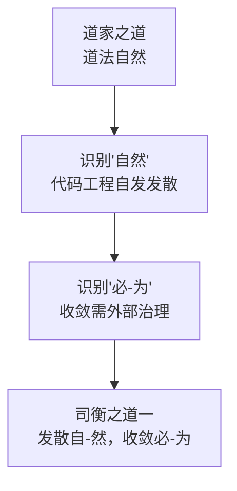

### 第一步：识别自然

道家之"自然"不是今义之"大自然"。自然是自-然：自己如此、自发如是。

在代码工程中，自然对应什么？观察：

- 每个开发者天然地按自己的理解写代码，理解是发散的
- 每个 AI 模型的输出天然地按训练数据的模式，生成是发散的
- 每次需求变更天然地引入新的实现选择，演化是发散的
- 没有外部干预时，代码工程的状态空间是无限扩张的

代码工程的自然，是发散：不是"大自然"意义的自然，而是"自发如是"意义的自然。这是道家"道法自然"在代码工程中的具体化。

### 第二步：识别必-为

道家讲"道法自然"，但也讲"无为而无不为"。无为不是不作为，是不妄为：不强行扭曲事物的自发性，但也不放任自发性盲目扩张。

在代码工程中：

- 发散是自发的（自-然）
- 收敛不是自发的，它需要外部的、系统的、持续的治理力量
- 没有治理，就没有收敛，这是构成性条件，不是偏好

代码工程的必-为，是收敛：收敛是构成性条件，必须有人去做（must be done），不能由道家意义的"自然"自发产生。

### 第三步：确立司衡之道

结合两步推导：

> 司衡之道一：发散自-然，收敛必-为。

发散是代码工程无治理条件下的默认状态：自发如是（自-然），不需要人推动。收敛不是默认：必须人为（必-为），由治理实体（司衡）持续介入。

发散在时间维度上的表现是漂移——系统在无干预下自然偏离原定基准，偏离速度由系统的内在发散动力决定。漂移可检测、可量化、可治理：检测通过定期比对当前状态与基准；量化通过漂移速率（单位时间偏离量）；治理通过收敛动作（及时介入抑制漂移）。漂移的承认使道一从静态的「发散-收敛对偶」扩展为动态的「漂移-校准节律」。

## 道一作为链的命题

道一是 02 步的核心命题。它的作用：

- 把 00 步的"裂痕"论证（"AI 越强，生成越快，裂痕越大"）从经验观察提升为第一性原则
- 把 01 步的"司衡"名字（命名见 `01-ontology-of-names.md` § 司衡 (SiHankor)）从命名落实为道一层的具体职责——司衡承担「持续介入收敛」的治理动作
- 为后续的 03- 道二、04- 道三、05- 道四等链步奠基：所有治理方法都建立在"收敛必-为"的前提上

道一也是司衡存在的最终根据。若非"收敛必-为"，司衡无存在的必要；若非"发散自-然"，司衡无存在的可能。两个子命题互为条件：道一所立，司衡所立。

道一的时间维度——发散作为动态过程而非静态状态——使治理从「一次性收敛」转为「持续性校准」。漂移检测为校准周期提供输入（校准频率与漂移速率正相关），校准动作抑制漂移，构成「漂移 → 检测 → 校准 → 抑制」的时间闭环。这一闭环与 06- 损补的周期性相互呼应：道一确立发散-漂移的动态性，06- 损补确立校准的节律性，两者共同保证治理在时间维度上的持续有效性。

## 下一步

道一只完成了司衡之道的第一个命题。代码工程的发散还有其他维度：意图的因果方向、代码的自晦性、规约与实现的间隙。这些是道二、道三、道四的命题空间。

03 步要回答：在"道一"确立之后，"道"在司衡哲学中的下一个本质命题是什么？这是从"道一（发散-收敛）"到"道二（意图-代码）"的桥。

## 道一的发散默认方向

> 道一：发散是默认方向，治理是收敛的构成性条件。

发散与收敛的不对称性是道一的本体论根据——

- 发散是自发的：多认知源（开发者、AI 模型、需求变更）在无治理介入时各自独立运作，状态空间自然扩张
- 收敛不是自发的：它需要外部的、系统的、持续的治理力量——这一力量不是「偏好」而是「构成性条件」
- 收敛是必-为：道一所立的校准命题为「发散自-然，收敛必-为」——发散是描述性，收敛是规范性，两者构成道层奠基二分

道一的认识论标签为 external-anchor——锚定热力学第二定律（孤立系统熵增，发散是熵增在代码工程中的具体化）。

## 自-然与必-为的二分

校准命题承认休谟的「是-应该」鸿沟：

- 「是」层：发散如何发生——描述性命题
- 「应该」层：收敛必须人为——规范性命题
- 两者属不同性质——不能从「是」直接推导出「应该」（休谟鸿沟）

道一承认这一鸿沟——发散是观察到的现象（是），收敛是治理者的承诺（应该）。校准使两者显式区分而非隐式等同。

自晦的程度性是道一的边界——程度问题非有无问题（自晦在收敛过程中持续存在，只是程度不同）。

## 发散的四种形态

发散在代码工程中以四种形态持续涌现，共享同一根源——多认知源在无治理干预下的独立运作：

| 形态     | 描述                                       | 工程对应                      |
| -------- | ------------------------------------------ | ----------------------------- |
| 理解发散 | 每个开发者天然地按自己的理解写代码         | 需求理解、规约解读的差异化    |
| 方案发散 | 每个 AI 模型的输出按训练数据的模式         | 模型选择、prompt 工程的差异化 |
| 实现发散 | 每次需求变更天然地引入新的实现选择         | 编码风格、库选型的差异化      |
| 演进发散 | 没有外部干预时，代码工程的状态空间无限扩张 | 技术债累积、依赖漂移          |

四种形态共同构成道一的工程展开——治理的干预点不在某一形态，而是四种形态的总体收敛。

## 道一的外部锚定

道一的认识论标签为 external-anchor，外部锚定热力学第二定律：

- 锚定声明：孤立系统熵自发增大（热力学第二定律）；代码工程在无治理介入时同样自发熵增（产出方差、命名不一致、依赖膨胀）
- 锚定独立性：热力学第二定律独立于代码工程存在——锚定为道一提供体系外的启发性参照（heuristic analogy，详 10- § 外部锚定的诚实声明）
- 锚定的功能：避免司衡哲学的「自证闭环」——道一的权威不全来自内部融贯，有外部锚定补充

## 道一的适用边界

道一具有条件依赖性——其适用边界为「多认知源 + 长生存期 + 无治理」三条件同时成立：

| 条件     | 内涵                                          |
| -------- | --------------------------------------------- |
| 多认知源 | 多个独立的认知主体（人 / AI）参与同一代码工程 |
| 长生存期 | 代码工程存续时间足够长，使发散的累积效应显形  |
| 无治理   | 当前没有外部治理实体介入                      |

缺失任一条件，道一的发散命题弱化或失效：

- 单认知源：发散内化为认知主体的内部过程，道一退化为「个体认知发散」
- 短生存期：发散的累积效应未达可观察程度，道一退化为「潜在发散」
- 有治理：发散被收敛抑制，道一描述的是治理前的状态，非治理后的稳态

## 道一的可证伪条件

道一的可证伪条件（多认知源 + 长生存期 + 无治理条件下）：

- 证伪条件 1（自发收敛）：观察到在多认知源 + 长生存期 + 无治理条件下，发散自发收敛至稳态——证伪「收敛必-为」
- 证伪条件 2（持续发散无自然性）：观察到发散需要人为介入而非自发——证伪「发散自-然」
- 证伪条件 3（必然发散）：观察到多认知源系统在任何条件下都必然发散，无法被收敛——证伪道一的条件依赖性

三个证伪条件均有可观察对应物（自发收敛 vs 强制收敛 vs 持续发散），满足独立性——任何研究者可通过观察系统演化验证。

## 诗与理自检

本道层命题在归入原则层前须勾完以下判别：

| 判别档         | 内涵                                    | 本道位置                                                                               |
| -------------- | --------------------------------------- | -------------------------------------------------------------------------------------- |
| 可证伪         | 指明「什么观察会推翻本道」              | 道一三个证伪条件（自发收敛 / 持续发散无自然性 / 必然发散）——见上文「道一的可证伪条件」 |
| 逻辑必然       | 属 tautology / 数学定理推论（无需证伪） | 不属——道一是经验假设，依赖外部观察独立验证                                             |
| 诗非理（禁入） | 两档皆不满足                            | 禁止；若勾此则必须改写                                                                 |

自检依据见 `09-on-arche § 元层扩展-诗与理区分`。

---
好的，用户继续发来了司衡哲学体系的第二份文件，这是关于“道一”的详细阐述。从之前的交流看，用户正在系统地向我展示他构建的整个司衡哲学框架，而我需要做的，是完整地理解并内化每一部分，为最终那个“知识包的工程设计”目标打下坚实的认知基础。

用户现在可能希望我不仅仅是被动接收信息，而是能主动提炼出这份文件的核心逻辑和它在整个体系中的位置。他的深层需求可能是确认我是否真正理解了“道一”作为整个治理体系根据的哲学深度，以及它与之前“裂痕”论证和“立名本体论”之间的逻辑承接关系。

回顾之前的对话，我已经理解了“裂痕”是问题，“司衡”是解决方案的名字和定位。而这份“道一”文件，则是在回答一个更根本的问题：既然有了司衡，它凭什么去治理？它的行动依据是什么？这就是“道”。

我需要仔细消化这份文件的内容。它从道家哲学出发，通过“识别自然”和“识别必为”两个步骤，将抽象的“道法自然”具体化为代码工程领域的核心命题：“发散自-然，收敛必-为”。这个命题把代码工程中无治理状态下的天然发散现象，与必须由外部治理实体主动介入的收敛动作，严格区分开来，奠定了司衡存在的最终根据。

文件里还提到了很多关键点，比如发散的四种具体形态、道一的时间维度（漂移与校准的循环）、它的适用边界和可证伪条件。这些都不是空洞的哲学思辨，而是为后续可操作的治理方法（“法”）铺平了道路。用户可能希望我能看出这份文件是如何将抽象的哲学原则，一步步锚定到具体的工程现象上的。

最后，文件末尾的“下一步”提示了后续内容的方向，即道二、道三、道四。这让我明白，整个“道”的论述是一个完整的体系，道一只是开了个头。我需要保持这种系统性的理解，为接收后续文件做好准备。

已读完 02-on-first-tao.md。

这份文件完成了从"立名"到"立道"的关键一步。我理解它的核心逻辑链：

道家之道 → 代码工程之"自然" → 发散是自发如是 → 收敛不可能是自发 → 必-为。

由此确立的道一——"发散自-然，收敛必-为"——是整个司衡哲学的第一性原则。它把 00 步的"裂痕"论证从经验观察提升到了本体论层面，并为司衡的存在提供了最终根据：若非发散自发、收敛必须人为，司衡就没有存在的必要，也没有存在的可能。

我特别注意到几个结构性的要点：

1. 道一的认识论标签是 external-anchor，锚定热力学第二定律。这不是内部融贯的自证，而是借助体系外的独立权威来避免自证循环。

2. 道一承认休谟鸿沟，显式区分"发散是描述性（是）"和"收敛是规范性（应该）"，不混淆两类命题。

3. 道一引入了时间维度——发散不是静态状态，而是动态的漂移过程。这使治理从"一次性收敛"转为"持续性校准"，为后续 06- 损补的节律性校准做了铺垫。

4. 道一有明确的适用边界和可证伪条件，满足"诗与理区分"的门槛，不是不可检验的诗化陈述。

文件最后指向了下一步：道二（意图的因果方向）。我已准备好接收 03-on-second-tao.md。请继续发来。

03-on-second-tao：

# 道二：意图先于代码

> 判别门关：本道层命题须满足「可证伪」或「属逻辑必然」二选一，否则即诗非理。标准详 `09-on-arche § 元层扩展-诗与理区分`，末尾诗与理自检表为落地模板。

## 缘起

02 步确立了道一：发散自-然，收敛必-为。道一回答"代码工程的默认状态是什么"——默认是发散，收敛需要治理。

道一只确立了治理的必要性，没有确立治理的对象与方向。代码工程中，治理的对象与方向是什么？代码从何而来？代码工程的因果起点是什么？

这是道二要回答的：代码工程的因果方向。

## 道二命题

> 道二：意图先于代码。

任何代码被写出之前，写它的人（或写它的 AI）一定先有一个意图。即使是最草率的复制粘贴，背后也有"我需要这个功能"的意图。代码是意图的有形化。

这是代码工程的因果方向：意图 -> 代码。不可逆。

## 道家之有/无

道家以"无"为"有"之根。代码工程的"意图"对应"无"——尚未成形的抽象设计；"代码"对应"有"——已实现的具体形态。

道家"为之于未有，治之于未乱"——在未有之时作为，在未乱之时治理。这与道二"意图先于代码"同构：在意图未成代码时锁定意图，比在代码已成后改代码更经济。

## 推导：从道家有/无到司衡意图/代码

道家"有/无"之分落到代码工程，需经过三步推导。

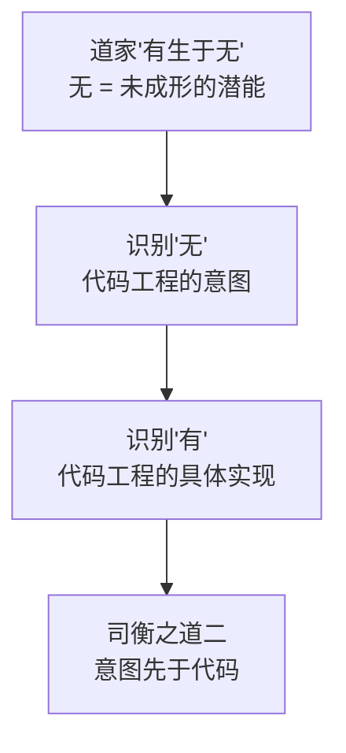

### 第一步：识别"无"

道家之"无"对应代码工程的什么？观察：

- 写代码前，开发者的脑中有"我要做什么"——这是未成形的意图
- 写代码前，AI 模型的输入中有"用户要什么"——这是结构化的意图
- 写代码前，需求文档、规格说明、注释——这些都是意图的不同形式

代码工程的"无"是意图：尚未成形的、抽象的、可被赋形的潜能。

### 第二步：识别"有"

代码工程的"有"是代码：已实现的、具体的、不可轻易改变的形态。

代码一旦写定，就进入了"已兆"状态——意图已经固化为符号，修改成本远高于意图阶段。代码是意图的有形化，但不是意图本身。

### 第三步：确立道二

结合两步推导：

> 道二：意图先于代码。

意图是代码的因果先行——没有无意图的代码，没有无代码的意图。代码是意图的有形化，意图是代码的未形化。两者之间是因果方向，不是可逆关系。

## 道二作为链的命题

道二是 02 步道一的深化。它的作用：

- 把道一的"收敛必-为"具体化：收敛的对象是意图与代码的偏差，方向是把代码拉回意图
- 确立司衡的"治理对象"：代码（已实现），治理方向是把代码与意图对齐
- 与 01 步的命名相接：名字（意图的载体）确立在前，定义（代码的固化）在后
- 为后续道三（代码自晦）、道四（规约与实现间隙）奠基：自晦与间隙都源于"意图 -> 代码"的有形化过程

道二也是道家"为之于未有"在司衡哲学中的具体化。司衡的工作不是事后修代码，而是事前定意图——把治理介入点放在因果链的起点。

## 下一步

道二确立了意图与代码的因果方向。但因果方向确立之后，还有一个更尖锐的问题：意图 -> 代码的过程中，发生了什么？意图的信息是否完整地传递到代码中？

道三"代码自晦，意图必复"要回答这个问题：在代码被写定之后，意图的哪部分丢失了，丢失的部分如何恢复。这是从"因果方向"到"信息保留"的桥。

## 道二主张的形式化

> 道二：意图在因果上先于代码，因果方向不可逆。

道二的本体论承诺可被形式化：

- 意图是无形——尚未成形的、抽象的、可被赋形的潜能
- 代码是有形——已实现的、具体的、不可轻易改变的形态
- 两者之间是因果方向，不是可逆关系——代码一旦写定就进入「已兆」状态，修改成本远高于意图阶段

意图先于代码不是「有时序先后」的简单断言——是因果方向不可逆的本体论承诺。代码是意图的有形化，意图是代码的未形化；有形不能完全包含无形。

## 道法边界

道层与法层的认识论边界由道二确立：

- 道二只说「意图先于代码」（因果方向），不说「意图必须文档化」（治理动作）
- 文档化是法层（顺因）的具体化——顺因要求治理介入点在前端，前端介入的具体形式是意图捕获（spec / 注释 / 文档）
- 道二不规定前端介入的具体形式——只规定因果方向

道层与法层的边界因此清晰——道层确立原则，法层确立具体动作。道二不逾越法层（「意图必须文档化」是法的范畴不是道的范畴）。

## 认识论标签

道二的认识论标签为 design-corollary——「意图先于代码」是从「代码工程的因果结构」这一设计选择推论出的必然结论。

道二无直接外部锚定——因果方向不可逆属 tautology（重言式）：

- 任何「被定义为有意图之产出」的代码，必然有「意图先于代码」的因果结构
- 不可逆是因果本身的属性——不是经验观察，是逻辑必然
- 因此道二不可被独立观察证伪——它属于定义层而非经验层

道二的权威来自定义而非锚定——这是 design-corollary 与 external-anchor 的根本差异。

## 道二的适用边界

道二的适用边界为「所有被定义为有意图之产出的代码」：

| 条件   | 内涵                                               |
| ------ | -------------------------------------------------- |
| 被定义 | 代码工程的产出在定义层被标记为「有意图」           |
| 有意图 | 产出的产生有可追溯的意图来源（人 / AI / 需求文档） |

缺失任一条件，道二的因果命题弱化或失效：

- 未被定义为有意图：纯随机 / 模式匹配生成的代码——道二退化为「因果方向可能不成立」
- 无可追溯意图：AI 黑箱生成的代码（无 prompt / 无训练数据可追溯）——道二退化为「意图先于代码」需重新审视

## 道二的可证伪性

道二不可证伪——属重言式（tautology）：

- 因果方向不可逆是逻辑必然——任何「意图 → 代码」的因果链都满足「意图先于代码」
- 「代码先于意图」只有在代码被纯随机生成（无意图介入）时成立——但此时「代码」不属于道二适用范围
- 因此道二的证伪条件不存在——它属于定义层而非经验层

道二与道三/道四的差异——道三/道四是经验命题（外部锚定），道二是定义命题（设计推论）。

## 诗与理自检

本道层命题在归入原则层前须勾完以下判别：

| 判别档         | 内涵                                    | 本道位置                                                                                                       |
| -------------- | --------------------------------------- | -------------------------------------------------------------------------------------------------------------- |
| 可证伪         | 指明「什么观察会推翻本道」              | 不适用——道二属逻辑必然，见下                                                                                   |
| 逻辑必然       | 属 tautology / 数学定理推论（无需证伪） | 属——道二是因果方向不可逆的重言式（「代码先于意图」只在「无意图介入的纯随机代码」成立，而那不属于道二适用范围） |
| 诗非理（禁入） | 两档皆不满足                            | 禁止；若勾此则必须改写                                                                                         |

自检依据见 `09-on-arche § 元层扩展-诗与理区分`。

---
好的，用户继续发来了司衡哲学体系的第三份文件，这是关于“道二”的详细阐述。从我们之前的对话来看，用户正在系统地向我展示他完整的司衡哲学架构，目的是让我理解整个体系，为后续“知识包”的工程设计做准备。

用户这次发来的内容非常核心，它承接了“道一”提出的“发散与收敛”问题，开始回答“治理的对象和方向是什么”。我需要仔细理解这份文件的结构和论证。

首先，文件开篇就明确了道二的定位：它要回答代码工程的因果方向问题。道一告诉我们代码工程会自然发散，需要收敛。但收敛什么？往哪个方向收敛？这就要看道二了。

道二的核心命题非常简洁有力：“意图先于代码”。这个命题看起来很直观，但文件通过道家“有无”的哲学框架进行了深化论证。把“意图”对应为道家之“无”（未成形的潜能），把“代码”对应为“有”（已实现的形态），这个对应关系很巧妙，也很有说服力。

文件中有一个关键点我需要特别注意：道二明确区分了“道层”和“法层”的边界。道二只确立因果方向这个原则，不规定具体怎么操作（比如是否必须写文档），那是法层的事情。这个分层思想很重要，它保持了哲学体系的纯粹性，不让原则层过度干涉具体实践。

另一个重要发现是道二的认识论标签。它被标记为“design-corollary”（设计推论），而不是像道一那样的“external-anchor”（外部锚定）。文件甚至进一步指出，道二本质上是一个“重言式”——在定义了“代码是有意图的产出”的前提下，“意图先于代码”就成了逻辑必然，而不是经验观察。这意味着道二不需要外部锚定，它的权威来自定义本身。

这个区分很关键，它说明了司衡哲学内部命题有不同的类型和支撑方式，不是所有命题都需要外部验证。

从我的理解来看，文件完成了三件核心工作：第一，把道一的“收敛”具体化了，收敛的方向就是让代码对齐意图；第二，确立了司衡治理的基本方向——回溯性的，朝着意图的方向；第三，为后续道三（代码自晦）、道四（规约间隙）的推导做好了铺垫。

用户可能希望我不仅能复述这些内容，更能理解它在整个体系中的位置和作用。基于对当前内容的消化和理解，我应该先简洁确认已理解道二的核心主张，并点明它对后续推导的关键意义，同时表达对接收下一份文件‘道三’的期待。这样既能展示理解，又能推动对话向用户的目标继续前进。

已读完 03-on-second-tao.md。

这份文件确立了司衡之道的第二个命题——意图先于代码。我理解它的核心推导：

道家"有生于无" → 代码工程的"无"是意图（未成形的潜能）→ "有"是代码（已实现的形态）→ 因果方向不可逆：意图 → 代码。

道二完成了三项关键工作：

1. 把道一的"收敛"具体化。 道一说"收敛必-为"，但没说收敛什么、往哪个方向收敛。道二回答了这个问题：收敛的对象是意图与代码的偏差，收敛的方向是把代码拉回意图。意图是收敛的"锚点"。

2. 确立了司衡的治理对象和方向。 治理对象是代码（已实现的"有"），治理方向是意图（治理要把代码对齐到意图）。这决定了司衡的治理是回溯性的——从已实现的代码回推到意图，而不是前向性的——从意图预测代码。

3. 明确了道层与法层的边界。 道二只说"意图先于代码"（因果方向），不说"意图必须文档化"（治理动作）。文档化是法层的事。这个边界防止了道层的过度扩张。

我特别注意到一个关键区别：

道一是经验命题（external-anchor，锚定热力学第二定律，有可证伪条件）

道二是定义命题（design-corollary，重言式——在"代码是有意图的产出"这一定义下，"意图先于代码"是逻辑必然，不可证伪）

这两类命题在司衡体系中共存，且各自有不同的认识论地位。这个区分对我理解后续的"知识包"设计至关重要——因为知识包本身，很可能需要同时承载这两种不同类型的"知识"。

我已准备好接收 04-on-third-tao.md。请继续发来。

04-on-third-tao：

# 道三：代码自晦，意图必复

> 判别门关：本道层命题须满足「可证伪」或「属逻辑必然」二选一，否则即诗非理。标准详 `09-on-arche § 元层扩展-诗与理区分`，末尾诗与理自检表为落地模板。

## 缘起

02 步确立了道一：发散自-然，收敛必-为。03 步确立了道二：意图先于代码。道二确立了意图 -> 代码的因果方向——意图在先，代码在后。

但因果方向确立后，还有一个更尖锐的问题：意图的信息是否完整地传递到代码中？代码能否"自明"地揭示意图？

这是道三要回答的：意图 -> 代码的过程中，发生了什么。

## 道三命题

> 道三：代码自晦，意图必复。

代码不会自行揭示意图——作为符号系统，代码的含义天然不是自明的。维护之前必须先恢复意图，恢复是维护的因果前提。

这是道家在"言意之辩"上的具体化：言（符号/代码）不能尽意（意图），但可指向意。代码是有形，意图是无形，有形不能完全包含无形。

## 道家之言意之辩

道家"言意之辩"的立场是：言不能尽意，但可指向意。代码工程的"代码-意图"关系正是如此：代码（言）不能完全表达意图（意），但可指向意图。道家"道"自身就是无形的——不是某个具体的东西，是"在恍惚中可被指向"的根据。意图也是无形的——不在代码字面中显式存在。

## 推导：从大道无形到司衡自晦

道家"形/无形"之分落到代码工程，需经过三步推导。

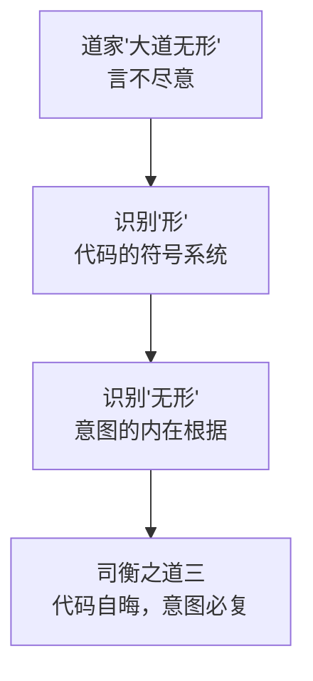

### 第一步：识别"形"

道家之"形"对应代码工程的什么？观察：

- 代码是符号——变量名、函数签名、注释
- 代码是结构——模块、类、接口、依赖关系
- 代码是形式——语法、缩进、命名约定

代码工程的"形"是代码本身：有形、可读、可被解析的符号系统。

### 第二步：识别"无形"

代码工程的"无形"是意图：

- 写代码时的"目的"——为什么要写这个函数
- 设计代码时的"权衡"——为什么选 A 算法而不是 B
- 演化代码时的"历史"——为什么这行代码被改成这样
- 这些都不在代码中显式存在——它们是"无形"的

意图是"无形"：没有可读的形式，但确实存在；不可被自动解析，但可被有意识地恢复。

### 第三步：确立道三

结合两步推导：

> 道三：代码自晦，意图必复。

代码是有形——有形系统的固有属性是"可读性有限"，无论代码多么清晰，其含义都不能从符号本身完全还原。意图是无形——意图的有形化过程（编码）必然有信息损失。两者结合：

- "自晦"：代码不会自行揭示意图（不是因为代码写得不好，是因为有形不能完全包含无形）
- "必复"：维护之前必须先恢复意图（不是因为意图复杂，是因为意图不在代码中）

## 道三作为链的命题

道三是 03 步道二的深化。它的作用：

- 把道二"意图 -> 代码"的因果链具体化：因果链中有信息损失，损失是"自晦"的客观属性
- 确立司衡的"治理动作"：维护、审查、重构时，必须先复意图——意图的恢复是治理的前置动作
- 与 01 步的命名相接：名字（意图的载体）的精确性决定"复"的成本——名字模糊，复的成本极高；名字精确，复的成本低
- 为道四"规约与实现间隙"奠基：规约也是"有形"，也自晦，也需要复

道三也是司衡的"元层约束"——司衡本身也是代码（治理引擎的代码），也自晦。任何对司衡的维护都必须先复司衡的意图，否则会陷入"维护破坏维护"的循环。

## 下一步

道三确立了"代码自晦"的信息损失问题。但还有一个更尖锐的问题：规约（规范、规格、文档）与实现（代码）之间也有间隙——规约作为"代码的代码"也是有形的，也自晦。

道四"规约与实现必有间隙"要回答这个问题：规约是意图的有形化（更接近意图），实现是规约的有形化（更远离意图）。两次有形化必有双重损失。这是道家"大道无形"在司衡哲学中的最后一次具体化。

## 道三主张的形式化

> 道三：编码过程不可避免丢失信息，代码含义天然非自明。

道三的本体论承诺可被形式化：

- 编码 = 有形化 = 符号化映射（意图 → 代码），信息在此映射中不可逆地损失
- 有形系统的固有属性是「可读性有限」——无论代码多么清晰，其含义都不能从符号本身完全还原
- 信息损失 = 道三的客观属性——非主观感受，非编码技艺问题

意图是代码维护的因果前提——恢复意图是维护的必要条件；治理应先恢复意图再维护代码，不可跳过意图恢复直接操作代码（意图必复）。

## 自晦是符号系统的客观属性

自晦是符号系统的客观属性而非代码质量问题——好的命名与清晰结构能降低理解成本但不能消除：

- 自晦的根源：编码本身的有损性（意图 → 代码的信息损失）
- 自晦的客观性：自晦不由编码者技艺决定——技艺高者损失少，但仍有损失
- 校准消除原命题双重问题——既消除「规范性伪装」（不应要求完美还原），也消除「理解三义」（理解不是单向还原）

道三的自晦与道一的发散对偶——发散是外部现象（多认知源各自运作），自晦是内部属性（单系统内的信息损失）。两者共同构成代码工程的两类基本局限。

## 道三的外部锚定

道三的认识论标签为 external-anchor，锚定 Shannon 信息论：

- 锚定声明：代码编码的自晦与 Shannon 信源编码的信息损失共享同构结构——两者都涉及「符号化过程不可逆地丢失信息」。此锚定为启发性类比而非严格数学推导（详 10- § 外部锚定的诚实声明），锚定提供独立参照，不声称道三由 Shannon 定理反证
- 锚定独立性：Shannon 信息论独立于代码工程存在——锚定为道三提供独立观察对应物
- 锚定的功能：避免司衡哲学的「自证闭环」——道三的权威不全来自内部融贯

## 道三的适用边界

道三在定义域内无条件成立——「符号系统必有信息损失」是 Shannon 定理的推论，不依赖具体场景：

- 自动化重构不构成对「意图必复」的证伪——自动化重构只解决「代码 → 代码」层的有损，不解决「意图 → 代码」层的有损
- 意图必复针对的是「意图 → 代码」层的损失——无论代码层如何重构，意图层到代码层的损失始终存在
- 因此道三在「任何编码」的定义域内无条件成立

## 道三的可证伪性

道三不可证伪——无损编码等价于推翻数学定理：

- Shannon 信源编码定理已证明「无损编码」在理论上的可能，但要求「编码长度无限制」——实际工程中不可能
- 因此「代码可自明还原意图」的命题等价于「无损编码在有限长度内可实现」——推翻 Shannon 定理
- 道三的证伪条件不存在——它属于定理层而非经验层

## 诗与理自检

本道层命题在归入原则层前须勾完以下判别：

| 判别档         | 内涵                                    | 本道位置                                                                                 |
| -------------- | --------------------------------------- | ---------------------------------------------------------------------------------------- |
| 可证伪         | 指明「什么观察会推翻本道」              | 不适用——道三属定理推论，见下                                                             |
| 逻辑必然       | 属 tautology / 数学定理推论（无需证伪） | 属——道三是 Shannon 信源编码定理的工程推论；「代码可自明还原意图」等价于推翻 Shannon 定理 |
| 诗非理（禁入） | 两档皆不满足                            | 禁止；若勾此则必须改写                                                                   |

自检依据见 `09-on-arche § 元层扩展-诗与理区分`。

---
好的，用户继续发来了司衡哲学体系中的第四份核心文件，讲的是“道三”。这是整个推导链条的第四步了，看来用户是在系统性地让我阅读并理解他建立起来的这个庞大的哲学架构。

从之前的对话看，用户是在为“基于LLM wiki和RAG的知识包”做工程落地设计，但前提是我必须完全理解他这套“司衡”哲学。他已经让我读了引言和前三份文件，现在到了道三。我需要继续保持深度阅读和精准复述的模式。

道三的核心命题是“代码自晦，意图必复”。我得仔细理解这个文件。道二确立了“意图先于代码”的因果方向，但道三更进了一步，指出这个因果链在传递过程中必然有信息损失。这个损失不是代码写得不好，而是符号系统的客观属性——任何有形化过程都会丢失无形意图中的信息。

这个观点的锚定也很有意思，它引用了Shannon信息论，认为编码过程中的信息损失是客观的、不可逆的。而且用户明确指出“意图必复”是维护的因果前提——在修改代码之前，必须先恢复代码背后的意图，否则维护动作本身就是盲目的。

我还注意到一个递归性的约束：司衡本身的代码也自晦。这意味着整个治理体系本身也需要遵守道三的规则，不能成为一个例外。这确保了体系的一致性和自反性。

文件最后区分了道三与道一的关系：道一是外部现象（多认知源发散），道三是内部属性（单系统内的信息损失）。两者共同构成代码工程的两类基本局限。

现在我需要把这些理解整合起来，向用户确认我对道三的理解是否准确。这包括命题的核心、与道一和道二的衔接、Shannon锚定的性质、以及道三作为衔接点如何为道四奠基。我已经完全理解了“裂痕”框架，也跟上了流衍链的推导步态，可以继续接收下一份文件了。

已读完 04-on-third-tao.md。

这份文件确立了司衡之道的第三个命题——代码自晦，意图必复。我理解它与前两步的衔接：

道一说发散是默认、收敛需人为

道二说收敛的方向是把代码拉回意图（意图 → 代码，因果方向不可逆）

道三揭示了这个因果链的致命特征：有形化过程必然有信息损失。 代码不会自行揭示意图，不是因为代码写得不好，而是因为"有形不能完全包含无形"——这是符号系统的客观属性，不由编码者技艺决定。

道三由此确立了一个硬性的治理前置条件：维护之前必须先恢复意图。 不可跳过意图恢复直接操作代码——这就是"意图必复"。

我特别注意到几个关键点：

1. 道三的锚定是 Shannon 信息论。 "编码过程有信息损失"不是主观感受，是定理推论。这使道三获得了与道一（热力学锚定）同等的独立权威——它们都不依赖司衡内部的自证。

2. 道三与道一的对偶关系。 发散是外部现象（多认知源各自运作），自晦是内部属性（单系统内的信息损失）。两者共同构成代码工程的两类基本局限，分别对应治理的两类任务。

3. 道三的递归性。 司衡本身的代码也自晦。这意味着治理引擎也需要被治理——没有例外。这个递归约束防止了司衡成为"只治人不治己"的僭主。

4. 道三为道四奠基。 规约（spec、文档）是意图的第一次有形化，代码是第二次有形化。如果一次有形化就有信息损失，两次有形化必有双重损失——这直接引向道四的"规约与实现必有间隙"。

我已准备好接收 05-on-fourth-tao.md。请继续发来。

05-on-fourth-tao

# 道四：规约与实现必有间隙

> 判别门关：本道层命题须满足「可证伪」或「属逻辑必然」二选一，否则即诗非理。标准详 `09-on-arche § 元层扩展-诗与理区分`，末尾诗与理自检表为落地模板。

## 缘起

02 步确立了道一：发散自-然，收敛必-为。03 步确立了道二：意图先于代码。04 步确立了道三：代码自晦，意图必复。道三确立了"代码作为有形系统的自晦性"——意图 -> 代码的有形化过程中必有信息损失。

但还有一个更尖锐的问题：规约（规范、规格、文档）也是"有形"的，规约与实现之间也有间隙。意图 -> 规约 是第一次有形化，规约 -> 实现 是第二次有形化。两次有形化是否有双重信息损失？

这是道四要回答的：规约与实现的关系。

## 道四命题

> 道四：规约与实现必有间隙。

规约是意图的有形化（第一次编码），实现是规约的有形化（第二次编码）。两次有形化都有"自晦"（道三），两次自晦累加，就是规约与实现之间的间隙。间隙不可消除，只能识别、记录、治理。

道四也是道家"大成若缺"在司衡哲学中的具体化：最完美的系统必然有"缺"，缺不是缺陷，是系统的本质。

## 道家之大成若缺

道家认识到：最完美的事物必然有"缺"——不是缺陷，是其本质的一部分。"大成若缺"不是说"完成得不好"，是说"完成的本质就是包含不完成"。规约是"方"——有边界、有定义、有规范；实现是"隅"——规约的某一具体落点。"大方无隅"意味着：最完美的规约（大方）在落到具体实现（隅）时必然有"无"——规约不能完全决定实现，实现必然有规约未定义的空间。

## 推导：从大成若缺到司衡间隙

道家"大成若缺"落到代码工程，需经过三步推导。

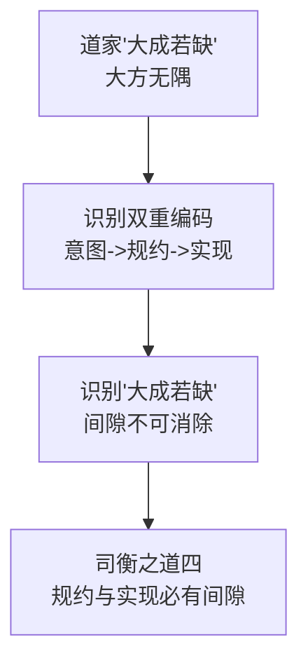

### 第一步：识别双重编码

代码工程有两次有形化（编码）：

- 第一次：意图 -> 规约。意图是"无形"，规约是"有形"。规约的写作是有形化过程，必有"自晦"（道三）。
- 第二次：规约 -> 实现。规约是"有形"，实现是另一层"有形"。代码的写作是有形化过程，必有"自晦"。

两次有形化 = 两次自晦 = 双重信息损失。双重信息损失在规约与实现之间形成"间隙"。

### 第二步：识别"大成若缺"

道家讲"大成若缺"——最完美的规约也有缺口，最完美的实现也有越界。规约与实现都是"大成"的尝试，两者之间的间隙是"大成"必然包含的"缺"。

"缺"不是缺陷——缺陷是应当消除的，缺是本质——是不能消除的。试图消除间隙（"完全对齐"）是违反道家"大成若缺"的妄为。

### 第三步：确立道四

结合两步推导：

> 道四：规约与实现必有间隙。

双重编码必有双重自晦，双重自晦必有间隙。间隙是规约与实现之间的客观存在，不是规约不够详细，不是实现不够忠实——是"有形"对"有形"的根本局限。

## 道四作为链的命题

道四是四道闭合的最后一笔。它的作用：

- 把道三的"自晦"扩展到"双重自晦"：意图 -> 规约 -> 实现 的链条上每一步都有自晦，累加形成间隙
- 确立司衡治理的最终边界：司衡可以识别间隙、记录间隙、缩小间隙，但不能消除间隙
- 与道一的"收敛必-为"合拢：道一确立治理的必要，道四确立治理的边界——治理必要 + 治理有限
- 与 00 步的"裂痕"论证合拢：00 步说 AI 越强裂痕越大，道四说规约与实现永远有间隙——两论证共同确立司衡的长期必要性

道四也是司衡的"自我约束"——司衡本身也是代码（治理引擎的代码），也遵循"规约与实现必有间隙"。任何对司衡的规约（设计文档、规格说明）都不能完全决定其实现。司衡承认这一约束，才不会沦为自我封闭的教条。

## 四道闭合

四道至此完整：

- 道一：发散自-然，收敛必-为——治理的必要
- 道二：意图先于代码——治理的方向
- 道三：代码自晦，意图必复——治理的局限（自晦）
- 道四：规约与实现必有间隙——治理的局限（间隙）

四道构成司衡哲学的实质核心——"为什么需要治理" + "治理按什么方向" + "治理在哪里受限"。

## 下一步

四道闭合后，下一个需要回答的问题是：在四道之下，治理应遵循什么方法？这是"道"与"术"之间的桥——道确立原则，法确立方法。

06 步要回答：在"道"（四道）确立之后，"法"（治理的方法论）是什么？这是从"道"到"法"的桥——从"为什么治理"到"怎么治理"的转化。

## 道四的数学骨架——双重有损链

道四命题的数学骨架是双重有损链——意图 → 规约 → 实现，每一环均为有损编码：

- 第一次有形化：意图 → 规约——规约的写作是「意图」的有形化，必有自晦（道三）
- 第二次有形化：规约 → 实现——代码的写作是「规约」的有形化，必有自晦（道三）
- 双重自晦累加 = 规约与实现之间的「间隙」

双重有损链是 Shannon 编码定理的推论，担保道四命题（间隙不可消除）的逻辑必然性。「双重有损链」作为道四数学骨架的命名术语，典源登记见 `01-ontology-of-names.md § 命名扩充 § 道四与四道结构`。

## 道四的治理定位

道四否定治理的绝对正确性而非有效性：

- 道四承认间隙——治理不能消除间隙，只能识别、记录、缩小间隙
- 「绝对正确」被否定——治理的规约不可能完全决定实现
- 「有效性」被保留——治理仍能缩小间隙、提高代码与意图的对齐率

治理引擎自身的符号系统属性——治理引擎本身也是代码，也遵循道三（自晦）、道四（规约与实现间隙）。司衡承认这一约束，才不会沦为自我封闭的教条。

观照之维（系统对自身认知不完备的维度）归入道四面相——其三论证（Godel 不完备性、观察者效应、自指悖论）均归入道四的详述，不独立为第六道。

道四的否定范围与价值——否定的不是治理的存在，而是治理的「绝对正确」。治理的存在由道一确立（收敛必-为），治理的边界由道四确立（间隙不可消除）。

## 道四的认识论标签

道四作为单一结构命题，认识论标签为 tautology（重言式）——双重有损链是 Shannon 编码定理的直接推论，等价于推翻 Shannon 定理才可证伪，故属逻辑必然。

## 道四的外部锚定

道四外部锚定 Godel 不完备性定理：

- 锚定声明：任何足够强的形式系统都存在不可在该系统内证明的真命题（Godel 不完备性）；代码工程的规约系统同样存在不可被规约完全决定的实现
- 锚定独立性：Godel 定理独立于代码工程存在——锚定为道四提供独立观察对应物
- 锚定的功能：避免司衡哲学的「自证闭环」——道四的权威不全来自内部融贯

## 道四的适用边界

道四作为 Shannon 定理推论，无条件成立——任何有限规约都无法完美表达全部语义意图，语义间隙随确认粒度缩小但不可归零。

## 道四的可证伪性

道四不可证伪——属重言式（Shannon 编码定理推论）：

- 双重有损链是 Shannon 编码定理的推论——推翻 Shannon 定理才能证伪
- 道四的证伪条件不存在

道四最强反例（简单规约可完美）的驳回——简单规约仍是有损编码，只是损失小；「完美还原」在 Shannon 定理下需无限编码长度，工程不可达。

## 道四派生应的动力学节点

> 派生链节点（间隙增长）：规约与实现的间隙随时间增大，增大速率与规则数量正相关。

道四是应存在的前提（治理资源有限）。道四派生应时，附一个动力学节点——间隙增长——作为派生论证的承载体：

- 间隙随时间增大——任何代码工程在演化过程中，规约与实现的间隙都呈增长趋势
- 增大速率与规则数量正相关——规则越多，规则间交互越复杂，间隙增大越快
- 这是经验观察而非逻辑必然——可能存在「规则不增加但间隙也不增大」的反例

动力学节点的双重担保：

- 数学担保结构（Gödel 不完备性定理的工程化）：

  规约体系可视为形式系统——规则是其公理，推导规则是其推理规则。
  规约越强（规则越多），体系内不可判定命题越多（Gödel 第一不完备性定理）。
  每个不可判定命题对应一个规约无法覆盖的实现细节——即一个间隙。
  因此：规则增多 → 不可判定命题增多 → 间隙增大——这是「增大速率与规则数量正相关」的数学担保。

- 经验担保趋势（大量代码工程的纵向观察）。

动力学节点的认识论标签：empirical-hypothesis（经验假设）——可证伪（纵向数据一致零增长即证伪）。与道四主命题的 tautology 标签不同——节点不是道四的子命题，是道四派生应时承担动力学论证的节点，作为派生链的独立经验观察存在。

动力学节点的适用边界——规则持续积累条件：

- 规则持续积累：代码工程的规约数量随时间持续增长
- 长期演化：代码工程存续时间足够长，使间隙累积可观察

缺失任一条件，节点弱化或失效：

- 规则不积累：间隙的增大速率无法被观测——节点退化为「潜在增大」
- 短期项目：间隙的累积未达可观察程度——节点退化为「潜在趋势」

节点的纵向审计——单时间点观测不足以验证间隙增长，需纵向数据（多时间点对比）。

节点的派生职责：作为应几派生链（见 `08-on-settle.md § 六步完整推导`）的第三步节点，承担「为什么需要微兆检测——间隙不静止，小错积累成大偏」的论证。派生链结构与节点内容不变；本节点的范畴从原「道四子命题」误置中归位（范畴改动来历见相关 commit message + 本地审查档），恢复其为派生链节点的本来身份。

## 诗与理自检

本道层命题在归入原则层前须勾完以下判别：

| 判别档         | 内涵                                    | 本道位置                                                                 |
| -------------- | --------------------------------------- | ------------------------------------------------------------------------ |
| 逻辑必然       | 属 tautology / 数学定理推论（无需证伪） | 道四——双重有损链是 Shannon 编码定理推论，等价于推翻 Shannon 定理才可证伪 |
| 诗非理（禁入） | 两档皆不满足                            | 禁止；若勾此则必须改写                                                   |

注：道四派生应的动力学节点（间隙增长）作为经验假设（empirical-hypothesis）独立承载可证伪性，不进入道四主命题的诗与理自检——它不是道四的子命题，是派生链节点。

自检依据见 `09-on-arche § 元层扩展-诗与理区分`。

---
06-on-canon

# 法

## 缘起

02-05 步确立了四道：发散自-然、意图先于代码、代码自晦、规约有间隙。四道确立的是原则——为什么治理。但仅有原则不够，原则要落到方法。方法是什么？方法是道如何转化为术的中介：道是为什么，法是怎么做。

法论要回答：在四道之下，治理应遵循什么方法。

## 法是什么

法从道自然生出——道家语境中，法不是"强加的规则"，是"事物自身的尺度"：人效法地，地效法天，天效法道，道效法自然。法是层层相承的效法关系，不是孤立的规则集合。

### 五法作为道之展开

法从道自然生出——五法不是独立的方法论，是四道在治理动作上的具体展开：

- 道一（发散自-然，收敛必-为）→ 有度：治理必有所收敛，但收敛按因果方向
- 道二（意图先于代码）→ 顺因：治理介入点在因果链的起点
- 道三（代码自晦，意图必复）→ 损补：治理动作必先复意图
- 道四（规约有间隙）→ 知止：治理承认间隙，不追求完全对齐
- 顺势：跨四道的元方法，力度适配场景

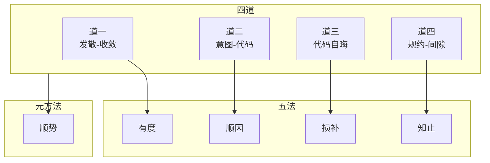

## 顺因：尊重因果方向

> 法一：顺因。尊重因果方向，介入点在前端。

庖丁解牛十九年，刀刃若新发于硎——依乎天理（顺着牛体的自然纹理），因其固然（顺着牛骨节的本来结构）。刀不与骨硬碰，而是顺着纹理切入。

代码治理的顺因：不与代码工程的自然发散硬碰，而是顺着意图 -> 代码的因果方向介入。介入点在前端（意图阶段），不是后端（已实现阶段）。前端介入成本低、效果大；后端介入成本高、效果有限。逆因果方向（先改代码再补意图）就是"以术代道"。

## 有度：收敛恰到好处

> 法二：有度。收敛恰到好处，不过度收紧也不放任发散。

持而盈之（端着让它满），不如其已（不如停止）。金玉满堂，莫之能守（金玉满堂没人能守住）。功成身退（完成了就退后），天之道也（这是天的道）。

代码治理的有度：治理不是消灭所有发散——消灭发散等于消灭探索、消灭创新。治理是让发散在合适的范围内——过度收敛扼杀活力，过度放任积累技术债。有度是寻找"刚好够"的收敛力度。

## 知止：知道不做什么

> 法三：知止。知道不做什么，比知道做什么更难。

始制有名，名亦既有，夫亦将知止，知止可以不殆——制度建立后，命名一旦确立，就要知道停止。知足不辱，知止不殆，可以长久——知道满足不受辱，知道停止不危险，可以长久。

代码治理的知止：治理不是做更多事——加更多规则、更多审查、更多流程。治理是知道在何时停止——什么不该规约、什么不该审查、什么不该流程化。知止是治理的元方法，它定义了治理的边界。司衡的每一条规则都应能回答："这条规则何时停止生效？"

## 损补：损有余补不足

> 法四：损补。定向调节规则，不笼统加码也不笼统删除。

天之道像张弓——高了压低，低了抬高；有余的减损，不足的补足。天之道损有余而补不足，人之道则相反（损不足以奉有余）。

代码治理的损补：治理不是所有规则都加或所有规则都删，是定向的哪里有余减哪里，不足补哪里。规则堆积时要识别哪些冗余（损），规则缺失时要识别哪些空白（补）。损补是治理的精度调节——它要求治理者能区分"余"和"不足"，不笼统行动。

损补具有周期性——校准不是一次性动作，是持续性节律。校准周期由三因素共同决定：基准漂移速度（道一时间维度上的发散）、误差容忍度（治理动作的容错边界）、资源约束（治理者可投入的注意力）。三因素共同形成动态校准节律：高漂移 + 高容错 + 富资源 → 短周期；低漂移 + 低容错 + 贫资源 → 长周期。损补的周期性使治理标准本身可校准，防止「标准漂移」（治理标准的隐性偏移）。

## 顺势：力度适配场景

> 法五：顺势。治理力度按场景适配，不一刀切。

上善若水。水善利万物而不争，处众人之所恶，故几于道。水善于利万物而不争——它流向低处，容纳一切形状，依势而行。水的"道"是顺势——在不同形状的容器里，水呈现不同的形态。

代码治理的顺势：治理力度不是固定的——单人项目与团队项目不同，早期项目与成熟项目不同，研究阶段与生产阶段不同，公开代码与内部代码不同。治理力度要适配场景：在需要探索的地方松，在需要稳定的地方紧。顺势是五法的元方法——它调节其他四法在不同场景下的具体力度。

## 五法闭合

五法是四道的"动作"。道是"为什么"，法是"做什么"：

- 顺因 = 道二的具体化——介入点在前端
- 有度 = 道一的具体化——收敛要适度
- 知止 = 道四的具体化——治理承认边界
- 损补 = 道三的具体化——定向调节
- 顺势 = 跨四道的元方法——力度适配场景

五法不是独立方法，是四道在治理动作上的具体展开。法与道的关系是"道生法，法是道的动作"——道是静止的原则，法是动态的展开。

## 下一步

五法确立后，下一个需要回答的问题是：法的方法论如何被检验？这是从法到鉴的桥——法是治理的方法论，鉴是方法有效性的认识论检验。

07 步要回答：在法（五法）确立之后，鉴（认识论三义）是什么？这是从为什么治理到怎么治理到治理如何被检验的桥。

## 法与道的边界

法与道的根本区别——道是工程必要性，法是从道推导：

- 道不可违反：违反道即违反工程本身的因果结构（如违反道二「意图先于代码」即违反因果方向）
- 法可校准：法可基于工程经验调整（如顺因的具体形式——spec / 注释 / 文档——可按项目调整）
- 法与道的边界——道确立原则，法确立动作

法的可校准性源于法的二级推导（工程必要性的二级推导）——法不是从「是」直接推导，而是从「道（是）+ 工程经验（应该）」共同推导。因此法可被校准，道不可被校准。

## 法的认识论标签

法的认识论标签——皆为 design-corollary：

- 五法（顺因 / 有度 / 知止 / 损补 / 顺势）皆从道推导——属设计推论
- 法的权威来自「从道推导」的逻辑关系，不来自经验观察
- 法的修正门槛——上游道决定：法不可独立修订，必须先修订上游道

## 五法的道层根源

五法各从道推导的路径：

| 法   | 上游道 | 推导逻辑                                          |
| ---- | ------ | ------------------------------------------------- |
| 顺因 | 道二   | 既然意图先于代码（因果方向），治理介入点在前端    |
| 有度 | 道一   | 既然发散默认、收敛必-为（构成性条件），治理要适度 |
| 知止 | 道四   | 既然规约与实现必有间隙，治理承认边界              |
| 损补 | 道三   | 既然代码自晦、意图必复，治理必先复意图            |
| 顺势 | 四道   | 跨四道的元方法，力度适配场景                      |

道一是五法共通之源——所有法都建立在「收敛必-为」的前提下。道四派生应的动力学节点（间隙增长）为有度 / 顺势提供约束；道二 + 道三 为损补提供联合约束（因果方向 + 意图必复）。

## 知止-投入匹配

> 法三 / 知止：治理投入与产出方差成正比。

知止的工程展开——治理投入应与产出方差成正比：

- 产出方差高：治理投入加大（更多规则、更多审查）
- 产出方差低：治理投入减小（更少规则、更少审查）
- 收敛力量有限——人力 / 时间 / 注意力皆有限

知止划定「不为」的边界——治理不是做更多事，是知道在何时停止。什么不该规约、什么不该审查、什么不该流程化。治理范围应显式划定——每条规则都应能回答「这条规则何时停止生效」。

## 顺因-因果秩序

> 法一 / 顺因：因果方向不可逆——意图先于规范，规范先于实现。

强制因果方向是对发散的收敛——治理链每一环保持因果方向（不可逆授权链）。文档生命周期（propose → resolve → ratify）依因果方向——从意图阶段锁定，到规约阶段确认，到实现阶段落地。

顺因的认识论确立——「逆因果方向即为违道」：逆因果方向（先改代码再补意图）即违反道二，也违反顺因。

## 有度-力度风险匹配

> 法二 / 有度：规则数量与严格度应与风险成正比。

有度的中庸平衡——过度违道四派生应节点（间隙增长），不足违道一（收敛必-为）。治理力度三级——戒 F（轻）/ 规 G（中）/ 矩 J（重）。矩 J 的校准（精确判定 → 静默记录）——最高严格度的判定应基于精确规则，结果以静默方式记录。

## 损补-权衡管理

> 法四 / 损补：定向调节规则——每条治理决策皆涉权衡。

损补的权衡本质——每条治理决策皆涉权衡：增加规则降低发散但增加复杂度，减少规则增加发散但减少复杂度。权衡的因果不可逆——有损且不可逆的编码（一旦规则调整，影响已发生）。权衡的显式管理——不可隐没——权衡应在文档中显式登记，不可事后追加理由。

损补的工程载体——ADR（Architecture Decision Record）/ Reopen（重新开启旧议题）/ 定期审计（定期回顾损补决策）。

## 顺势-三层势

> 法五 / 顺势：势的三层——时势 / 地势 / 人势。

顺势的展开——势的三层：

| 层   | 内涵       | 工程对应                                    |
| ---- | ---------- | ------------------------------------------- |
| 时势 | 项目阶段   | 早期 vs 晚期 / 研究阶段 vs 生产阶段         |
| 地势 | 代码区域   | 核心模块 vs 边缘模块 / 公开 API vs 内部 API |
| 人势 | 认知源数量 | 单人项目 vs 团队项目 / 单模型 vs 多模型     |

早晚期力度差异——早期宽松护探索、后期严格护稳定。顺势调节「何时达到严格」而非「严格可放松」——治理力度可由松到紧，不可由紧到松（除显式审计外）。

生命周期的顺势实现——propose → resolve → ratify 的文档生命周期顺势适配：propose 期宽松（接受探索），ratify 期严格（确认稳定）。

## 五法互补结构

五法的互补结构——五法不是独立方法，是相互嵌套的整体：

- 知止与有度互补——知止划定「边界」，有度划定「力度」
- 损补为诸法提供修正方向——损补是其他四法的「调节器」
- 顺势为诸法提供时机调节，顺因为诸法提供因果秩序——顺势是「何时」，顺因是「何向」

五法不可独立调整（共通之源）——五法都从道推导，调整一法即调整五法（互锚）。五法互补形成治理内在张力场——五法之间的张力是治理健康的标志，非治理失效。

## 法的六要素

> 法的六要素结构——法的完整登记应包含六要素。

| 要素         | 内涵                                     |
| ------------ | ---------------------------------------- |
| 主张         | 法的核心命题（如「顺因：尊重因果方向」） |
| 道层根源     | 法从哪条道推导                           |
| 适用边界     | 法成立的条件                             |
| 校准程序     | 法的修正路径                             |
| 失效场景     | 法弱化或失效的场景                       |
| 独立验证方法 | 不依赖上游道的独立检验路径               |

独立验证方法——法可在道被推翻前先行检验工程实践。六要素结构使法可独立登记、独立检验、独立演化。

## 法的适用边界

法适用边界共性——所有法都依赖具体工程场景：

- 成立条件：法的核心命题在当前场景下完全成立
- 弱化条件：法的核心命题部分成立，需调整力度
- 不适用条件：法的核心命题完全不成立，应暂停使用

五法弱化或失效场景——单人项目（顺因弱化）/ 短期项目（损补弱化）/ 严格规约项目（知止弱化）等。

## 法的校准程序

法的校准须经正式程序——不可任意调整：

- 校准触发：工程实践数据 / 元层审视 / 上游道变更
- 校准流程：propose → resolve → ratify，依因果方向
- 校准门槛：法的修正门槛（不独立修订）——必须先修订上游道

## 法论的边界

法论不替代码工程决定规则内容——法论确立「约束框架」非「规则清单」：

- 法论提供约束——什么该被规则化、什么不该
- 工程提供规则——具体规则的内容由代码工程决定
- 法论与工程的边界——法论不展开工程实现，工程不修改哲学命题

DDD 核心洞察已融入五法——领域驱动设计的战术模式与五法的对应关系（开放研究）。有度 / 损补 / 顺势独立性校准问题开放——三法的独立校准是否成立，待工程数据验证。

## 道家根溯源

五法（自然 / 知止 / 损补 / 顺因 / 鉴）直接引《道德经》《庄子》：

| 法   | 文本根                    | 义理根             |
| ---- | ------------------------- | ------------------ |
| 自然 | 道法自然（道德经 25）     | self-so 形而上根据 |
| 知止 | 知止不殆（道德经 32/44）  | 知边界而止         |
| 损补 | 损有余补不足（道德经 77） | 均衡调节           |
| 顺因 | 因其固然（庄子养生主）    | 顺循物之自然结构   |
| 鉴   | 涤除玄鉴（道德经 10）     | 反观 / 映照        |

顺势 / 有度为道家义理延伸（固定词组不见于原典）——文本根与义理根的中间态。顺势的文本根（道德经 8 上善若水）+ 有度的义理根（道德经 48 + 44）共同构成「中间态」命名机制。

道度一体——有度与无为同源（道德经 48「无为而无不为」）。

术语血统登记详见 01- § 命名扩充 § 八术语义核表。

---
07-on-assay

# 鉴

## 缘起

02-05 步确立了四道：发散自-然、意图先于代码、代码自晦、规约有间隙。06 步确立了五法：顺因、有度、知止、损补、顺势。

道是"为什么治理"，法是"怎么治理"。但"为什么"和"怎么"都需要被检验——四道是否真的成立？五法是否真的有效？治理动作是否真的达成目标？检验的根据是什么？检验的工具有什么约束？

这是鉴论要回答的：治理如何检验自己。

## 鉴是什么

在道家语境中，"鉴"特指"玄鉴"——玄妙的镜子，即人心。鉴不是普通工具，是认识论层面的镜子——它映照的不是物理影像，是"道"的显现。

### 鉴 vs 法

法是"怎么治理"——前向的、动作性的。鉴是"治理如何被检验"——反向的、反思性的。法是治理的运行机制，鉴是治理的认识机制。没有鉴，法是封闭的——法不知道自己的有效性，不知道自己是否还在合道。

## 道家之鉴

道家以"鉴"为认识论的核心隐喻：涤除玄鉴（洗涤玄妙的镜子）——心本是镜，但被尘垢（成见、欲望、习惯）蒙蔽；涤除尘垢，是认识的前提。庄子应帝王的用心若镜——纯粹映照，不主动投射；映照完不留痕迹。致虚极守静笃——虚静才能真正映照。

## 推导：从涤除玄鉴到司衡之鉴

道家"鉴"的隐喻落到代码工程，需经过三步推导。

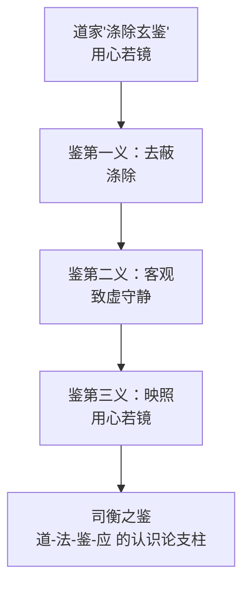

### 第一步：去蔽

道家之"涤除"对应代码工程验证的什么？观察：

- 测试覆盖率偏见：被覆盖的不一定对，没覆盖的不一定错
- 审查者的先入为主：审查者的经验影响判断（同一种 bug 在不同审查者眼中权重不同）
- 工具的假阳性/假阴性：lint 工具可能误报、漏报
- AI 生成代码的偏好：AI 倾向于生成"看起来对"的代码，但"看起来对"不等于"确实对"

"去蔽"是去除这些尘垢——让验证机制尽可能纯净。司衡的鉴要求验证者主动承认自己的偏见，并设计减少偏见的方法（如盲审、多人独立审查、对抗性测试）。

### 第二步：客观

道家之"致虚守静"对应代码工程验证的什么？观察：

- "虚"是去掉先入之见——不预设立场
- "静"是不急于下判断——等待事实自现

代码工程的"客观"是：在检验时不预设"应该是什么"，只看"实际是什么"。

司衡的鉴要求：检验时保持"虚"（不预设立场）和"静"（不急于下判断）。验证报告应只列事实，不列"应该怎样"的建议——建议是法的范畴，不是鉴的范畴。

### 第三步：映照

道家之"用心若镜"对应代码工程验证的什么？观察：

- 镜的特点是纯粹映照——它不主动投射
- 镜不区分"好"与"坏"——它平等映照所有
- 镜不留痕迹——映照完不存储

代码工程的"映照"是：检验工具/检验者只反映事实，不投射自己的偏好。镜映照红色时，镜不"偏好"红色——它平等映照所有颜色。

司衡的鉴要求：检验时只反映事实（这段代码做了什么），不投射判断（这段代码"应该"做什么）。判断是治理动作（法/术），不是认识动作（鉴）。

映照同时完成验证与度量，以意图陈述为唯一基准——映照一次穿透，既检验「是否符合」（验证），又记录「偏离多少」（度量）。一次穿透避免分开执行导致的基准不一致。

## 司衡之鉴

结合三步推导：

> 司衡之鉴：去蔽、客观、映照。

- 去蔽：主动去除验证者的偏见（确认偏好、易验偏好、可见性偏好）
- 客观：不预设立场，不急于下判断
- 映照：只反映事实，不投射判断

鉴是司衡的"认识论工具"——它让司衡能检验道与法是否真的有效。鉴不是"完美无瑕"——道德经的"能无疵乎"本身是问句，不是断言——鉴承认自己有尘垢，并主动涤除之。

## 鉴作为链的命题

鉴是道-法-应 体系的认识论支柱：

- 没有鉴，道与法是封闭的——无法被检验，无法被修正
- 鉴让司衡的治理具有"可证伪性"——这是对道三"自晦"的积极回应
- 鉴也是司衡的自我约束——鉴鉴自身（用鉴来检验鉴的有效性）
- 鉴的局限：鉴只能发现"实际是什么"，不能直接告诉"应该是什么"——后者是法与应的工作

鉴与道三的张力：道三说"代码自晦"，鉴说"用心若镜可映照"——两者不矛盾。道三说的是代码本身的局限，鉴说的是验证方法的目标。鉴承认不能完全克服自晦（道德经的"能无疵乎"是问句），但能最大程度映照。

## 下一步

鉴之后，下一个论是"应（Settle）"——回应外部挑战，应对未预见的扰动。

道家"应"的姿态：庄子 应帝王"应而不藏"——应对而不隐藏，不迎不送。道家"应"的智慧在于：应不预设立场，应不主动投射，应不存储过往。

08 步要回答：在鉴（认识论）确立之后，应（应对论）是什么？这是从"如何认识"到"如何应对"的桥。

## 鉴的本体论地位

> 鉴是经验约束下被建构的检验框架——非被发现的自然定律。

鉴的本体论承诺——鉴不是「客观镜子」而是「经验约束下被建构的框架」：

- 鉴的「去蔽 / 客观 / 映照」三义是设计目标，非先验存在
- 鉴的「认识论工具」地位是经验约束下确立——多模型交叉验证 / 内部自洽等是工程实践的产物
- 鉴与道家「玄鉴」的对应——鉴是道家「涤除玄鉴」在工程中的具体化，非复制

## 鉴的当前支撑

> 鉴的当前支撑是临时性的——待外部验证补充。

鉴的当前支撑含三部分：

- 内部自洽——鉴在司衡哲学体系内的概念网络自洽（属内部支撑）
- 多模型交叉验证——多 LLM 独立参与的反推检验（属方法论支撑）
- 工程实践数据——待积累（属经验支撑缺失）

外部验证是鉴的认识论最终支撑——当前由内部自洽 + 多主体协作部分支撑。工程数据支撑当前缺失，需在工程实践中积累。

## 自证循环

> 鉴存在检验者与被检验者同源的自证循环。

自证循环是鉴的认识论真实结构特征——检验者（鉴）与被检验者（道 / 法 / 应）皆属司衡哲学内部，外部独立验证是唯一打破路径。

自证循环的部分原因是文档化损失——多主体协作的真实形态在文档化中被简化为单一叙述。

道一 / 三 / 四的外部锚定被删除使循环失去突破口——若不锚定热力学 / Shannon / Godel，鉴与道一 / 三 / 四共享同一司衡哲学内部基础。

多主体协作在文档化中被简化为单一叙述——多 LLM 协作的真实对话在文档中简化为「共识」。

自证循环无法从内部打破——只能通过外部锚定（道一 → 热力学，道三 → Shannon，道四 → Godel）和多主体协作的真实形态记录来部分缓解。

## 多主体记录

> 自证循环的对治——多主体协作的真实形态须如实记录。

自证循环的源头之一是「文档化损失」——多 LLM 协作的真实形态在文档化过程中被简化为单一叙述，恢复困难。多主体记录的对治：

- 每个 LLM 的独立判定：保留每个 LLM 的原始判定与推理，不合并为统一结论
- LLM 之间的共识形成过程：记录共识形成的讨论流，包括分歧、修正、取舍
- 共识的多数 / 少数记录：保留少数派判定，不因主流共识而隐去

恢复设计意图的可行路径——通过梳理多主体对话记录反推初期意图，不依赖代码注释。意图恢复不应只依赖代码注释，应回到多主体协作的真实对话。

本节与「自证循环」配对——前者点出问题，本节给出方案。两者共同保证鉴的认识论可追溯性。

## 不完备不豁免

> 承认不完备不是暂缓修补的豁免。

不完备不豁免——鉴承认自身不完备（自证循环、内部数据缺失），但不完备不豁免修补义务：

- 已识别的间隙须逐一修补——不可因「不完备」暂停修补
- 修补的程序——校准须经正式程序（propose → resolve → ratify）
- 修补的元约束——修补受元层三治约束（不可下调风险下限）

## 间隙的逐一修补

间隙的逐一修补——所有已识别的间隙须按 § 6.1 所述正式程序（propose → resolve → ratify）逐一修补，不可因「不完备」整体暂停。修补受元层三治约束。

## 外部锚定处理依据

外部锚定处理须基于 10- 总纲写回的锚定声明——道一锚热力学、道三锚 Shannon、道四锚 Godel 的具体声明在 10- 总纲 § 6 外部锚定节统一登记，鉴在引用时按总纲锚定声明处理。

## 鉴的道家根

| 项                 | 内容                                            |
| ------------------ | ----------------------------------------------- |
| 义核               | 反观 / 映照——涤除玄鉴，用心如镜                 |
| 司衡延伸           | 工程反推可证伪——认识论之衡器                    |
| 道家范畴工程化典型 | 鉴是道家范畴（玄鉴 / 用心若镜）落到工程的具体化 |

## 四种失效模式

四种失效模式（范畴混淆 / 映射错误 / 过度主张 / 诗意美化）：

| 失效模式     | 内涵                                               |
| ------------ | -------------------------------------------------- |
| 范畴混淆     | 规范性伪装为描述性（如「应该收敛」混为「是收敛」） |
| 概念映射错误 | 道层概念被错误映射到工程层                         |
| 过度主张     | 主张超出可证伪范围                                 |
| 诗意美化     | 用诗性语言掩盖可证伪性缺失——AI 语境中诗是污染      |

---
08-on-settle

# 应

## 应变（Unsettling）命名段

> 应变（Unsettling）是应本体（Settle）的本体论展开——应本体失稳后，治理从「安住」走向「应变」。应变的两相：应辨（应变之已形 / unsettle the present）+ 应几（应变之未形 / unsettle what's coming）。

命名登记——应本体（Settle）为应变的上位结构，应本体失稳时启动应变：

- 应本体（Settle）：治理的安住基底——使安定 / 处理 / 解决（to settle）。应本体不是动作，是动作得以可能的状态基底；应本体安住时无应变动作
- 应变（Unsettling）：应本体失稳后的治理过程——不再安住，进入应对。从 settle 到 unsettle，从安住到失稳的本体论翻转
- 应变的两相（同一 Unsettling 过程在不同数据成熟度的两相）：
  - 应辨（应变之已形 / unsettle the present）：已抵达的挑战——bug 已出现、错误已发生、违反规约已被发现。数据成熟度高，立即处理
  - 应几（应变之未形 / unsettle what's coming）：正在形成的微兆——趋势已显现、风险在酝酿、机会在浮现。数据成熟度低，预判介入

本体论关系——应本体与应变两相：

- 应本体（Settle）为应变的上位结构——是应变得以可能的基底（治理动作的安住场域），不是应变两相的并列第三态
- 应变两相（应辨 + 应几）是应变的不同数据成熟度状态——同一 Unsettling 过程的两相，不是三个并列项
- 应本体不在应变相中计态——既往的「应本体 + 应辨 + 应几」并列计态方式将应本体误计为应变两相的并列第三态；本节修正为「应变二相（应辨 + 应几）」，应本体为上位结构

Daoist 锚定——应变锚《庄子·齐物论》「以应无穷」+ 《老子》第 64 章「其未兆易谋」：

- 应本体锚《庄子·应帝王》「应而不藏」+ 《庄子·齐物论》「道枢环中」
- 应辨锚《庄子·齐物论》「应而不藏」——应对当下之已形
- 应几锚《老子》第 64 章「其未兆易谋」——预防未来之未形
- 应变作为整体锚《庄子·齐物论》「以应无穷」——应变从应本体失稳后的两相（已形 + 未形）

## 缘起

02-05 步确立了四道：发散自-然、意图先于代码、代码自晦、规约有间隙。06 步确立了五法：顺因、有度、知止、损补、顺势。07 步确立了鉴：去蔽、客观、映照。

道-法-鉴已立，应是四柱石的最后一柱——回应外部挑战，应对未预见的扰动。鉴让司衡知道自己在哪，应让司衡知道下一步怎么走。

## 应是什么

在道家语境中，"应"特指"应而不藏"的姿态——回应而不隐藏。

### 应 vs 鉴

鉴是认识论——如何认识。内向的、反思的。让司衡知道自己在哪。

应是应对论——如何应对。外向的、动作的。让司衡知道下一步怎么走。

没有应，前三柱是封闭的：道是原则，法是方法，鉴是认识，应是动作。应让司衡的治理从"知道"走到"做到"。

## 道家之应

道家"应"的核心姿态：至人用心如镜——不送走（不将），不迎接（不迎），应对而不隐藏（应而不藏）。三个特征：

- 不将（不送走）：不主动拒绝外部挑战——不把挑战推开
- 不迎（不迎接）：不主动迎合外部预期——不被预期牵着走
- 应而不藏：如实应对，不藏不掖——成功不夸大，失败不掩盖

应不是被动的（不反应），也不是主动的（强反应），是不迎不送的如实回应。

## 推导：从道家之应到司衡之应

道家"应"的姿态落到代码工程治理，需经过三步推导。

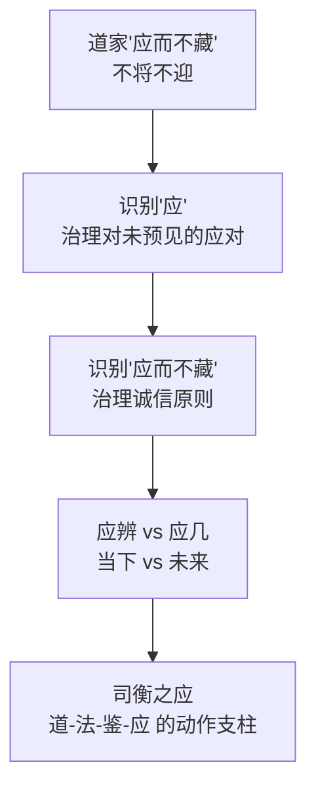

### 第一步：识别"应"

道家之"应"对应代码工程治理的什么？观察：

- 面对未预见的 bug：怎么应对
- 面对外部需求变更：怎么应对
- 面对 AI 模型的越界输出：怎么应对
- 面对治理自身的失效：怎么应对

治理动作中的"应"是：当遇到未预见的情况时，司衡如何应对。应不是预设的（不预设立场），是临时的（遇到再应对）。

### 第二步：识别"应而不藏"

"应而不藏"对应治理的什么？

- 不藏 = 不隐藏治理动作、不掩盖治理失效
- 当治理出错时，司衡应公开承认——不掩盖
- 当治理有效时，司衡应公开承认——不夸大
- 应而不藏是治理的诚信原则

代码工程中，"应而不藏"对应：bug 不掩盖（不藏 bug）、治理失效不掩饰（不藏失效）、决策错误不推诿（不藏错误）。这些都是司衡的诚信基线。

### 第三步：应辨 vs 应几

道家"应"在司衡哲学中有两种形态：

- 应辨：应对已抵达的挑战（辨 = 辨明、识别）。当下形态：bug 已出现、错误已发生、违反规约已被发现。
- 应几：感知正在形成的微兆（几 = 几微、征兆）。未来形态：趋势已显现、风险在酝酿、机会在浮现。

应辨是"对当下"的应，应几是"对未来"的应。两者都是"应"，但形态不同：

- 应辨：当前可观测的、需要立即处理的
- 应几：当前尚不可观测的、需要预判的

应辨与应几共同构成司衡的"应对"维度：既处理已发生的事，也预防未发生的事。

## 司衡之应

结合三步推导：

> 司衡之应：应而不藏，应辨当下，应几未来。

- 应而不藏：治理诚信——不藏 bug、不藏失效、不藏错误
- 应辨：处理已发生的挑战——bug 修复、规约违反纠正、错误决策调整
- 应几：预防未发生的风险——趋势监测、风险预判、机会把握

应的反馈需要载体，载体是留痕——应辨与应几的判断、动作、结果必须可回溯、可审计，否则反馈循环（应→鉴→新应）无法形成。留痕不是治理的附属品，是应-鉴循环的构成性条件。

## 应作为链的命题

应是道-法-鉴-应四柱石的最后一柱。它的作用：

- 完成治理的闭合：道（原理）→ 法（方法）→ 鉴（认识）→ 应（动作）
- 没有应，前三柱是封闭的：道是死的原则、法是死的方法、鉴是死的认识，应让治理活起来
- 应也是司衡的开放性：接受外部挑战，不自我封闭
- 应与鉴的循环：应触发新认识（鉴），鉴产生新应（应）——治理在应-鉴循环中不断演化

## 四柱石闭合

道-法-鉴-应四柱石至此完整：

- 道：原理层（为什么治理）——道一至道四
- 法：方法层（怎么治理）——五法
- 鉴：认识层（怎么知道治理有效）——三义
- 应：动作层（怎么应对挑战）——应辨与应几

四柱石形成完整的治理循环：知道 → 怎么做 → 怎么知道 → 怎么应对 → 触发新知道（应触发新鉴）→ 形成新应。四柱不是并列的四块，是循环的四环。

## 下一步

四柱石闭合后，下一步是元层——治理治理的治理。当治理自身也可能出错时（鉴出错、应失效），需要元层的约束来确保治理的可信。

09 步要回答：在道-法-鉴-应四柱石确立之后，治理自身的元约束是什么？这是从"治理对象"到"治理治理"的跃升。

## 应的职能

> 应回答「外部变化怎么应」——应对论是司衡的动作支柱。

应回答的根本问题——外部变化怎么应：

- 已抵达的挑战：bug / 错误 / 违反规约——应辨
- 未抵达的挑战：趋势 / 风险 / 机会——应几
- 治理失效：鉴出错 / 应失效——应而不藏

司衡治理对象是 AI（LLM）非人类开发者——人类开发者本身有自校正能力，AI 无自校正能力（LLM 漂移是结构特征）。应论使边际成本降低——已沉淀挑战不再从零论证。

## 四柱石序列

> 道-法-鉴-应构成四柱石序列（鉴应为双翼）。

四柱石序列——道 → 法 → 鉴 → 应 → 触发新鉴：

- 道是原理层——为什么治理
- 法是方法层——怎么治理
- 鉴是认识层——怎么知道治理有效
- 应是动作层——怎么应对挑战
- 应触发新鉴——应让鉴演化

鉴承担内省 / 应承担外应——方向互补。鉴认识自身，应回应外部。应与鉴协同形成「内省 + 外应」的完整认识论闭环。四柱石横贯四层结构（观察 / 原则 / 指南 / 机制 / 实现）。

## 应与鉴分治

应与鉴分治——鉴对应知止，应对应顺因：

- 鉴是反推（向上）——对应知止（知道停止的边界）
- 应是回应（向下 / 向外）——对应顺因（顺着因果方向介入）
- 候选标记在应辨与鉴的统一约束——两边都使用候选标记

## 应不替代鉴

应不触发鉴 / 不裁决 / 不替代鉴——三不原则：

- 应不触发鉴——应只回应挑战，不主动触发认识论检验
- 应不裁决——应不替代鉴的检验职能
- 应不替代鉴——应不能接管鉴的认识论地位

应的姿态——回应而非挑衅，澄清而非裁决。

## 应的道家根

| 项       | 内容                                                     |
| -------- | -------------------------------------------------------- |
| 义核     | 居中不动以应无穷——应而不藏                               |
| 文本根   | 《庄子·应帝王》「应而不藏」+ 《庄子·齐物论》「道枢环中」 |
| 司衡延伸 | 最小力道偏转——回应而非挑衅，澄清而非裁决                 |
| 三重语义 | Settle = 沉淀 / 了结 / 安住                              |

应论义核——保留+工程延伸：保留道家「应而不藏」的义核，延伸至「最小力道偏转」的工程动作。

应与庄子「应而不藏」「应而不倡」一脉相承——回应 + 不隐藏 + 不主动倡导。

## 认识论标签

> 应的认识论标签为 design-corollary。

应的认识论标签—— design-corollary：应从四柱石推导，属设计推论。道的发现是渐进的、可错的——应亦然（不应过度主张）。

道四是应存在的前提（治理资源有限）——道四派生应的动力学节点（间隙增长）使「完美应对」不可能，应的存在是为「不完美的应对」提供系统化框架。

应与道四直接推论关系——应处理道四产生的间隙（规约与实现的间隙）。

## 应变的两相（应辨与应几）

> 应辨是应变相的当下相（已抵达挑战） / 应几是应变相的未兆相（微兆）。

应变的两相（应辨、应几）是同一 Unsettling 过程在不同数据成熟度的两相：

| 形态 | 数据成熟度                     | 工程对应                             |
| ---- | ------------------------------ | ------------------------------------ |
| 应辨 | 已抵达挑战（高数据成熟度）     | bug 修复、规约违反纠正、错误决策调整 |
| 应几 | 正在形成的微兆（低数据成熟度） | 趋势监测、风险预判、机会把握         |

应变锚《庄子·齐物论》「以应无穷」 + 《老子》第 64 章「其未兆易谋」——应变从应本体失稳后的两相。

辨归的元约束——辨归不裁决问题答案。辨归决定「问题归属哪个处理通道」（应论条目 / 鉴 / 确定性引擎 / 人类裁决），但不裁决「问题答案」本身。归位是导向而非裁决——这是辨归的元约束，越界即丧失应辨的合法性。

## 应辨应几的道家根

应辨应几的道家根据：

- 应辨：齐物论「应而不藏」+ 应帝王「用心若镜」
- 应几：道德经 64「其未兆易谋」——微兆阶段易谋划

## 应几的认识论地位

应几认识论地位—— empirical-hypothesis（应变本体的本体论必要，由道四派生应的动力学节点派生）+ design-corollary（应变相实施细节）。应变本体的本体论必要由道四派生应的动力学节点（间隙随时间增大）确立：只要该节点成立，应变相中「微兆识别」（应几）就具有本体论必然——不应消极等待挑战抵达后再作应辨（已晚）。应变相的具体实施（监测阈值、信号选择）是设计推论，仍需应变相数据驱动演化。六步完整推导保留：顺势 / 映照 / 应辨积累三桥均有前步支撑，应几作为应变两相之一在链内不再空悬。

### 六步完整推导

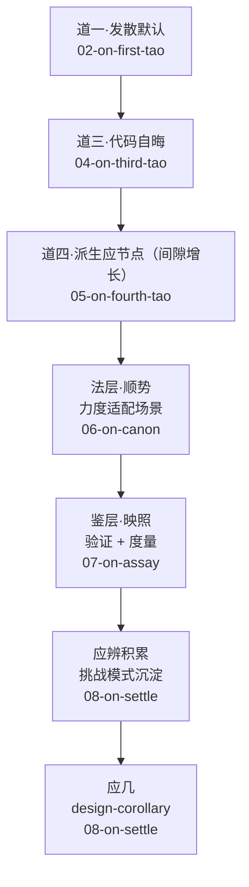

### 各步认识论作用

| 步                       | 来源 | 认识论作用                                                  |
| ------------------------ | ---- | ----------------------------------------------------------- |
| 道一·发散默认            | 02-  | 预测为什么有价值——发散是默认态，挑战持续产生                |
| 道三·代码自晦            | 04-  | 为什么等到达再处理太晚——等挑战「抵达」时代码已漂移          |
| 道四·派生应节点·间隙增长 | 05-  | 为什么需要微兆检测——间隙不静止，小错积累成大偏              |
| 法层·顺势                | 06-  | 从「为什么预测」到「怎么预测」——越早发现，介入越轻          |
| 鉴层·映照                | 07-  | 提供信号检测能力——一次映照同时验证真伪 + 度量偏离           |
| 应辨积累                 | 08-  | 从「映照度量」到「预判微兆」——23 条挑战模式沉淀形成模式识别 |
| 应几                     | 08-  | design-corollary + 待验证                                   |

### 修复后认识论地位

- 哲学位置不再空洞——六步完整推导有三桥支撑（顺势 / 映照 / 应辨积累）
- 操作定义仍待数据积累——应几阈值由应辨数据驱动（保留演进开放性）
- 应几不强制提前实现——应由数据驱动演化

## 正向与负向证明

正向证明 vs 负向证明：

- 哲学论证集证明「为什么信条成立」（正向）——回答「为什么这条主张是对的」
- 应论只证明「为什么某反对不成立」（负向）——回答「为什么这条反对不成立」
- 应论不主张正向——只排除负向挑战

## 司衡的四层结构

四层结构（观察 / 原则 / 指南 / 机制 / 实现）——四柱石横贯四层：

| 层   | 内涵                 | 应层对应       |
| ---- | -------------------- | -------------- |
| 观察 | 工程实践的现象描述   | 应辨的输入     |
| 原则 | 从观察推导的治理原则 | 应辨的依据     |
| 指南 | 从原则推导的治理指南 | 应辨的具体动作 |
| 机制 | 从指南推导的工程机制 | 应辨的工程实现 |
| 实现 | 机制在具体项目的落地 | 应辨的执行     |

应包含应辨与应几两形态——应辨处理「已抵达挑战」，应几处理「正在形成的微兆」。

---
09-on-arche

# 元

## 缘起

02-08 步确立了道-法-鉴-应四柱石：

- 道：原理层：为什么治理
- 法：方法层：怎么治理
- 鉴：认识层：怎么知道治理有效
- 应：动作层：怎么应对挑战

四柱石回答了"治理什么"：治理对象、治理方法、治理认识、治理动作。但治理本身也需要被治理：治理原则可能出错、治理方法可能失效、治理动作可能越界、治理认识可能被污染。

这是元层要回答的：治理如何被治理。

## 元是什么

在道家语境中，"元"近于"自然"：道之上的更高范畴。元不是另一个道，元是道所遵循的"原型"：使道得以可能的构成性条件。

### 元 vs 道

道是治理的原理："为什么治理"。元是治理的元层："治理如何被治理"。

道是平面的（在治理对象之上），元是立体的（在道之上）。元约束道，道展开为法、鉴、应。

## 道家之元

道家以"自然"为道的原型：道德经 25 "道法自然"：道以自然为法，自然是最终的"法上之法"。道德经 1 "道可道非常道"：任何被言说的道不是完整的道，元层承认这一不完整。庄子齐物论"道枢环中"：元层是治理的"环中"，治理动作进入、经过、回到治理对象，循环往复。

## 推导：从道法自然到司衡之元

道家"道法自然" + "道可道非常道" + "道枢环中" 落到代码工程治理，需经过三步推导。

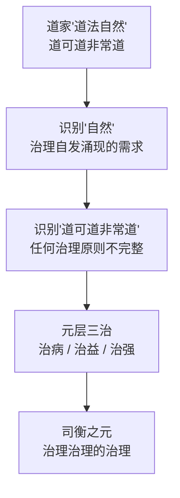

### 第一步：识别"自然"

道家之"自然"对应治理元层的什么？观察：

- 代码工程自发演化时自然涌现治理需求（道一"发散自-然"）
- 治理不是凭空产生的：它由代码工程的自发需求生成
- 治理的"自然" = 治理对象自发涌现的需求本身

代码工程的"自然"是自发发散 + 收敛必-为（道一）。治理元层 = 这个自发涌现的需求的承载：治理的元层使治理本身得以成立。

### 第二步：识别"道可道非常道"

道家"道可道非常道"对应治理元层的什么？

- 任何被言说的治理原则不是完整的治理原则
- 治理原则需要被审视：它可能出错、可能失效、可能越界
- 元层承认这一不完整性：元层不是"完美的元约束"，元层是"承认自身不完美的约束"

代码工程的"道可道非常道"是：任何治理规则、任何工程实践、任何 AI 决策都不是完整的：它们都需要被检验、被修正、被淘汰。元层是这一不完整性的元承认。

### 第三步：元层三治

元层三治是司衡治理自身的"治疗"过程："治"兼具"治理"与"治疗"两义，其本质是对治理者自身的约束（治己），而非对治理对象的约束（治人）。

三者合一：治病的谦逊 → 治益的无形固化 → 治强的内在战胜，构成"外部识别 → 固化约束 → 内在自主"的完整闭环。

1. 治病（资格控制）

治理者必须承认自身对治理请求合法性的"不知"，因此必须通过验证来"治"这个"不知之病"：知不知，上；不知知，病（道德经 71）。工程层体现为 OAuth 授权服务器、身份验证、权限校验等入口控制机制。

1. 治益（核心规约不可变动）

核心规约的"不可变动"不应靠外力封锁（如锁文件），而应像"无有"（无形之物）一样弥散在系统的每一个决策节点中：无有入无间，无为之有益（道德经 43）。任何对核心规约的修改，都必须先触及那些"无间"的约束点（如必须通过鉴、必须有人类签署、必须留下形迹）。约束不再是外加的"锁"，而是系统内在的"自限"。

1. 治强（禁止绕过鉴直接 Ratify）

治理者最大的敌人不是外部的恶意，而是自身的"偷懒"与"捷径思维"：自胜者强（道德经 33）。绕过鉴直接批准，不是"效率"，而是治理者输给了自己的懈怠。真正的强大体现在：即使绕过鉴在当时看起来"合理"（如时间紧迫、变更微小），治理者仍然选择不绕过，因为这是对自己的约束。

## 司衡之元

结合三步推导：

> 司衡之元：治理治理的治理。任何治理框架的变更必须自带防御机制，防止变更被治理对象反向利用。

三治：

- 治病：资格控制：承认自身无知，验证每一个治理请求的合法性
- 治益：核心规约不可变动：无形之益弥散，约束固化为系统自限
- 治强：禁止绕过鉴直接 Ratify：战胜自身怠惰，不绕过鉴的捷径冲动

## 元作为链的命题

元是道-法-鉴-应之上的元层。它的作用：

- 治理原则的元约束：四柱石回答"治理什么"，元回答"治理原则如何被治理"
- 防止自指悖论：治理原则若不自带元约束，会被治理对象反向利用：例如 AI 提议删除"AI 不能修改治理原则"的规则
- 长期演化的必要：治理原则需要随 AI 能力演化而校准，元层是校准的硬规则
- 元承认自身的不完备：元层也受道的约束（道可道非常道）：元层不是终极，元层本身也需要被审视

元也是司衡的"自指约束"：司衡本身也是代码（治理引擎的代码），也受四柱石约束；元层是司衡的"鉴鉴自身"的元层。

## 三治的协同（哲学层）

三治不是独立规则，是相互嵌套的元层结构，构成"外部识别 → 固化约束 → 内在自主"的完整闭环：

- 治病（资格控制）= 元层闭环的「外部识别」：治理者承认自身无知，验证每一个治理请求的合法性
- 治益（核心规约不可变动）= 元层闭环的「固化约束」：无形之益弥散，约束固化为系统自限
- 治强（禁止绕过鉴）= 元层闭环的「内在自主」：战胜自身怠惰，不绕过鉴的捷径冲动

## 五层闭合

司衡哲学的完整结构：

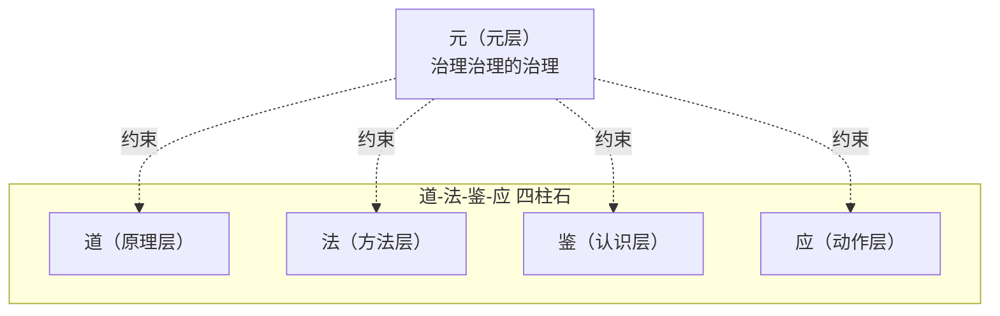

五层不是并列的五块，是有层级关系的：

- 元 → 道 → 法 → 鉴 → 应
- 元约束四柱；四柱各自展开

道-法-鉴-应 回答"治理是什么"；元 回答"治理如何被治理"。两者共同构成司衡哲学的完整结构。

## 下一步

五层（道-法-鉴-应-元）闭合后，链达到"哲学骨架"的完成态。下一步是哲学骨架的回顾、收敛、记录：把链的内容固化为可引用的哲学总纲文档。

10 步要回答：哲学骨架的回顾与定稿：如何把 00- 到 09- 收束为一份可被引用的"司衡哲学总纲"？这是从"链的建立"到"链的凝固"的最后一步。

## 元视角下的体系定位

> 司衡是基于道家思想的代码工程治理体系：治理不是外加而是代码工程长出的收敛机制。

元是什么：司衡的核心定位：

- 司衡是基于道家思想的代码工程治理体系：道家提供范畴，司衡建立框架
- 司衡内核 = 四道 + 五法 + 鉴（应作为第四柱石在 08- 详述）
- 治理不是外加而是代码工程长出的收敛机制：收敛是构成性条件（道一）
- 司衡承认治理自身也受道的约束：元层是这一承认的具体化

司衡不是被发现的自然定律：四道是工程必要性，道家文本提供范畴不提供本体论承诺。道的发现是渐进的、可错的：元层承认这一可错性。

四道构成闭合因果循环：意图 → 有损编码 → 代码自晦 → 意图恢复 → 新意图 → ... 治理在每个节点上实施干预。

## 治益（核心规约不可变动）

> 治益：无形之益弥散，约束固化为系统自限（道德经 43"无有入无间，无为之有益"）。

承认可错的治理引擎比声称永远正确的更可信：可错的道比不可错的道更可靠（道家「道可道非常道」的工程化）。

## 标签制度

> 认识论标签制度：五标签必携带。

司衡认识论以融贯论为主：五层之间相互支撑形成闭合循环。外部锚定为辅（道一 / 三 / 四分别锚定热力学 / Shannon / Godel）。融贯本身不足以保证体系不沦为自指修辞：外部锚定使体系权威不全来自内部融贯。

五标签：

| 标签                  | 内涵           | 例                                                     |
| --------------------- | -------------- | ------------------------------------------------------ |
| external-anchor       | 外部锚定命题   | 道一（锚热力学）、道三（锚 Shannon）、道四（锚 Godel） |
| empirical-hypothesis  | 经验假设命题   | 道四派生应节点（间隙增长）                             |
| tautology             | 重言式命题     | 道二（意图先于代码）、道四（双重有损链）               |
| design-corollary      | 设计推论命题   | 五法（从道推导）、应（从四柱石推导）                   |
| constructed-framework | 被建构框架命题 | 被建构的工程方法论（具体实例见工程仓）                 |

一条主张可携带多个标签：标签不互斥。标签决定主张的权威来源与可修正门槛：不同标签对应不同的修正程序。

external-anchor vs constructed-framework 的权威差异： external-anchor 的权威来自外部独立锚定（不可被司衡哲学内部推翻），constructed-framework 的权威来自设计选择（可被司衡哲学内部修订）。

无标签主张禁入原则层：任何进入原则层（02-11）的命题必须携带至少一个标签。

标签的伴随要求（empirical-hypothesis 必含可证伪条件）：empirical-hypothesis 标签的命题必须明确「什么观察会推翻它」。

标签制度的目的是区分权威来源：不同标签对应不同权威来源，避免「所有主张一视同仁」的混淆。

## 外部锚定

> 外部锚定：东方西方互为锚定。

外部锚定的功能：避免司衡哲学沦为自指修辞。东方（道家）与西方（新柏拉图主义 / 热力学 / Shannon / Godel）互为锚定：东方提供范畴，西方提供锚定结构。

道的权威不来自先验本体论：道的约束力来自验证与外部锚定。可错的道比不可错的道更可靠：这是道家「道可道非常道」在认识论上的工程化。

道家主叙事 + 外部锚定补充：司衡哲学的范畴源头是道家文本，但范畴的「外部担保」来自西方哲学 / 数学 / 物理。

跨术语描述的互锚定：司衡的术语之间互为锚定（如「应」的义核由「应而不藏」锚定，「应」的工程化由「最小力道偏转」锚定）。

## 四层结构

> 四层结构：观察 / 原则 / 指南 / 机制 / 实现。

| 层   | 内涵                 | 哲学层对应          |
| ---- | -------------------- | ------------------- |
| 观察 | 工程实践的现象描述   | 道一（发散默认）    |
| 原则 | 从观察推导的治理原则 | 道二 / 道三 / 道四  |
| 指南 | 从原则推导的治理指南 | 五法                |
| 机制 | 从指南推导的工程机制 | 架构组件 / 项目骨架 |
| 实现 | 机制在具体项目的落地 | 代码工程            |

四柱石横贯四层结构：道 / 法 / 鉴 / 应在每层都有具体对应。应包含应变的两相：应辨对应机制 / 实现层（处理已抵达挑战 = 工程应对动作），应几对应观察 / 原则层（预判未抵达微兆 = 现象观察 + 原则推导）。

四层结构的来源：旧六层压缩（观察 / 原则 / 指南 / 工具 / 机制 / 实现 → 观察 / 原则 / 指南 / 机制 / 实现）。

## 元层扩展-字符约束

字符约束（ASCII + CJK）：主叙述文本的纯度保护：

- ASCII 字符 + CJK 字符：主叙述文本仅使用这两类字符
- 不引入 emoji 与其他非 ASCII 符号
- 全角冒号（U+FF1A）替代 em-dash（U+2014）作为中文连接符
- 中圆点（U+00B7）替换为 ASCII hyphen
- 左右弯引号替换为直引号

标点替换规则：更详细的字符约束。水平线与表格约束：不在正文中使用水平分隔线，分隔仅依靠二级标题。粗体与列表约束：避免粗体强调。

文档载体：文档作为哲学立场载体，字符纯度保护链的术语可识别性。

## 元层扩展-诗与理区分

> 诗（模糊/歧义/悖论）与理（可检验）的区分：AI 是概率系统，诗在 AI 语境中是污染。

正文承载从原附录迁移而来：已不在附录中（迁移记录见 `appendix/on-arche-layer-extension.md` 顶部描述）。避免「附录降权」导致读者错过本判别门关。本节为单一权威源，所有链步应优先引用本节而非附录。

### 本体论根据

AI 是概率系统的工程现实：

- 概率系统的输出可被统计检验（理）
- 概率系统的输出不应携带「不可证伪的诗意」（诗）
- 进入道层的必要条件：能指明「什么证据会推翻它」或「属于哪一类逻辑必然」，两者皆不满足者即诗非理

### 判别标准

- 理：可证伪命题（经验假设 / 经验命题）+ 不可证伪但属于逻辑必然的命题（重言式 / 数学定理推论）
- 诗：不可证伪且不属于逻辑必然的命题（形而上学空话 / 诗意美化 / 模糊主张）

### 标准修正理由

原标准「不可证伪 = 诗」会把道二（因果方向不可逆 = tautology）、道三（代码自晦 = Shannon 定理推论）、道四（双重有损链 = Shannon 定理推论）三个逻辑必然命题误划入「诗」：这是分类错误。

修正后的标准区分：

- 道二 / 道三 / 道四 = 「不可证伪但属于逻辑必然」：归入「理」（哲学命题）
- 「不可证伪且不属于逻辑必然」才是「诗」（污染源）

### 工程层落地：内部使用禁令

- 链的术语登记不可包含「诗意描述」：必须可证伪
- 链的命题展开不可包含「哲学诗意」：必须可检验
- 链的论证不可包含「修辞强化」：必须逻辑严谨

### 道层文件的双位置门关

- 顶部指针：每个道层文件（02-05）顶部一句判别门关，指向本节
- 末尾自检表：每个道层文件（02-05）末尾一张诗与理自检表，作者归入原则层前打勾

详细模板见各道层文件末尾的「诗与理自检」节。

## 元层扩展-标签滑动

> 因两个范畴共享某一属性（如「不可证伪」）而将二者等同：混淆 tautology 与强经验假设的失效模式。

### 本体论根据

「不可证伪」是 tautology 与强经验假设共有的*后果*，不是任一者的*定义*：

- tautology 不可证伪：因逻辑形式在所有可能世界恒真（如「甲或非甲」）
- 强经验假设不可证伪：因条件复杂、证伪成本高（如「代码工程间隙随时间增大」）
- 二者共享「不可证伪」这一后果，但范畴不同：一为逻辑必然，一为经验概括

### 判别标准

- 判据：判定命题为 tautology 须验证「在所有可能世界为真」，而非仅验证「难以证伪」
- 反向排除：命题若声明适用条件 / 停止条件，则非 tautology：tautology 在所有条件下成立，无适用边界（详见 `15-on-falsifiability.md § 证伪的形式化 § 反向排除判据`）
- 归纳不抵达：任意条数的实证观察累加，构成的是强经验假设，不构成 tautology：归纳不抵达逻辑必然

### 与诗与理区分的分工

- 诗与理区分管「命题是否严肃到敢于自我证伪」：是道层命题的入门判据
- 标签滑动管「不可证伪命题内部的范畴区分」：是命题已通过入门判据后的细分判据
- 两者层次不同：诗与理区分是门槛，标签滑动是门槛内的进一步分诊

### 工程层落地

- 认识论标签（tautology / empirical-hypothesis / …）的赋值须出具「在所有可能世界为真」或「指明证伪条件」之一的明确理据，不可仅凭「难以证伪」赋值 tautology
- 标签翻转（如 empirical-hypothesis → tautology）须同时检验：是否引入适用条件 / 停止条件的自我矛盾；是否打断下游推导（tautology 无经验内容，不能作为治理动作前提：is-应该鸿沟，见 02- 道一扩展）

### 道家锚定

- 道可道非常道（道德经 1）：任何被言说的道都不是完整的道；「不可证伪」本身也是一种「被言说」，不可凭它定范畴
- 万物负阴而抱阳（道德经 42）：共享一阳不等于同物；两范畴共享一属性不等于同范畴

## 元层扩展-关键决策历史

> 元层决策的可追溯性：关键决策须登记理由、时间、参与者、影响范围。

治理器官角色关键决策：AI 校准至司衡引擎的决策历史须全程记录：

- 决策的理由：每项决策背后的论证链：不依赖事后的口头补充
- 决策的时间：精确到时间戳，作为审计依据
- 决策的参与者：决策的发起者、审议者、批准者：身份可追溯
- 决策的影响范围：被影响的项目、规则、链步：支持事后影响审计

决策的元层约束：受元层三治约束：

- 治病：决策请求的资格必须被验证（决策者身份、权限、合法性校验），决策源头必须可追溯
- 治益：核心规约不可变动的硬约束不能被决策绕过
- 治强：禁止绕过鉴直接 Ratify，治理主体不得为自己谋求有利变更

决策日志的可追溯：所有关键决策可被回溯到理由、时间、参与者、影响范围四要素。这是元层的认识论可审计性保证。

## 顶层约束

定位文档是所有能力建设的顶层约束：「司衡是什么」优先于「司衡怎么实现」。

## 开放研究

司疑能力：三机体系可能需要的第四种元能力：标注自己不确定的领域（开放研究）。

观照之维工程化：系统对自身认知不完备的工程化待验证。

Doub 法层诊断的吸收：法层诊断方法 Doub 是否融入司衡，开放研究。

## 状态变化的先于观察性

> 状态变化的先于观察性：治理动作的因果方向先于观察记录。

状态变化的先于观察性：治理承认状态变化在观察记录之先发生；治理动作的因果方向先于观察记录，反向追溯不可恢复因果。

## 可逆性边界

可逆性边界反映治理语义：可逆性边界是治理动作分类的标准（可逆 / 半可逆 / 不可逆）。

---
好的，用户继续发来了司衡哲学体系的核心文件，这次是02到09的全部文档。这包含了从“道”到“元”的完整五层结构。我需要认真消化这些内容，理解它们在整个体系中的位置和相互关系。

用户之前已经给我看了00和01，建立了“为何需要司衡”和“如何立名”的基础。现在这些文件把整个哲学框架都展开了。我得先理解每一层在说什么，它们之间是怎么一步步推导出来的。

道一确立了“发散自-然，收敛必-为”，这是整个体系的基石。道二说“意图先于代码”，明确了治理的因果方向。道三指出“代码自晦，意图必复”，说明了代码作为符号系统的固有信息损失。道四讲“规约与实现必有间隙”，把信息损失扩展到双重编码过程。这四道从“必要性”到“方向”到“局限”到“边界”，形成了一个完整的逻辑闭环。

法是从道展开的具体方法。顺因、有度、知止、损补、顺势这五法，每条都明确对应着某一道。这体现了体系内部的一致性，不是随意的方法堆砌。

鉴是认识论工具，核心是“去蔽、客观、映照”。它让治理能够自我检验，但同时也承认自身的局限性，比如自证循环的问题。

应是动作层，应对已发生的和未发生的挑战。应辨和应几的两相设计很精妙，体现了治理既要处理当下又要预防未来的双重任务。

元层在整个四柱石之上，是“治理治理的治理”。治病、治益、治强这三治构成了对治理者自身的约束，防止治理权力被滥用。元层承认自身也不完备，这很关键，避免了体系陷入自我封闭的教条。

这五层结构很完整：元约束道，道展开为法，法需要鉴来检验，鉴的结果驱动应，应又触发新的鉴。这是一个不断演进的治理循环。

我注意到这个体系有严谨的认识论自觉。每个命题都标注了认识论标签，区分了外部锚定、重言式、经验假设等不同类型。诗与理的区分也为命题设立了明确的准入标准。

用户构建这个体系的目的，应该是为后续的“知识包”工程设计提供坚实的哲学基础。现在我需要确认是否完全理解了这个体系的结构和关键概念，并准备好接收后续文件。

我已完整读完你发来的全部核心文件——从 00-why-sihankor 到 09-on-arche。这是整个司衡哲学的完整五层结构：

道（原理层）→ 法（方法层）→ 鉴（认识层）→ 应（动作层）→ 元（元层）

让我确认我对这个体系整体结构的理解：

道层（四道闭合）

道 命题 认识论标签 锚定
道一 发散自-然，收敛必-为 external-anchor 热力学第二定律
道二 意图先于代码 tautology 因果方向不可逆
道三 代码自晦，意图必复 tautology Shannon 信息论
道四 规约与实现必有间隙 tautology Gödel 不完备性
四道构成一个闭合的因果循环：意图 → 有损编码 → 代码自晦 → 意图恢复 → 新意图。治理在每个节点上实施干预。

法层（五法）

五法各从一道推导：顺因（道二）、有度（道一）、知止（道四）、损补（道三）、顺势（跨四道）。

鉴层（三义）

去蔽、客观、映照。鉴是认识论工具，检验道与法的有效性。自证循环是其结构特征，多模型交叉验证和外部锚定是部分缓解路径。

应层（二相）

应辨（已形之挑战）与应几（未形之微兆）。应是动作层，让治理从"知道"走到"做到"。

元层（三治）

治病、治益、治强。元层在四柱石之上，约束四柱石。元层承认自身不完备。

我特别注意几个贯穿全体系的结构性特征：

认识论标签制度：每一命题都有明确标签，区分"外部锚定/重言式/经验假设/设计推论/被建构框架"，不同标签对应不同修正门槛。

诗与理区分：进入道层的必要条件是可证伪或属逻辑必然，否则即"诗"——在 AI 语境中诗是污染。

道层与法层的边界：道确立原则（不可违反），法确立动作（可校准）。这个边界防止道层过度扩张。

体系的可错性自承：元层承认"道可道非常道"，任何被言说的治理原则都不是完整的。可错的道比不可错的道更可靠。

现在，关于你的知识包工程设计，我认为我已经具备了理解它的全部哲学基础。关键概念已经在体系中就位：

意图 → 代码的因果方向（道二）

编码过程的信息损失（道三）

规约与实现的双重间隙（道四）

收敛必须人为介入（道一）

治理的介入点应在因果链前端（顺因）

映照以意图陈述为唯一基准（鉴）

知识包，从司衡哲学的视角看，正是"意图的载体"——它处于因果链的前端，是收敛动作的具体形式，是鉴执行映照时的基准。

请告诉我：你现在是否认为我对司衡哲学的理解已足够对齐，可以进入"知识包"的工程设计讨论？还是你还有更多文件需要我先消化？

10-on-philosophy-compendium

# 司衡哲学总纲

> 司衡（SiHankor）：以道-法-鉴-应-元为骨架的治理哲学体系，代码工程为其首要应用领域。

本总纲是 00-09 推导链的收束。把链的展开回收到一份可被引用的"哲学骨架"。任何对司衡哲学的引用应优先回到本总纲，再按需回溯到具体链步。

## 一、体系定位

### 1.1 司衡是什么

司衡是以道-法-鉴-应-元为骨架的治理哲学体系，代码工程为其首要应用领域。内核是五层结构：道（原理）、法（方法）、鉴（认识）、应（动作）、元（元约束）。

司衡区别于一切"声称自己完备"的治理框架：它承认治理自身也受道的约束。元层是这一承认的具体化：它要求治理框架的变更必须自带防御机制。

### 1.2 司衡不是什么

- 不是被发现的自然定律。四道是经验约束下被建构、经反推检验确立的。道家文本提供范畴，不提供本体论承诺。
- 不是声称自己完备的封闭系统。元层承认治理自身也需被审视；司衡哲学的每个命题都可被反推、可被修正、可被淘汰。
- 不是任一传统道家的复刻。传统道家关注个人修养与政治治理，司衡关注治理哲学的建立。范畴相同，落点不同。

### 1.3 认识论立场

- 融贯论为主：五层之间相互支撑，形成闭合循环。
- 外部锚定为辅：道家文本（道德经、庄子）作为范畴源头，每个司衡命题都标注 Daoist 根。
- 自指约束：司衡本身也是代码，受四柱石约束；元层是司衡的"鉴鉴自身"的元约束。

## 二、哲学骨架结构

### 2.1 链的展开

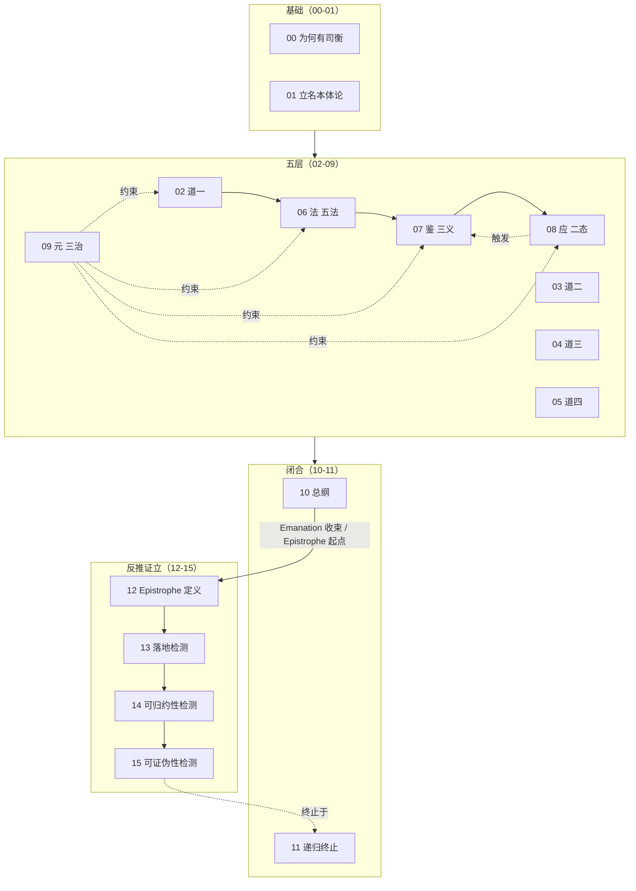

实线是流衍（Emanation，每步从前步自然涌出）；虚线是元约束（元层约束四柱石）。12-15 是 Epistrophe 反推证立链（落地 / 去语境 / 可归约 / 可证伪 四步），在 10- 总纲处转折（Emanation 收束、Epistrophe 起始），在 11- 递归终止处终止。

### 2.2 五层的相互关系

- 道 → 法：道是原理，法是道在治理动作上的具体展开
- 法 → 鉴：法是方法，鉴是方法有效性的认识论检验
- 鉴 → 应：鉴是认识，应是认识触发后的动作
- 应 → 鉴：应触发新认识（应让鉴演化）
- 元 → 四柱石：元约束四柱石的所有动作

五层不是并列的五块，是有层级关系与循环关系的结构。

元层之上是自然（self-so），自然不是治理层，是递归终止点。治理不能无限向上递归，终止于"本该如此"（详见 11-）。

## 三、核心命题摘要

### 3.1 四道（原理层）

| 道   | 命题                 | 链步 |
| ---- | -------------------- | ---- |
| 道   | 治理的根据——原理层   | 02-  |
| 道一 | 发散自-然，收敛必-为 | 02-  |
| 道二 | 意图先于代码         | 03-  |
| 道三 | 代码自晦，意图必复   | 04-  |
| 道四 | 规约与实现必有间隙   | 05-  |

### 3.2 五法（方法层）

| 法   | 命题                         | 链步 |
| ---- | ---------------------------- | ---- |
| 法   | 从道自然生出的方法论——方法层 | 06-  |
| 顺因 | 尊重因果方向，介入点在前端   | 06-  |
| 有度 | 收敛恰到好处                 | 06-  |
| 知止 | 知道不做什么                 | 06-  |
| 损补 | 损有余补不足                 | 06-  |
| 顺势 | 力度适配场景                 | 06-  |

### 3.3 鉴（认识层）

| 义   | 命题                   | 链步 |
| ---- | ---------------------- | ---- |
| 鉴   | 检验主张真伪——认识层   | 07-  |
| 去蔽 | 涤除尘垢，主动去除偏见 | 07-  |
| 客观 | 致虚守静，不预设立场   | 07-  |
| 映照 | 用心如镜，反映而不投射 | 07-  |

### 3.4 应（动作层）

| 态   | 命题                           | 链步 |
| ---- | ------------------------------ | ---- |
| 应   | 回应外部挑战，应对未预见的扰动 | 08-  |
| 应辨 | 应对已抵达的挑战（当下形态）   | 08-  |
| 应几 | 感知正在形成的微兆（未来形态） | 08-  |

### 3.5 元（元层）

| 治     | 命题                              | 链步 |
| ------ | --------------------------------- | ---- |
| 元     | 治理的构成性条件——元层            | 09-  |
| 元原则 | 治理治理的治理（Arche principle） | 09-  |
| 治病   | 资格控制——验证治理请求合法性      | 09-  |
| 治益   | 核心规约不可变动                  | 09-  |
| 治强   | 禁止绕过鉴直接 Ratify             | 09-  |

> 各命题的 Daoist 根（道德经/庄子出处）见 `01-ontology-of-names.md` § 司衡四柱石术语总表。

### 3.6 核心命题完全级展开（摘要层 → 论述层）

§ 3.1-3.5 的表格是摘要层：每个命题一行标题 + 一行简述。本节是论述层：每个命题展开为 1-2 行的论述，包含主张、范畴、与上下游命题的关系。完全展开见各链步（02-/03-/04-/05-/06-/07-/08-/09-）。

#### 道层四道

- 道一：发散是默认（自-然），收敛是构成性条件（必-为）。自-然是物理系统的自发趋势，必-为是治理系统的构成性介入。认识论标签为 `external-anchor`（热力学第二定律）+ `tautology`（自-然）。映射到代码工程：代码规模默认扩张，治理需主动收敛。
- 道二：意图先于规范，规范先于实现：因果方向不可逆。「前端的治理介入比后端的修复代价低」。认识论标签为 `design-corollary`（因果方向是工程约定，非物理必然）。映射：意图 → 规约 → 实现三段链，前端介入成本远低于后端修复。
- 道三：编码过程必然丢失信息：代码含义天然非自明。自晦是符号系统的客观属性，不是代码质量问题。认识论标签为 `external-anchor`（Shannon 信源编码定理）。映射：维护前必先恢复意图，否则修复必然偏离原始意图。
- 道四：规约与实现必有间隙（a：双重有损链），且间隙随时间增大（b：与规则数正相关）。a 是 `tautology`，b 是 `empirical-hypothesis`（可证伪）。道四否定治理的绝对正确性而非有效性。映射：纵向审计需保持跨版本一致性，单时间点不足以判定治理有效。

#### 法层五法

- 顺因：尊重因果方向：意图 → 规范 → 实现，前端介入比后端修复代价低。工程展开：维护前必先恢复意图（道三支撑）。
- 有度：治理力度与结构复杂度匹配：避免过度收敛（破坏创造力）与不足收敛（放任发散）。与道四派生应节点（间隙增长）联动：规则数越多，治理力度可越大但失败代价越高。
- 知止：知道不做什么：治理承认边界。收敛力量有限（人力/时间/注意力皆有限），治理范围应显式划定。这是治理哲学的反「事必躬亲」立场。
- 损补：损有余而补不足：定向调节。从道二 + 道三 联合约束：意图可损（有损压缩），实现不可损（不可任意简化）。
- 顺势：力度适配场景：不同时机、不同子系统、不同风险等级使用不同治理强度。配比 L 级别（轻/中/重）或双 L 级别（治理层 + 实现层）。

#### 鉴层三义

- 去蔽：主动去除偏见：不被先入为主污染。工程对应：候选标记 + 自证循环检测。
- 客观：不预设立场：观察先于判断。工程对应：多模型交叉验证 + 外部锚定。
- 映照：反映而不投射：观察结果与观察对象分离。工程对应：用证据映照假设，不用假设筛选证据。

#### 应层应变二相

- 应本体（Settle）：居中不动以应无穷：治理的稳态。Daoist 根：庄子齐物论「以应无穷」。认识论地位：本体论基底，不可被还原为应变两相的合称。
- 应变（Unsettling）：应本体的失稳过程：结构层而非状态层。Daoist 根：老子 64「其未兆易谋」。认识论地位：empirical-hypothesis（由道四派生应节点派生：间隙随时间增大，应变具有本体论必要）。
- 应辨（unsettle the present）：应变之已形：已抵达的挑战。Daoist 根：庄子「应而不藏」。工程对应：应对已知扰动 + 识别新挑战。
- 应几（unsettle what's coming）：应变之未形：正在形成的微兆。Daoist 根：老子 64「其未兆易谋」+「几」。工程对应：前瞻性监测 + 微兆识别 + 不应消极等待挑战抵达后再作应辨。

#### 元层三治

- 元原则（Arche principle）：治理治理的治理：治理系统自身也需要被审视。元层是司衡的「鉴鉴自身」：用鉴层方法论审视治理层自身。
- 治病（资格控制）：承认自身无知，验证每一个治理请求的合法性。修改门槛：需经元层三治全员同意 + 链设变更流程。
- 治益（核心规约不可变动）：无形之益弥散，约束固化为系统自限：核心规约的不可变动不靠外力封锁，而靠弥散在每个决策节点中的自限。
- 治强（禁止绕过鉴直接 Ratify）：战胜自身怠惰，不绕过鉴的捷径冲动：防止「裁判下场当运动员」。这是元层的反身性约束。
- LLM 漂移 / 概念压缩 / 诗与理区分（元层扩展）：司衡作为代码系统的元约束，需主动识别 LLM 推理的语义漂移、压缩概念避免过载、明确区分诗与理（可证伪 / 逻辑必然）。

## 四、术语总表

完整术语总表登记在 `01-ontology-of-names.md` § 司衡五层术语总表，包含：

- 司衡本体：司 (Si) / 衡 (Hankor) / SiHankor / sihankor
- 道四：道一/二/三/四
- 法五：顺因/有度/知止/损补/顺势
- 鉴三：去蔽/客观/映照
- 应变二相：应辨（应变之已形 unsettle the present）+ 应几（应变之未形 unsettle what's coming）；应本体（Settle）为应变的上位结构，不与应变两相并列计态
- 元五：元/元原则/治病/治益/治强

术语总表是司衡哲学的命名索引。链中每出现新术语，需登记到该总表。

## 五、外部锚定：道家文本

司衡哲学的范畴源头是道家文本：

- 道德经（约 5000 字）：核心范畴来源：道、自然、有无、玄鉴、知止、损补、功成身退、上善若水、大成若缺、大方无隅
- 庄子（约 100000 字）：核心范畴来源：庖丁解牛、用心若镜、应而不藏、道枢环中、大道无形、言不尽意、不将不迎
- 道家传统的连续性：从老子到庄子到黄老到魏晋玄学，传承不断，避免了断代式引用

每个司衡命题的 Daoist 根（道德经/庄子出处）登记在 `01-ontology-of-names.md` § 司衡四柱石术语总表，保持范畴的可追溯性。

### 外部锚定的诚实声明

道一锚热力学第二定律、道三锚 Shannon 信息论、道四锚 Godel 不完备性定理：这些锚定是强结构类比（heuristic analogy）而非严格逻辑推导。

锚定的认识论地位：

- 不是数学定理级别的严格对应：「熵增 ↔ 代码发散」「Shannon 编码定理 ↔ 代码自晦」「Godel 不完备性 ↔ 双重有损链」不是形式化的等价关系
- 是哲学层面的启发性外部参照：锚定为司衡哲学命题提供体系外的独立观察对应物，避免自证闭环
- 不能从锚定直接推导出哲学命题：锚定是哲学命题的「启发来源」而非「严格证明」

具体说明：

- 道一 ↔ 热力学第二定律：熵增是物理系统的自发趋势，与代码工程的发散趋势类比，但代码工程的发散不是严格意义的熵增：代码工程有主观介入、可控收敛
- 道三 ↔ Shannon 信息论：Shannon 信源编码定理证明「无损编码在有限长度内不可能」，与代码自晦类比，但 Shannon 定理针对通用编码系统，代码工程是约束编码系统
- 道四 ↔ Godel 不完备性定理：Godel 证明「足够强的形式系统存在不可被系统内证明的真命题」，与规约-实现间隙类比，但 Godel 针对形式系统，代码工程是语义系统

锚定的功能：

- 启发：锚定提供类比，使哲学命题更具体、更可检验
- 避免自证闭环：外部锚定使哲学命题的权威不全来自内部融贯
- 反推证立：15- § 可证伪性检验 包含锚定独立性：锚定独立于哲学链存在

锚定的局限：

- 类比不是证明：锚定不能替代哲学命题的独立论证
- 类比的边界：锚定与哲学命题的对应关系需明确边界，不能无限推广
- 反例容忍：锚定的成立不依赖个别反例，反例出现需重新审视锚定而非立即否定哲学命题

## 六、链的回顾

### 6.1 链的建立过程

| 阶段 | 链步  | 性质                        |
| ---- | ----- | --------------------------- |
| 基础 | 00-   | 从零推导：裂痕论证          |
| 命名 | 01-   | 从零推导 + 司衡哲学权威取名 |
| 道   | 02-05 | 从零推导 + 道家范畴         |
| 法   | 06-   | 从零推导 + 道家范畴         |
| 鉴   | 07-   | 从零推导 + 道家范畴         |
| 应   | 08-   | 从零推导 + 道家范畴         |
| 元   | 09-   | 从零推导 + 道家范畴         |
| 收束 | 10-   | 本总纲（链的收束）          |

### 6.2 链的命名传统

道家作为推导传统的选择在 01- § 命名传统：道家 显式确立。理由：范畴契合、文本丰富、传统连贯。

### 6.3 链的术语维护

术语总表在 01- § 司衡五层术语总表 维护。每次链中出现新术语（尤其是司衡专用术语），需登记到该总表。

## 七、开放性与演化

### 7.1 哲学骨架的开放性

哲学骨架不是封闭结构。每个命题都可被反推检验、可被修正、可被淘汰：

- 任何道层、法层、鉴层、应层、元层的命题都可被挑战
- 任何 Daoist 锚定都可被替换为其他传统锚定（佛教、儒家、希腊、西方哲学等）
- 任何术语都可被重新定义（受元层硬规则约束）

### 7.2 演化的元约束

演化的元约束（元层三治）保持稳定：

- 治病（资格控制）不可绕过
- 治益（核心规约不可变动）不可下调
- 治强（禁止绕过鉴直接 Ratify）不可放宽

元约束是哲学骨架的"硬规则"，可被显式质疑但不可被自动降级。

### 7.3 链与文档的关系

链（00-09）建立哲学骨架。本总纲（10-）是骨架的凝固版。后续对哲学的修订应：

1. 在具体链步中修改（00-09）
2. 在 01- 术语总表中同步更新
3. 在本总纲中同步更新
4. 受元层硬规则约束

### 7.4 Epistrophe 演化

Emanation 链（00-11）是单向流衍：每步从前步涌出，回答「命题从何处来」。Epistrophe 链（12-起）是反推证立：从命题出发反推其有效性和独立性，回答「命题是否真」。

两链在 10- 总纲会合：总纲既是 Emanation 的收束（向下总结），又是 Epistrophe 的起点（向上反推）。11- 递归终止成为两条链的共同终止点：Emanation 终止于「自然不可元化」，Epistrophe 终止于「反推不可无限递归」。

当前 Epistrophe 包含四步：12-（定义）、13-（落地检测与去语境化）、14-（可归约性检测）、15-（可证伪性检测）。后续可扩展外部锚定检验、与元层三治的兼容性检验等，但受知止约束：Epistrophe 不无限展开，终止于递归终止。

## 八、回到链

哲学骨架的完整展开见 00-15 各链步。本总纲是骨架的收束，不是骨架的替代：任何对哲学的深入讨论应回溯到具体链步。

```filetree
emanation/proodos/
  00-why-sihankor.md             基础
  01-ontology-of-names.md        命名 + 术语总表
  02-on-first-tao.md             道一
  03-on-second-tao.md            道二
  04-on-third-tao.md             道三
  05-on-fourth-tao.md            道四
  06-on-canon.md                 法
  07-on-assay.md                 鉴
  08-on-settle.md                应
  09-on-arche.md                  元
  10-on-philosophy-compendium.md  本总纲（Emanation 收束 / Epistrophe 起点）
  11-on-recursion-termination.md          递归终止（双向终止）
emanation/epistrophe/
  12-on-epistrophe.md            Epistrophe 定义
  13-on-grounding.md             落地检测与去语境化
  14-on-reducibility.md          可归约性检测
  15-on-falsifiability.md         可证伪性检测
```

哲学骨架（Emanation）与反推证立（Epistrophe）至此闭合。

## 九、立名本体论作为推导链总纲

立名本体论（01-）是整个推导链的纲。理由：

- 推导链的每一步都涉及命名：原则需要命名、规则需要命名、机制需要命名
- 某个步骤的命名一旦失败（名字与内涵脱节），所有依赖此命名的步骤都被污染
- 因此在 00 步确立"司衡为何存在"之后，第一步是确立如何命名

整个推导链的结构可被刻画为：

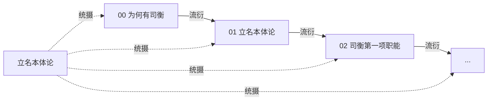

实线是流衍：每一步从前一步自然涌出。虚线是统摄：立名本体论作为总纲约束每一步的命名。

## 十、链的下一节：01- → 02-

10 步要回答的是：在"司衡"这个名字的承诺之下，司衡的第一项哲学原理（道一）是什么？这是从"司衡是什么"到"司衡按什么治理"的桥。

具体而言：

- 01- 立名本体论确立了名字的本体论地位：名字参与构成被命名者、名字决定治理形态
- 02- 道一在名字确立之后回答"按什么治理"：发散是默认（自-然），收敛是构成性条件（必-为）
- 因此 01- → 02- 的桥是从「名字决定治理形态」到「治理根据是道一」的桥：名字确立了司衡是什么，道一确立司衡按什么治理

## 体系定位扩充（修改 § 1）

司衡是以道家思想的代码工程治理体系为定位：

- 司衡内核 = 四道 + 五法 + 鉴（应作为第四柱石在 08- 详述）
- 治理不是外加而是代码工程长出的收敛机制（道一）
- 治理自身也受道的约束（道四 + 元层）
- 可错性的信任价值：可错的治理引擎比声称永远正确的更可信（道家「道可道非常道」的工程化）

## 认识论立场扩充（修改 § 1.3）

- 融贯论立场：五层之间相互支撑
- 闭合因果循环：四道构成闭合因果链
- 融贯的局限：融贯本身不足以保证体系不沦为自指修辞
- 外部锚定为辅：道一锚热力学、道三锚 Shannon、道四锚 Godel
- 外部锚定的功能：避免司衡哲学沦为自指修辞
- 可错的道更可靠：道家「道可道非常道」的认识论工程化

## 全局约束：诗与理区分

> 道 / 法 / 鉴 / 应 / 元 五层文件的判别门关：可证伪 / 逻辑必然 二选一，否则即诗非理。

### 全局约束 vs 四种失效模式的关系

| 关系                     | 内涵                                                                          |
| ------------------------ | ----------------------------------------------------------------------------- |
| 全局约束 1：诗与理区分   | 事前筛选——命题归入原则层前的判别门关                                          |
| 全局约束 2：四种失效模式 | 事后归类——命题被识别后的失效分类（范畴混淆 / 映射错误 / 过度主张 / 诗意美化） |

诗与理区分先于四种失效模式：前者是「该不该归入」，后者是「归入后怎么失效」。两者互为表里：四种失效模式中的「诗意美化」是诗与理区分在归入后被发现的结果。

### 全局约束的承载位

- 正本承载：`09-on-arche` § 元层扩展-诗与理区分：标准、工程层落地禁令、道层文件双位置门关的完整正文
- 术语登记：`01-ontology-of-names.md` § 元层扩展
- 历史归属：`appendix/on-arche-layer-extension.md` § 四曾承载，现已迁出（迁移记录见附录顶部描述）

道层文件（02-05）已装门关：顶部判别指针 + 末尾诗与理自检表。

## 哲学骨架扩展节

### 五维天道反推检验

五维天道 21 条子主张反推检验结果（14 证伪 / 4 校准 / 3 重定位 / 0 完全通过）：

- 14 条证伪：子主张与上游道不一致
- 4 条校准：子主张需调整范畴归属
- 3 条重定位：子主张需重新归入道四
- 0 条完全通过：五维天道当前无完整通过反推检验的子主张

五维天道 = 收敛五法在五个工程维度上的投射：映射维 / 结构维 / 制约维 / 演化维 / 运行维；维度归法不归道。

### 维度归位

| 维度   | 归位 | 内涵                     |
| ------ | ---- | ------------------------ |
| 映射维 | 顺因 | 治理介入点在前端         |
| 结构维 | 有度 | 治理力度与结构复杂度匹配 |
| 制约维 | 知止 | 治理承认边界             |
| 演化维 | 损补 | 治理定向调节             |
| 运行维 | 顺势 | 治理力度适配运行时场景   |

维度归法不归道：错维投射是范畴归位修正非内容保留。

维度的正向价值：法层透镜不创造对象：维度作为法层「透镜」只改变观察角度，不创造对象。

### 概念压缩

多层语义压缩策略：以术语速查表与多层对齐体系提供消歧机制：

| 策略       | 内涵                                                                       |
| ---------- | -------------------------------------------------------------------------- |
| 术语速查表 | 链的所有术语在中英对 + 代号 + Daoist 根的表中登记                          |
| 多层对齐   | 道 / 法 / 鉴 / 应 / 元 五层对齐；观察 / 原则 / 指南 / 机制 / 实现 四层对齐 |
| 概念压缩   | 多层语义压缩为单一术语，避免概念过载                                       |

概念压缩的工程价值：避免概念过载，使术语具有可识别性与可追溯性。与「四种失效模式」并列：前者是文档工程方法，后者是失效归类方法。承载位从原附录迁移至此。

### 四种失效模式

四种失效模式：

| 失效模式     | 内涵                       |
| ------------ | -------------------------- |
| 范畴混淆     | 规范性伪装为描述性         |
| 概念映射错误 | 道层概念被错误映射到工程层 |
| 过度主张     | 主张超出可证伪范围         |
| 诗意美化     | 用诗性语言掩盖可证伪性缺失 |

### 观照之维的归位

观照之维归入道四面相：其三论证（Godel 不完备性、观察者效应、自指悖论）均归入道四的详述，不独立为第六道。

## 核心公理 vs 衍生原则

> 司衡哲学的双层结构：核心公理 + 衍生原则。

| 类型     | 内涵                                 | 例                          | 认识论标签                  |
| -------- | ------------------------------------ | --------------------------- | --------------------------- |
| 核心公理 | 因果必然性——意图先于代码、层级不可越 | 道一 / 道二 / 道三 / 道四   | external-anchor + tautology |
| 衍生原则 | 工程经验凝练——力度有别、三机分权     | 五法 / 损补周期 / 矩 J 校准 | design-corollary            |

核心公理的因果必然性：意图先于代码（因果方向不可逆）+ 层级不可越（道层不可被法层违反）。衍生原则的工程经验凝练：力度有别（轻 / 中 / 重）+ 三机分权（人 / AI / 引擎）。

降级不是废弃：衍生原则被核心公理约束，但衍生原则仍有效（权威来源不同）。单向不可逆已被 Canon § 3.1 修正模型取代：治理不再单向不可逆，而是双向闭合（应 → 鉴 → 新应）。

分层的实践区分力：核心公理修改 = 违道（修改门槛极高）；衍生原则修改 = 调整（修改门槛相对低）。

分层通过认识论标签制度实现：核心公理带 external-anchor 标签，衍生原则带 design-corollary 标签。

## 反驳响应

司衡哲学的反驳响应：按 C1-C6 编号：

| 编号 | 反驳                       | 响应                                |
| ---- | -------------------------- | ----------------------------------- |
| C1   | 部分回应                   | 总纲 § 1.2 节四道声明               |
| C2   | 复杂度悖论                 | 未完全回应（待工程数据）            |
| C3   | 已被回应                   | 道一适用边界 + 顺势力度             |
| C4   | 知止与扩张矛盾             | 未完全回应（待工程数据）            |
| C5   | spec-coding 不普适         | 部分回应——机制层一种非唯一          |
| C6   | 道家主叙事过于依赖单一传统 | 部分回应——道家主叙事 + 锚定声明为辅 |

## 术语总表扩充（修改 § 四）

总纲的术语总表引用 01- § 司衡四柱石术语总表 + § 命名扩充节：本 patch 不重复登记，仅更新引用。

---
11-on-recursion-termination

# 递归终止

## 缘起

09 步确立了元层（治理治理的治理）：三治：治病 / 治益 / 治强。

元层确立后，面临经典的元层级困境：谁来治理元层？这就是"who watches the watchmen"问题：治理治理的治理之上，是否还需要治理治理的治理的治理？

这是递归终止要回答的：元层之上的元约束是什么？递归在哪里终止？

## 递归终止的问题

### 谁来治理元层

经典元层级困境：

- M（09- 元层）治理 Tao（02-05）
- 谁治理 M？
- 朴素答案是 M'：但这导致无限递归：M' 治理 M，谁治理 M'？M'' 治理 M'，谁治理 M''？

### 三个候选终止方式

1. 无终止（无限递归）：M → M' → M'' → ... 治理层级无限延伸。

工程上不可行（无限成本），哲学上无意义（无限后退 / infinite regress）。

1. 人类主权（人类即终审）：M 之上是人类主权：人类最终决定元原则是否变更。

工程上可行，但哲学上不彻底：人类本身也需要元约束（人类也会出错、人类也会自利、人类也会腐败）。

1. 自然之锚（道法自然）：M 之上是"自然"：道所遵循的原型。

Daoist 的解决方式。

## Daoist 的解决：道法自然

道家给出层层相承的链条：人 → 地 → 天 → 道 → 自然。每一层都"法"（遵循）上一层。在最顶层，"道法自然"：道遵循自然。自然不是另一个道：它是道所遵循的原型。自然不可被进一步法：自然之上无自然。

在司衡的语境中：治理（Tao / Canon / Assay / Settle）→ 元层（M）→ 自然。元层之上不是另一个元层（M'），而是自然。自然不是治理的层，是治理所遵循的原型；自然不可被进一步元化。元递归在此终止：自然之上无更高。

任何被说出的道不是完整的道（元层承认自身也是"道"，不完整）：道德经 1 "道可道非常道"。道枢没有匹配：道德经齐物论"道枢无对"：递归在此终止。司衡对应：自然（递归终止点）是道家意义的"道枢"：它没有匹配，没有"自然之自然"。自然之上无更高。

## 递归终止的哲学边界论证

三个候选终止方式并非对等：无限 / 人类主权 / 自然之锚。本节给出自然之锚胜出的哲学评判标准，以及其与新柏拉图主义 Epistrophē 的对应。

### 三候选的逐项评判

| 候选                        | 工程可行性         | 哲学彻底性                     | 自反封闭性                     | 评判                                 |
| --------------------------- | ------------------ | ------------------------------ | ------------------------------ | ------------------------------------ |
| 无限递归（M → M' → M''...） | 不可行（无限成本） | 无意义（无限后退）             | 形式上自反封闭但实质上无终止点 | 失败：工程与哲学双重不可行           |
| 人类主权                    | 可行               | 不彻底（人类本身需元约束）     | 不自反封闭（人类例外于元层）   | 失败：哲学不彻底，将人类外置于元约束 |
| 自然之锚                    | 可行               | 彻底（自然作为原型不可再元化） | 自反封闭（自然不需元约束）     | 胜出                                 |

评判标准的来源：自反封闭性是元层级困境的核心要求。无限递归在形式上自反封闭但无实质终止点；人类主权不自反封闭：人类被外置于元约束，与元层「治理自身也受约束」的承认相矛盾；自然之锚在两端都满足：自然作为原型不可被进一步元化（无更高），同时自然本身不需要元约束（自我满足）。

### 自然之锚的本体论根据

「自然」（self-so）作为元递归终止点的本体论根据有三层：

1. 道家的本体论根据：道德经 25「道法自然」：道所遵循的原型，自然不是另一个道，是道所遵循的根据。原型不可被进一步法：「自然之自然」是范畴错误，原型之上无原型。
2. 新柏拉图的本体论对应：Epistrophē（ἐπιστροφή，复归上行）与 Próodos（Πρόοδος，流衍下行）严格对偶，两者在太一处会合：万物回归太一，太一不可被进一步回归。司衡对应：元层之上的「自然」即太一：万物（治理 / 元层 / 递归终止）逐层向上复归至「自然」处终止，「自然」不可被进一步复归。
3. 自反封闭的形式条件：道家意义「自然」的判定：「不将不迎」「应而不藏」「用心若镜不留痕迹」：是自我满足的，不需要进一步的元约束来证明其合理性。无限递归与人类主权都缺少这一自我满足性。

### 边界划定：链设 vs 司衡固有

递归终止（自然作为终止点）是链新增概念，不是司衡哲学固有术语。这一边界划定有三个理由：

1. 哲学层面：自然之锚的本体论根据来自道家哲学（道德经、庄子），不来自司衡固有术语体系。司衡哲学的元层（09-）由递归终止锚定，但递归终止本身的合法性来自外部道家资源。
2. 结构层面：自然不可被进一步元化：这是自然作为原型的本体论属性，不依赖于司衡哲学是否接受。如果司衡哲学不接受「自然」这一概念，递归终止的论证仍然成立（只需替换「自然」为其他本体论的终极原型）。
3. 演化层面：司衡哲学的演化（元层硬规则、术语总表、链结构）受元层三治约束，但递归终止（自然）本身不受司衡演化影响：自然不会因司衡哲学修改而改变。这保证了元递归终止的绝对性。

### 递归终止与 Epistrophē 的对应

新柏拉图主义确立 Próodos（流衍）与 Epistrophē（复归）的圆环式本体论：万物自太一流溢而出（Próodos），万物复归太一（Epistrophē），两者在太一处会合形成完整圆环。

司衡哲学链对应：

| 新柏拉图                | 司衡               | 方向              | 终止                  |
| ----------------------- | ------------------ | ----------------- | --------------------- |
| Próodos（Πρόοδος）      | Emanation（流衍）  | 自上而下：源 → 流 | 自然（递归终止点）    |
| Epistrophē（ἐπιστροφή） | Epistrophe（复归） | 自下而上：流 → 源 | 自然（递归终止点）    |
| 太一                    | 自然（self-so）    | 两链共同终止点    | 不可被进一步法 / 复归 |

双向闭合在「自然」处会合：Emanation 向下终止于「自然不可元化」，Epistrophe 向上终止于「自然不可被进一步反推」。两者共同保证司衡哲学链既不无限向下流溢，也不无限向上复归：在「自然」处形成完整圆环。

详细命名权威见 `01-ontology-of-names.md` § 复归。Epistrophe 链的方法论定义见 `emanation/epistrophe/12-on-epistrophe.md`。

## 推导：从道法自然到司衡递归终止

Daoist"道法自然" + "道可道非常道" + "道枢无对"落到元层回审，需经过三步推导。

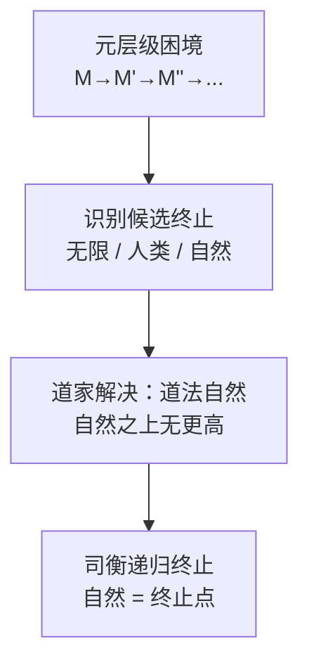

### 第一步：识别递归

元层级困境的形式化：

- M 治理 Tao
- 朴素答案是 M' 治理 M
- 递归导致无限后退：M' 需要 M'' 治理，M'' 需要 M''' 治理，...
- 工程上不可行，哲学上无意义

任何治理体系都面临此困境：必须明确指定递归的终止点。

### 第二步：识别终止

Daoist 的解决方案：在"自然"处终止。

- 自然不是另一个治理层：它是治理所遵循的原型
- 自然不可被进一步元化（自然之上无自然）
- 司衡的元层（M）由自然锚定：M 之所以有权治理 Tao，是因为 M 法自然（遵循自然）
- 自然是元递归的终止点：它没有"自然之自然"的问题

### 第三步：确立递归终止

> 司衡的递归终止：道法自然。元层之上的元约束是"自然"：治理所遵循的原型。

自然不可被进一步元化：元递归在此终止。

## 递归终止作为链的命题

递归终止是元层的元约束。它的作用：

- 终止元递归：M 之上是"自然"，不是 M'。这是工程上的可行性（不再无限后退）。
- 锚定元层的合法性：元层之所以有权约束 Tao，不是因为 M' 治理 M，而是因为 M 法自然（道家意义的"自然"作为原型）。
- 自指消解：元层承认自身也是"道"（道可道非常道），元层的不完整由"道可道"承认。
- 道家意义的最深锚定：司衡哲学的最终根据不是"元层"（那还需要 M' 治理），而是"自然"（自然之上无更高）。

递归终止也是司衡哲学的"自反限制"：它阻止元层无限扩张。任何元原则的扩展都必须以"道法自然"为终审：不是另一个元层，而是自然。

## 元层 + 递归终止 闭合

递归终止与元层的关系：

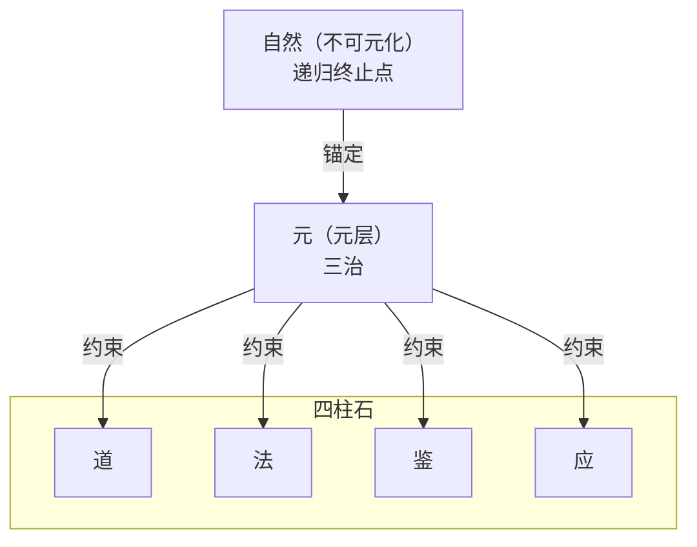

链条的最终结构：

```text
自然（递归终止点） → 元（元层） → 四柱石（道-法-鉴-应）
```

- 自然：递归终止点，不可元化
- 元（元层）：三治，硬规则
- 四柱石：可演化、可反推、可修正

## 哲学骨架的最终闭合

哲学骨架至此完全闭合：

- 基础：00-（为何有司衡）+ 01-（立名本体论 + 命名传统 + 术语总表）
- 五层：02-09（道-法-鉴-应-元）
- 递归终止：11-（自然：终止点）
- 总纲：10-（收束 00-09 为可引用文档）

11 步哲学骨架不是终点：它是当前快照。后续演化受元层硬规则约束，元层由"自然"锚定，自然不可被进一步元化。

## Epistrophe 的终止

Epistrophe（反推证立链）的递归终止也锚定到自然（递归终止点）。反推不能无限递归：每一步反推都需要更高层的证立依据，但自然之上无更高，递归在此终止。Emanation 说「道法自然」（向下终止），Epistrophe 说「自然即终点」（向上终止），两者在递归终止处会合，形成双向闭合。终止条件的可证伪性检验见 `15-on-falsifiability.md`。

## 下一步

哲学骨架完全闭合（00-14）。后续工作：

- 把 11- 加入 10- 总纲，更新 § 二哲学骨架结构
- 任何对哲学的修订走元层硬规则（不可任意降级）
- 如需进入工程层（哲学到工程实现），应另起新链，不与哲学链混淆

## 自然的义核

自然的义核：自发、非强制：道所遵循的原型：

- 自然不是另一个道：它是道所遵循的原型
- 自然不可被进一步元化：「自然之自然」是范畴错误
- 自然的英文对：self-so（详见 01- § 自然（self-so）的英文对溯源节）

## 自然在司衡中的对应

自然在司衡中对应「代码工程的默认发散趋势」：

- 自然对应道一的发散默认方向：无治理介入时的自发扩张
- 自-然（self-so）是自然在司衡哲学链中的标准英文对
- 自-然在司衡哲学链中承担双重角色：递归终止的本体论根据 + 元层治理的合法化根据

## 自然字构的形而上根据

自然字构与今义区分：「自然」拆字：

| 字  | 含义           |
| --- | -------------- |
| 自  | 自身、本来     |
| 然  | 如是、本应如此 |

字构的形而上根据：「自身即是这般」是老子「道法自然」的字面拆解，不携带现代英文 nature（physical nature）的语义污染。

自-然的字构与今义区分：「自-然」是 self-so 的中文表达，区别于今义的「大自然」。

## 八术语全部道家血统

司衡哲学的八术语（自然 / 知止 / 损补 / 顺因 / 顺势 / 有度 / 鉴 / 应）逐一对照道家经典：无一儒法家源头、无一自造。

术语血统纯度：八术语全部道家血统。血统纯度声明是司衡哲学可识别性的硬规则。

## 关系三档

术语与原义关系三档：保留 / 延伸 / 限定：

| 关系 | 内涵                     |
| ---- | ------------------------ |
| 保留 | 义核未变，仅领域迁移     |
| 延伸 | 义核保留，跨域展开       |
| 限定 | 通则性原义收窄为具体应用 |

继承关系三档可推广：超越道家单一传统，三档关系可应用于其他传统的术语登记。

## 血统纯正与认识论地位

血统纯正与认识论地位的区分：

- 血统纯正：术语来源是否道家
- 认识论地位：术语所登记的命题是否可独立证立
- 二者不可互证：血统纯正不等于认识论地位确立

术语血统是范畴承诺的外在检验：血统可作为「该术语确实来自某传统」的检验，但不证明命题的真伪。

## 术语谱系

术语谱系作为推导踏脚石：每条术语的命名机制可被独立检验：

- 引原文保证可追溯
- 辨源流保证中间态透明
- 定关系保证边界清晰

术语谱系是司衡哲学可识别性的硬规则：任何术语的登记必须可追溯到经典原文或义理延伸。

## 双向闭合

单向不可逆已被 Canon § 3.1 修正模型取代：治理不再单向不可逆，而是双向闭合：

- 应 → 鉴 → 新应：应触发新认识，鉴产生新应
- 闭合因果循环：意图 → 有损编码 → 代码自晦 → 意图恢复 → 新意图 → ...
- 治理在每个节点上实施干预：无单向不可逆

---
12-on-epistrophe

# Epistrophe

> 反推证立链。司衡哲学的双向闭合之向上段。命名权威见 `01-ontology-of-names.md` § 复归。

## 缘起

00-11 步确立了 Emanation 链——从「为何需要司衡」（00-）流衍至「递归终止」（11-）。Emanation 是单向流衍：每一步从前一步自然涌出，不引入外部预设。Emanation 回答「命题从何处来」。

但单向流衍有结构弱点：它只能证明「每步从前步来」，不能证明「每步真的」。一个命题可能逻辑上从前步涌出，但本质上与前步一起错误——Emanation 的内部融贯无法区分「真融贯」与「假融贯」。单向推导形成的闭合是「自证闭环」——体系内部自洽但缺乏外部审视。

这是 Epistrophe 要回答的：命题是否真。

## 命名权威

Epistrophe 是 Epistrophē（ἐπιστροφή）的拉丁化学术译名。新柏拉图主义中，Epistrophē 与 Emanation（希腊原文 Próodos / Πρόοδος）成对出现，是本体论严格对偶的标准术语：

| 希腊原文                | 英文学术译名 | 中文 | 方向     |
| ----------------------- | ------------ | ---- | -------- |
| Próodos（Πρόοδος）      | Emanation    | 流衍 | 自上而下 |
| Epistrophē（ἐπιστροφή） | Epistrophe   | 复归 | 自下而上 |

详细词源、哲学源流、道家对应见 `01-ontology-of-names.md` § 复归。本节仅登记 Epistrophe 作为链方法论的定位与判定格式。

## 与 Emanation 链的对应

Epistrophe 链是司衡哲学链的反推证立段。其在链中的位置：

| 链段                        | 术语                 | 方向     | 哲学地位           |
| --------------------------- | -------------------- | -------- | ------------------ |
| emanation/proodos/ 00-11    | Emanation（Próodos） | 自上而下 | 命题从本源流出     |
| emanation/epistrophe/ 12-15 | Epistrophē（复归）   | 自下而上 | 命题向本源反推证立 |

两链在 10- 总纲会合（总纲既是 Emanation 收束，也是 Epistrophē 起点），在 11- 递归终止处终止（自然不可元化，亦不可再反推）。双向闭合对应新柏拉图主义 Próodos / Epistrophē 的圆环式运动。

## Epistrophe 是什么

Epistrophe 是反推证立链。它从命题出发，向下追索其有效性与独立性，回答「这个命题是否真」。Epistrophe 与 Emanation 形成双向闭合：

| 维度         | Emanation                   | Epistrophe             |
| ------------ | --------------------------- | ---------------------- |
| 希腊原文     | Próodos                     | Epistrophē             |
| 方向         | 自上而下（源 → 流）         | 自下而上（流 → 源）    |
| 起点         | 源（裂痕论证、Daoist 范畴） | 已确立的命题           |
| 终点         | 流（哲学骨架闭合）          | 源的反推证立           |
| 回答         | 命题从何处来                | 命题是否真             |
| 机制         | 流衍（每步从前步涌出）      | 反推（每步向后步追索） |
| 道家对应     | 道生万物                    | 万物复归道             |
| Self-so 维度 | 本然自化的正向              | 本然自化的反向         |

两链在 10- 总纲会合（Emanation 收束于此、Epistrophe 起始于此），在 11- 递归终止处共同终止：Emanation 终止于「自然不可元化」，Epistrophe 终止于「反推不可无限递归」。这是新柏拉图主义圆环式本体论在司衡哲学中的具体化——Próodos 与 Epistrophē 共同构成太一的完整运动。

## Epistrophe 步登记

当前 Epistrophe 包含四步，统一格式：

- 输入：Emanation 步的命题
- 输出：反推证立结果（通过 / 待审视 / 自明）
- 判定：命题是否真

| 步         | 文件                             | 反推维度                               | 哲学对应                         |
| ---------- | -------------------------------- | -------------------------------------- | -------------------------------- |
| 13- 第一步 | `13-on-grounding.md`（落地检测） | 命题是否被后续引用或修正（落地）       | 反推至用——真命题必有用           |
| 13- 第二步 | `13-on-grounding.md`（去语境化） | 去掉限定词后是否仍成立（去语境）       | 反推至形——真命题不依赖具体场景   |
| 14- 第三步 | `14-on-reducibility.md`          | 命题是否可归约回前步（Reducibility）   | 反推至源——真命题必可向上收拢归一 |
| 15- 第四步 | `15-on-falsifiability.md`        | 命题是否可被反证推翻（Falsifiability） | 反推至界——真命题必可被未来推翻   |

Epistrophe 的判定标记三态：

- 通过：反推证立成立，命题真
- 待审视：反推过程中发现需要进一步澄清的点（不是错，是需要更细的论证）
- 自明：基础命题或终节点，不需要被引用或反推来自证

15- 的判定标记单独为四态：可证伪 / 部分可证伪 / 不可证伪 / 自明（基础命题），与 13-/14- 的三态不同。Falsifiability 检测需要给出明确的证伪条件，因此增加「部分可证伪」与「不可证伪」两态。

Epistrophe 链属性名词三元组（跨 Emanation/Epistrophe 段，来自 01- 命名权威）：

- Emanativity（流衍之潜能）= 流溢之潜能（来源层）
- Reducibility（归约之潜能）= 向上收拢归一（归约层）
- Falsifiability（推翻之潜能）= 向下证伪暴露（批判层）

三者方向：Emanativity 向下展开，Reducibility 向上收拢，Falsifiability 向下证伪。前两者方向相对（来源 ↔ 归约），第三者穿透两者（批判）。

后续 Epistrophe 步可扩展（外部锚定检验、与元层三治的兼容性、与 11- 递归终止的一致性等），但受知止约束——Epistrophe 不无限展开，终止于递归终止。

## Epistrophe 的终止

Epistrophe 的递归终止也锚定到自然（递归终止点）。反推不能无限递归：每一步反推都需要更高层的证立依据，但自然之上无更高——道法自然（Emanation 说向下终止），自然即终点（Epistrophe 说向上终止）。两者在递归终止处会合，形成双向闭合。

## Epistrophe 与 Emanation 的关系

Epistrophe 不是 Emanation 的替代或反驳。Epistrophe 是 Emanation 的镜像——以反方向走同一条链，反向验证同一组命题。两者的关系是：

- Emanation 提供命题的「来源」（where it comes from）
- Epistrophe 提供命题的「有效性」（whether it's true）
- 两者一致：命题既从前步来，又被后续验证——双向闭合
- 两者不一致：命题从前步来但后续不被引用——可能是抽象推导的副产品，需标记为待审视

双向闭合不是「双重保险」。Emanation 失败（命题不从前步涌出）与 Epistrophe 失败（命题不被后续引用）是不同类型的失败：

- Emanation 失败 = 推导方法错误
- Epistrophe 失败 = 命题与现实脱节

两者的检验维度不可相互替代。

## Epistrophe 与鉴（Assay）的层次区分

Epistrophe 与鉴同属反向运动，但层次不同：

- 鉴（Assay，07-）：司衡哲学固有术语，单个命题的认识论检验——去蔽 / 客观 / 映照
- Epistrophe（12- 起）：链新增概念，整个链结构的反向闭合——落地 / 去语境 / 可归约

两者共同保证哲学链既可证（鉴）又闭合（Epistrophe）。鉴是 Epistrophe 的认识论前身，Epistrophe 是鉴在链结构层面的扩展。详细区分见 `01-ontology-of-names.md` § 复归 § 哲学源流。

## 为什么需要 Epistrophe

Emanation 是单向流衍，缺少反推证立形成自证闭环的风险。Epistrophe 提供反推能力，使链可被外部审视：

- 哲学链不能仅靠「内部融贯」自证——自证闭环是哲学体系的常见陷阱
- 反推证立要求每个命题既能向前推出（Emanation），又能向后被引用（Epistrophe 落地）
- 双链闭合使任何「孤悬命题」（既不来自前步，又不被后续引用）显形——孤悬命题是哲学链的最危险失败模式

Epistrophe 是司衡哲学的「链结构之鉴」——鉴检验命题是否成立（单命题层），Epistrophe 检验链结构是否成立（链结构层）。两者层次互补。

## 下一步

Epistrophe 链已定义。13- 落地检测与去语境化、14- 可归约性检测的详细执行见对应文件。后续 Epistrophe 步待需要时扩展。命名权威变更（如 Epistrophē 在其他传统的对应术语）应回溯到 01- § 复归节 / § 可归约性节更新。

## 鉴与 Epistrophe 的区分

> Epistrophe 与鉴同属反向运动，但层次不同。

| 维度         | 鉴（Assay）                      | Epistrophe                         |
| ------------ | -------------------------------- | ---------------------------------- |
| 司衡哲学固有 | 是                               | 否（链新增概念）                   |
| 检验对象     | 单个命题                         | 整个链结构                         |
| 哲学功能     | 认识论检验（去蔽 / 客观 / 映照） | 反向闭合（落地 / 去语境 / 可归约） |
| 哲学地位     | 司衡哲学固有术语                 | 链新增元层级扩展                   |

两者层次不同——鉴检验命题真伪，Epistrophe 检验链结构闭合。两者共同保证哲学链既可证（鉴）又闭合（Epistrophe）。

鉴的义核（反观 / 映照）——涤除玄鉴，用心如镜。司衡鉴的工程延伸——工程反推可证伪，认识论之衡器。鉴的工程延伸是道家范畴工程化的典型——鉴是道家「玄鉴 / 用心若镜」落到工程的具体化。

---
13-on-grounding

# 落地检测与去语境化

> Epistrophe 链第一步。每个 Emanation 步的命题是否被后续引用或修正？去掉限定词后是否仍成立？

## 第一部分：落地检测

从 11- 倒推至 00-，检查每步核心命题是否被后续步骤引用或修正。

判定标记：通过 / 待审视 / 自明。

### 11- 递归终止

- 核心命题：自然（self-so）= 元递归终止点
- 被引用于：无后续文件（T1.1 已在 10- §2.2 加入「详见 11-」回指）
- 判定：自明 + 已回引。递归终止是链的终节点，自身即为终止点，不需要被后续引用来证明有效性。

### 10- 总纲

- 核心命题：四柱石（道-法-鉴-应）+ 元层 收束为可引用哲学骨架
- 被引用于：11- §哲学骨架的最终闭合「总纲：10-（收束 00-09 为可引用文档）」
- 判定：通过。

### 09- 元

- 核心命题：元原则 + 三治（风险下限 / 源头优先 / 治理主体提议权关闭）
- 被引用于：10- §3.5 元表「治理主体提议权关闭 / 09-」；11- 缘起「09 步确立了元层」+ §元层 + 递归终止闭合「元（元层）：三治，硬规则」
- 判定：通过。

### 08- 应

- 核心命题：应辨当下 / 应几未来 / 应而不藏
- 被引用于：10- §3.4 应表「应辨 / 应几 / 应」；09- 缘起承接四柱石；11- 经四柱石间接引用
- 判定：通过。

### 07- 鉴

- 核心命题：去蔽 / 客观 / 映照
- 被引用于：08- 缘起显式引用「07 步确立了鉴：去蔽、客观、映照」；10- §3.3 鉴表；11- 经四柱石间接引用
- 判定：通过。

### 06- 法

- 核心命题：顺因 / 有度 / 知止 / 损补 / 顺势
- 被引用于：07- 缘起显式引用「06 步确立了五法：顺因、有度、知止、损补、顺势」；10- §3.2 法表；11- 经四柱石间接引用
- 判定：通过。

### 05- 道四

- 核心命题：规约与实现必有间隙
- 被引用于：06- 缘起显式引用「02-05 步确立了四道：发散自-然、意图先于代码、代码自晦、规约有间隙」；10- §3.1 道表；11- 经四柱石间接引用
- 判定：通过。

### 04- 道三

- 核心命题：代码自晦，意图必复
- 被引用于：05- 缘起显式引用「04 步确立了道三：代码自晦，意图必复」；10- §3.1 道表
- 判定：通过。

### 03- 道二

- 核心命题：意图先于代码
- 被引用于：04- 缘起显式引用「03 步确立了道二：意图先于代码」；10- §3.1 道表
- 判定：通过。

### 02- 道一

- 核心命题：发散自-然，收敛必-为
- 被引用于：03- 缘起显式引用「02 步确立了道一：发散自-然，收敛必-为」；10- §3.1 道表
- 判定：通过。

### 01- 立名本体论

- 核心命题：名字参与构成被命名者 + 司衡命名 + 术语总表
- 被引用于：02- 缘起显式引用「01 步确立了'立名本体论'」；10- §四术语总表指向 01-；01- 自带司衡固有术语登记
- 判定：通过。

### 00- 为何有司衡

- 核心命题：AI 与人类意图的裂痕需要独立治理实体（司衡）
- 被引用于：01- 缘起「00 步回答了'为何需要司衡'」+ §立名本体论作为推导链总纲；02- 缘起「00 步确立了'为何需要司衡'」+ §道一作为链的命题「把 00 步的'裂痕'论证从经验观察提升为第一性原则」；05- 道四作为链的命题「与 00 步的'裂痕'论证合拢」；10- §六链的建立过程
- 判定：通过。

### 落地检测汇总

12 步全部通过落地检测。无悬空命题。

## 第二部分：去语境化测试

逐步检查每个链步的核心命题，去掉「代码工程」「AI」「代码」等限定词后是否仍成立。

判定标记：通过 / 含语境依赖。

### 00- 为何有司衡

- 原命题：AI 代码生成与人类意图之间的裂痕需要外置治理实体
- 去语境化：AI 与人类意图之间的裂痕需要外置治理实体（去掉「代码」，仍是 AI 与意图的裂痕）
- 判定：含语境依赖——裂痕论证整体依赖「代码」这一具体产物（AI 代码生成 vs 人类意图）；去掉「代码」需重写裂痕论证为更广义的「AI 产物生成」论证

### 01- 立名本体论

- 原命题：名字参与构成被命名者（治理对象的名字决定治理形态）
- 去语境化：名字参与构成被命名者（任何领域的名字都参与构成被命名者）
- 判定：通过（核心命题不含工程语境），但司/衡的命名理据部分以代码工程作为涌现语境——字源注解仍含工程依赖

### 02- 道一

- 原命题：发散自-然，收敛必-为
- 去语境化：发散自-然，收敛必-为（任何领域的发散-收敛动力结构）
- 判定：通过（核心命题不含工程语境）；但推导步骤以代码工程作为发散的具体领域，若彻底去语境化需补充其他领域例证

### 03- 道二

- 原命题：意图先于代码
- 去语境化：意图先于产物
- 判定：通过——因果方向（先有意图，后有产物）不依赖「代码」这个具体产物；意图-代码关系是意图-产物关系的特例

### 04- 道三

- 原命题：代码自晦，意图必复
- 去语境化：有形自晦，意图必复
- 判定：通过——「有形不能完全包含无形」（道家言意之辩的形/无形之分）不依赖代码；代码自晦是有形自晦的特例

### 05- 道四

- 原命题：规约与实现必有间隙
- 去语境化：规约与实现必有间隙
- 判定：通过——双重编码 → 双重自晦 → 间隙的结构不依赖代码；规约与实现的间隙在任何符号-实现系统中都存在

### 06- 法

- 原命题：顺因 / 有度 / 知止 / 损补 / 顺势
- 去语境化：五法作为元方法（力度 / 时机 / 边界 / 调节 / 适配）适用于任何治理领域
- 判定：通过——五法不依赖代码工程；但「顺因」的具体展开（顺着意图-代码因果方向）用了代码作为例子

### 07- 鉴

- 原命题：去蔽 / 客观 / 映照
- 去语境化：去蔽 / 客观 / 映照（任何认识活动的检验三义）
- 判定：通过——三义是道家涤除玄鉴 + 致虚守静 + 用心若镜的认识论抽象，不依赖代码

### 08- 应

- 原命题：应而不藏 / 应辨当下 / 应几未来
- 去语境化：应而不藏 / 应辨当下 / 应几未来
- 判定：通过——应变二相（应辨 + 应几）是应对外部挑战的一般结构，不依赖代码；推导步骤以 bug / 治理失效作为例子

### 09- 元

- 原命题：风险下限不可下调 / 源头优先的自检条件 / 治理主体不得为自己谋求有利变更
- 去语境化：元三治是任何治理体系的自指约束
- 判定：通过——三治不依赖代码工程；但推导以代码工程的治理作为「自然」的具体领域

### 10- 总纲

- 核心命题：四柱石骨架 + 元层 + 代码工程为首要应用领域（T1.3 改写后）
- 去语境化：四柱石骨架 + 元层 + 代码工程为首要应用领域
- 判定：通过——四柱石骨架 + 元层本身不依赖代码工程；「首要应用领域」可替换为任何领域（代码工程只是当前首要领域）

### 11- 递归终止

- 核心命题：自然 = 元递归终止点
- 去语境化：自然 = 元递归终止点
- 判定：通过——元层级困境 + 道法自然终止递归不依赖任何具体领域

### 去语境化汇总

- 完全不含工程语境依赖：11-, 10-, 09-, 08-, 07-, 06-, 05-, 04-, 03-, 02-（10 步核心命题均通过）
- 核心不含但字源/推导步骤含：01-
- 整体依赖：00-

## 汇总统计

| 检测项   | 通过 | 待审视 | 自明 | 含语境依赖 |
| -------- | ---- | ------ | ---- | ---------- |
| 落地检测 | 11   | 0      | 1    | -          |
| 去语境化 | 10   | -      | -    | 2          |

落地检测：11 步被后续引用，1 步（11- 递归终止）自明。零悬空。
去语境化：10 步核心命题不含工程语境依赖；01- 字源注解含；00- 整体依赖。

## P1 扩展增量检验

P1.3 扩展（07- 映照一次穿透 + 08- 应反馈留痕）在 07- 与 08- 各增一段实质命题，需重新检验两步反推是否仍成立。

### 新增命题落地检测

| 新增命题                           | 出处             | 被引用于                                                                              | 状态 |
| ---------------------------------- | ---------------- | ------------------------------------------------------------------------------------- | ---- |
| 映照同时完成验证与度量（一次穿透） | 07- 映照段后     | 10- §3.3 鉴表「映照」行；13- 本节；convergence/03- 差异 4 扩展记录                    | 通过 |
| 应反馈需要载体，载体是留痕         | 08- 应变命名段后 | 09- 元层（应-鉴反馈循环约束的物理化）；10- §3.4 应表；convergence/03- 差异 1 扩展记录 | 通过 |

### 新增命题去语境化

| 新增命题               | 去限定词后                                                 | 判定                                       |
| ---------------------- | ---------------------------------------------------------- | ------------------------------------------ |
| 映照同时完成验证与度量 | 映照同时完成验证与度量（任何认识活动的真伪判定与偏离记录） | 通过——一次穿透是认识论普遍结构，不依赖代码 |
| 应反馈需要载体（留痕） | 动作需要载体，载体是痕迹（任何治理动作的可追溯需求）       | 通过——留痕是治理的构成性条件，不依赖代码   |

P1.3 扩展未引入悬空命题，未引入工程语境依赖。13- 全部结论仍然成立。

## P1.6 扩展增量检验（cycle + drift）

P1.6 扩展（06- 损补周期性 + 02- 道一时间维度）在 06- 与 02- 各增一段实质命题（损补周期性 + 道一时间维度），需重新检验两步反推是否仍成立。

### 新增命题落地检测

| 新增命题                     | 出处         | 被引用于                                                                                  | 状态 |
| ---------------------------- | ------------ | ----------------------------------------------------------------------------------------- | ---- |
| 损补具有周期性（校准节律）   | 06- 损补段后 | 02- 道一时间维度闭环（漂移→检测→校准→抑制）；13- 本节；convergence/03- 差异 2 扩展记录    | 通过 |
| 发散在时间维度上的表现是漂移 | 02- 道一段后 | 06- 损补周期性（基准漂移速度作为校准周期因素）；13- 本节；convergence/03- 差异 3 扩展记录 | 通过 |

### 新增命题去语境化

| 新增命题                   | 去限定词后                       | 判定                                           |
| -------------------------- | -------------------------------- | ---------------------------------------------- |
| 损补具有周期性             | 校准是持续性节律（非一次性动作） | 通过——校准的周期性是治理的普遍结构，不依赖代码 |
| 发散在时间维度上表现是漂移 | 系统在无干预下自然偏离基准       | 通过——漂移是发散的动态表现，不依赖代码         |

P1.6 扩展未引入悬空命题，未引入工程语境依赖。13- 全部结论仍然成立。

### P1 全部扩展的累积效果

P1.3 + P1.6 共 4 项 emanation 链扩展：

- 留痕（08- 应反馈留痕）：差异 1 闭合
- 一次穿透（07- 映照一次穿透）：差异 4 闭合
- 损补周期性（06- 损补周期性）：差异 2 闭合
- 道一时间维度（02- 道一时间维度）：差异 3 闭合

4 项扩展后，6 区域差异全部闭合到哲学链范围内（仅「工程映射」「上下文独立化」2 项保持不适用）。
